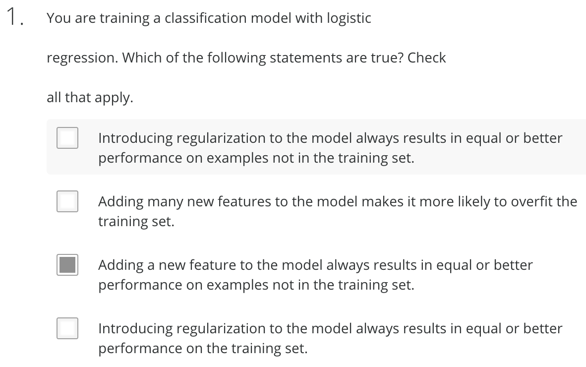
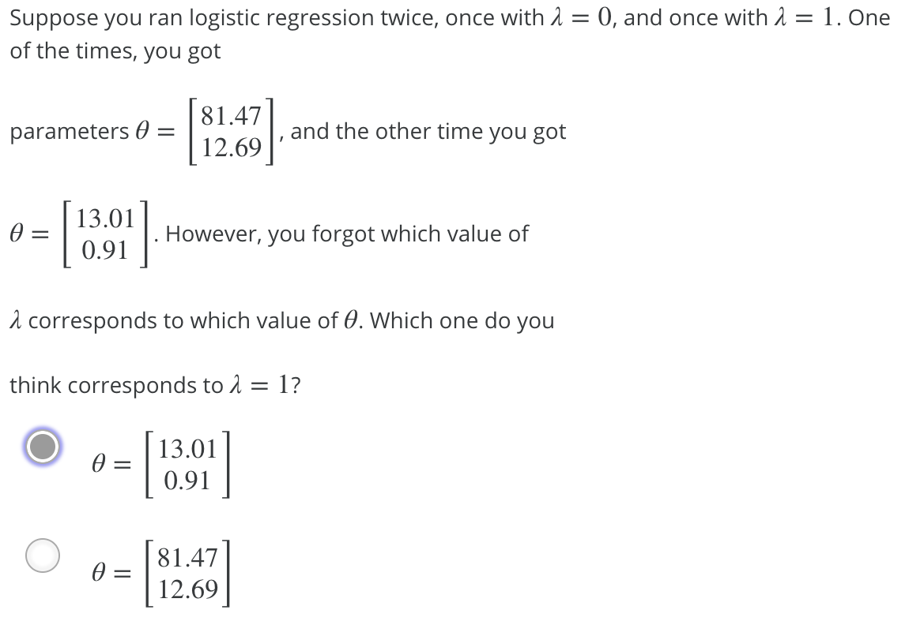

# 
Regularized Logistic Regression

  

## Cost Function
----
代价函数添加正则化项：

$$
\begin{split}
J(\theta) &= \frac{1}{m} \sum_{i=1}^m [y^{(i)}\ \log(h_\theta(x^{(i)})) + (1 - y^{(i)})\ \log(1 - h_\theta(x^{(i)}))] + \frac{\lambda}{2m}\sum_{j=1}^n \theta_j^2 \\
&= \frac{1}{m}((log(g(X\theta))^{T}y + (log(1-g(X\theta))^{T}(1-y)))) + \frac{\lambda}{2m}\sum_{j=1}^{n}\theta_{j}^{2}
\end{split}
$$

  

## Gradent Descent
----
逻辑回归和线性回归代价函数求导结果一样，此处通过给正则化项添加常数$$\frac{1}{2}$$，则其求导结果也一样。

从而应用正则化的逻辑回归梯度下降算法：

$$
\begin{align*}
& \text{Repeat}\ \lbrace \newline
& \ \ \ \ \theta_0 := \theta_0 - \alpha\ \frac{1}{m}\ \sum_{i=1}^m (h_\theta(x^{(i)}) - y^{(i)})x_0^{(i)} \newline
& \ \ \ \ \theta_j := \theta_j - \alpha\ \left[ \left( \frac{1}{m}\ \sum_{i=1}^m (h_\theta(x^{(i)}) - y^{(i)})x_j^{(i)} \right) + \frac{\lambda}{m}\theta_j \right], \ \ \ j \in \lbrace 1,2...n\rbrace \newline
& \ \ \ \text{即：} \newline
& \ \ \ \ \theta = \theta - \alpha (\frac{1}{m}X^{T}(y - g(X\theta)) + \frac{\lambda}{m}\theta_{j}), \ \ \ j \ne 0 \newline
& \rbrace \end{align*}
$$

  

## Quiz
----

|       | Statement | Explanation |
| ----- | --------- | ----------- |
| False | Adding many new features to model helps prevent overfitting on training set. | Adding many new features gives more expressive models which are able to better fit training set. If too many new features are added, this can lead to overfitting of the training set. |
| False | Introducing regularization to model always results in equal or better performance on examples <b> not </b> in training set. | If introducing too much regularization, we can underfit training set and this can lead to worse performance even for examples not in training set. |
| False | Introducing regularization to model always results in equal or better performance on training set. | If we introduce too much regularization, we can underfit training set and have worse performance on training set. |
| True | Adding a new feature to model always results in equal or better performance on training set. | Adding many new features gives us more expressive models which are able to better fit training set. If too many new features, this can overfit training set. |

Adding many new features to the model helps prevent overfitting on the training set.