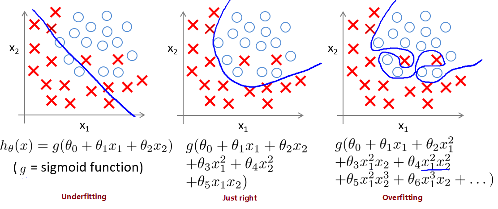

# 
Regularization

  

## 拟合问题
----
线性模型：

  

逻辑分类模型：

  

为度量拟合表现，引入：

* 偏差 Bias

    模型预测值与真实值偏离程度。偏差低意味着较好反应训练集数据情况。

* 方差 Variance

    模型预测值离散程度或变化范围。方差越大，数据分布越分散，函数波动越大，泛化能力越差。方差低意味着拟合曲线稳定性高，波动小。

避免过拟合方法有：

1. 减少特征数量

    * 手动选取需保留的特征。
    * 使用模型选择算法选取合适特征（如PCA算法）。
    * 减少特征的方式易丢失有用的特征信息。

2. 正则化 Regularization

    * 可保留所有参数。
    * 减少/惩罚各参数大小，以减轻各参数对模型影响程度。
    * 当有很多参数对模型只有轻微影响时，正则化方法表现很好。

> 结构风险最小化就是在经验风险最小化基础上（训练误差最小化），尽可能采用简单模型，提高泛化预测精度。

  

## Model Complexity
----
The training optimization algorithm is now a function of two terms: 
1. **loss term**, which measures how well the model fits the data;
2. **regularization term**, which measures model complexity.

Two common ways to think of model complexity:
1. Model complexity as a function of the weights of all the features in the model.
2. Model complexity as a function of the total number of features with nonzero weights.

We can quantify complexity using **L2 regularization**:

$$
\mathrm{L}_{2}\ regularization\ term = \parallel\mathbf{w}\parallel^{2}_{2} = w_{1}^{2} + w_{2}^{2} + ... + w_{n}^{2}
$$

  

## Lambda
----
Model developers tune the overall impact of the regularization term by multiplying its value by a scalar known as **lambda** (also called the **regularization rate**):

$$
\mathrm{minimize}(\mathrm{Loss}(\mathrm{Data}|\mathrm{Model}) + \lambda \mathrm{complexity}(\mathrm{Model}))
$$

Performing $$L_{2}$$ regularization has following effect on a model:
* Encourages weight values toward 0 (but not exactly 0).
* Encourages the mean of weights toward 0, with a normal (bell-shaped or Gaussian) distribution.

Increasing the lambda value strengthens the regularization effect. For example, the histogram of weights for a high value of lambda might look as shown below:

Lowering the value of lambda tends to yield a flatter histogram, as shown below:

When choosing a lambda value, the goal is to balance between simplicity and training-data fit:
* If lambda value is too high, model will be simple, but run the risk of underfitting data. The model won't learn enough about training data to make useful predictions.
* If it is too low, model will be more complex, and run the risk of overfitting data. Model will learn too much about the particularities of training data, and won't be able to generalize to new data.
* Setting lambda to zero removes regularization completely. Then training focuses exclusively on minimizing loss, which poses the highest possible overfitting risk.

  

## 统一表达式
----
为了控制$$L_{1}$$和$$L_{2}$$正规化强度，会加上参数$$\lambda$$，且通过交叉验证（ cross validation）选择较好的$$\lambda$$。为统一正则化方法，使用$$p$$代表对参数的正则化程度。所以，一系列正则化方法最终表达形式是：

$$
\mathrm{J(\theta)} = [y_{\theta}(x) - y]^{2} + \lambda \sum{\theta^{p}_{i}}
$$

其中，$$p > 0$$。不同的$$p$$值对应不同的约束边界：

* $$p=1$$对应$$L_{1}$$，$$p=2$$对应$$L_{2}$$。
* 当$$p < 1$$，约束边界为非凸函数，求解最优值困难。$$p=1$$是满足约束边界为凸的最小值。
* 当$$p \le 1$$，约束边界在坐标轴上不可导，为非光滑函数，不能用梯度下降法求解。
* 对$$p \in (1, 2)$$情况是$$L_{1}$$和$$L_{2}$$折中，同时具有两者优点。此时约束边界为凸边界，既有$$L_{2}$$光滑可导性，也有$$L_{1}$$稀疏特征。

整个最优化问题从贝叶斯观点来看是一种贝叶斯最大后验估计：
* 正则化项<-->先验信息
* 损失函数<-->似然函数，
* 两者乘积<-->贝叶斯最大后验估计。
* 贝叶斯最大后验估计的形式取对数<-->损失函数+正则化项的最优化问题形式。

  

## L2 Regularization
----

如果过拟合，那么该方程可能是复杂的非线性方程。因为$$x^{3}$$和$$x^{2}$$使虚线弯来弯去，所以模型会努力学习作用在$$x^{3}$$和$$x^{2}$$上的参数$$c$$和$$d$$。但期望模型学到的是蓝色曲线，这就是$$L_{1}$$和$$L_{2}$$正则化出现的原因。

$$L_{1}$$和$$L_{2}$$区别是在误差公式多加一个东西，让误差不仅取决于拟合的好坏，且取决于像参数$$c$$的值大小。

 

### 核心思想

机器学习过程是通过修改参数$$\theta$$减小误差的过程。可在减小误差时非线性越强的参数，如$$x^{3}$$的$$\theta_{4}$$会被修改得越多。因为如果使用非线性强的参数能使方程更曲折，也就能更好拟合分布的数据点。所以误差方程需要平衡这些参数的影响，即正规化算法思想。

L2正则化在实现时是在loss函数后加一项：

$$
L(\theta) = L_{0}(\theta) + \frac{\lambda}{2n}\sum_{w}w^{2}
$$

* $$L_{0}(\theta)$$是原始loss函数。
* $$\theta$$是神经网络的参数，包括权重$$w$$和偏置$$b$$。
* $$\lambda$$是需指定的超参数，用来权衡原来loss函数和$$L_{2}$$正则化项。

那么，原来的梯度计算过程变成：

$$
\frac{\partial\theta}{\partial{w}} = \frac{\partial{L_{0}}}{\partial{w}} + \frac{\lambda}{n}w
$$

加入$$L_{2}$$使得神经元权重倾变小。当每个神经元权重较小时，神经元对某种特定模式不会太敏感，从而避免过拟合。若神经元在训练集上学习到训练集的某特征，使在训练集上loss函数显著变小，那么学到的特征以较大权重形式出现在参数中。通过避免产生过大参数，$$L_{2}$$避免过拟合。

 

### 图像化

想象只有两个参数$$\theta_{1}$$和$$\theta_{2}$$要学。蓝色圆心是误差最小的，而每条蓝线上误差都一样。

正则化方程是在黄线上产生的额外误差，即惩罚度。在黄圈上额外误差也一样。所以蓝线和黄线交点能让两个误差合最，即$$\theta{1}$$和$$\theta_{2}$$正则化后的解。

使用$$L_{1}$$，可能结果是只有$$\theta_{1}$$特征被保留。所以很多人用$$L_{1}$$正则化挑选对结果贡献最大的特征。但是$$L_{1}$$的解并不稳定。比如用批数据训练，每次批数据会有不同的误差曲线。

$$L_{2}$$针对于这种变动，白点移动不会太大。而$$L_{1}$$白点可能跳到许多不同地方。因为这些地方总误差都差不多。侧面说明$$L_{1}$$解的不稳定性。

  

## L1 Regularization
----
$$L_{1}$$是在loss函数后加一项：

$$
L(\theta) = L_{0}(\theta) + \frac{\lambda}{n}\sum_{w}|w|
$$

原来的梯度计算和参数更新为：

$$
\frac{\partial\theta}{\partial{w}} = \frac{\partial{L_{0}}}{\partial{w}} + \frac{\lambda}{n}\mathrm{sgn}(w)
$$

  

## L1 vs L2
----
### 数学公式
从权值更新公式看权值收敛结果。先看看$$L_{1}$$和$$L_{2}$$梯度（导数反方向）：

$$
L_{1} = |w_{1}| + |w_{2}| + ... + |w_{n}|, \frac{\partial{L_{1}}}{\partial{w_{i}}} = \mathrm{sgn}(w_{i}) = 1\ \mathrm{or}\ -1 \\
L_{2} = \frac{1}{2}w^{2}_{1} + w^{2}_{2} + ... + w^{2}_{n}, \frac{\partial{L_{2}}}{\partial{w_{i}}} = w_{i}
$$

设学习速率$$\mu$$为$$0.5$$，$$L_{1}$$和$$L_{2}$$权值更新公式为：

$$
L_{1}: w_{i} = w_{i} - \mu * 1 = w_{i} - 0.5 * 1 \\
L_{2}: w_{i} = w_{i} - \mu * w_{i} = w_{i} - 0.5 * w_{i}
$$

说明：
* $$L_{1}$$权值每次更新都固定减少特定值（比如0.5）。若干次迭代后，权值可能减少到0。
* $$L_{2}$$权值每次都等于上一次的一半。虽然权值不断变小，但因为每次都等于上一次一半，所以很快收敛到较小值但不为0。

    

所以：
* $$L_{1}$$能产生等于0的权值，即能剔除某些特征在模型中作用（特征选择），产生稀疏效果。
* $$L_{2}$$可迅速得到较小的权值，但难以收敛到0，所以产生平滑效果。

 

### 几何空间
从几何位置关系看权值取值情况。

左边方形线是$$L_{1}$$中$$\frac{w1}{w2}$$取值区间。右边圆形线上是$$L_{2}$$中$$\frac{w1}{w2}$$取值区间。绿色圆圈表示$$\frac{w1}{w2}$$取不同值时，正则化项的值的等高线（凸函数）。从等高线和$$\frac{w1}{w2}$$取值区间交点可看到，$$L_{1}$$中两个权值倾向于一个较大另一个为0。$$L_{2}$$中两个权值倾向于均为非零的较小数。这也是$$L_{1}$$稀疏，$$L_{2}$$平滑的效果。

  

## Quiz
----

|       | Statement | Explanation |
| ----- | --------- | ----------- |
| False | Using a very large value $$\lambda$$ can't hurt hypothesis performance; the only reason we don't set to be too large is to avoid numerical problem. | Using a very large value of $$\lambda$$ can underfit training set. |
| False | Because regularization causes $$J(\theta)$$ to no longer be convex, gradient descent may not always converge to global minimum (when $$\lambda > 0$$, and when using an appropriate learning rate $$\alpha$$). | Regularized logistic regression and regularized linear regression are both convex, and thus gradient descent will still converge to the global minimum. |
| True | Using too large a value of $$\lambda$$ can cause hypothesis to underfit data. | A large value of results in a large $$\labmda$$ regularization penalty and thus a strong preference for simpler models which can underfit data. |
| False | Because logistic regression outputs values $$0 <= h_{0} <= 1$$, its range of output values can only be "shrunk" slighly by regularization anyway, so regularization is generally not helpful for it.  |  |