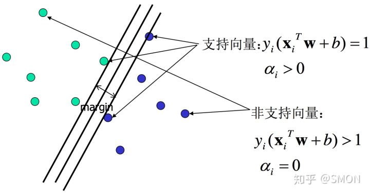

# 
Hard Margin

  

## What
----
考虑如下线性可分训练数据集：

$$
(x_{1}, y_{1}), (x_{2}, y_{2}), ..., (x_{n}, y_{n})
$$

其中$$x_i$$是含有$$d$$个元素的列向量, 即$$x_i \in \mathbf{R}^d$$；$$y_i$$是标量，$$y \in {+1,-1}$$，$$y_i = 1$$时表示$$x_i$$属于正类别，$$y_i = -1$$时表示$$x_i$$属于负类别。

> $$x$$、$$x_i$$、$$w$$等都是列向量。

感知机使用误分类最小法求得超平面，不过解有无穷多个（如H2和H3及它俩任意线性组合）。线性可分SVM利用间隔最大化求最优分离超平面，这时解唯一。

  

## 超平面与间隔
----
一个超平面由法向量$$w$$和截距$$b$$决定，方程为$$x^T w+b=0$$。可规定法向量指向的一侧为正类，另一侧为负类。下图画出三个平行超平面，法方向取左上方向。

> $$x$$和$$w$$都是列向量，即$$x^{T}w$$会得到$$x$$和$$w$$点积（dot product，标量），等价于$$x \cdot w$$和$$w \cdot x$$。

为找到最大间隔超平面，可先选择分离两类数据两个平行超平面，使它们距离尽可能大。这两个超平面范围内的区域称为间隔（margin），最大间隔超平面是位于它们正中间的超平面。

  

## 超平面数学表达
----
超平面公式：

$$
\omega_1x_1 + \omega_2x_2 + \cdots + \omega_nx_n + b = 0  \tag{1}
$$

写成$$\mathbf{\omega},\mathbf{x}$$矩阵形式为：

$$
\mathbf{\omega}^T\boldsymbol{x} =  [ \omega_1 , \omega_2 , \cdots , \omega_n ] \begin{bmatrix} x_1 \\ x_2 \\ \vdots \\ x_n \end{bmatrix} = \omega_1x_1 + \omega_2x_2 + \cdots + \omega_nx_n \tag{2}
$$

式1又可写成：

$$
\mathbf{\omega}^T\boldsymbol{x} + \mathbf{b} = \mathbf{0} \tag{3}
$$

其中$$\omega = ( \omega_1 , \omega_2 , \cdots , \omega_n )$$为法向量，$$b$$为截距，超平面由该方程唯一确定。

  

## 点到超平面距离计算
----

设点$$\boldsymbol{x}_0$$在超平面S：$$\mathbf{\omega}^T\boldsymbol{x} + \mathbf{b} = \mathbf{0}$$投影为$$\boldsymbol{x}_1$$，那么有$$\mathbf{\omega}^T\boldsymbol{x_1} + \mathbf{b} = \mathbf{0}$$，于是有：

$$
\omega^1x_1^1 + \omega^2x_1^2 + ... + \omega^nx_1^n  = -\boldsymbol{b} \tag{4}
$$

令$$\boldsymbol{x}_0$$在超平面S距离为$$d$$。其中$$\boldsymbol{x}_0$$，$$\boldsymbol{x}$$和$$\boldsymbol{\omega}$$都是n维向量。

由于向量$$\overrightarrow{x_0x_1}$$与S平面法向量$$\boldsymbol{\omega}$$平行，所以有：

$$
\boldsymbol{\omega}\cdot \overrightarrow{x_0x_1}| = |\boldsymbol{\omega}||\overrightarrow{x_0x_1}| = \sqrt{(\omega^1)^2 + ... + (\omega^1)^n}d = ||w||d \tag{5}
$$

又由于：

$$
\begin{split}
\boldsymbol{\omega}\cdot \overrightarrow{x_0x_1} &= \omega^1(x_0^1 - x_1^1) + \omega^2(x_0^2 - x_1^2) + ... + \omega^n(x_0^n - x_1^n) \\
&= \omega^1x_0^1 + \omega^2x_0^2 + ... + \omega^nx_0^n - (\omega^1x_1^1 + \omega^2x_1^2 + ... + \omega^nx_1^n) \\
&= \omega^1x_0^1 + \omega^2x_0^2 + ... + \omega^nx_0^n - (-\boldsymbol{b})
\end{split} \tag{6}
$$

由式子5和6推出：

$$
||w||d = |\omega^1x_0^1 + \omega^2x_0^2 + ... + \omega^nx_0^n +\boldsymbol{b} | = |\boldsymbol{\omega}\cdot\boldsymbol{x}_0 + \boldsymbol{b}|
$$

即：

$$
d = \frac{1}{||w||}|\boldsymbol{\omega}\cdot\boldsymbol{x}_0 + \boldsymbol{b}| \tag{7}
$$

  

## 间隔最大化
----
将求两平行直线距离公式推广到高维可得图中margin的$$\rho$$：

$$
margin = \rho = \frac 2 {||w||} \tag{2.2.1}
$$

目标是使$$\rho$$最大，等价于使$$\rho^2$$最大：

$$
\underset{w,b}{\mathrm{max}} \rho \iff \underset{w,b}{\mathrm{max}} \rho^2 \iff \underset{w,b}{\mathrm{min}}\frac 1 2 ||w||^2 \tag{2.2.2}
$$

> 上式$$\frac{1}{2}$$是为后续求导后刚好能消去，没有特殊意义。

约束条件：

$$
x_i^{T}w+b \ge +1, y_i=+1 \\ x_i^{T}w+b \le -1, y_i=-1 \tag{2.2.3}
$$

对最大间距描述，有公式：

$$
\underset{w,b}{\mathrm{max}} \{\frac{1}{||w||}\underset{n}{\mathrm{min}}[y_{i}(w^{T}x+b)]\} \tag{3}
$$

这个数学表达式描述了对支持向量机的理解：先找出所有可能的直线/平面，满足条件就是样本点到该直线的距离最小。集合里每个元素至少包含两个信息：
1. 距离其最近的支撑点；
2. 支撑点到直线/平面的距离。

再在这个集合中找出间距最大的，就是要求的最优解。公式多乘一个$$y$$是因为直线两侧点到直线距离有正负，所以点到直线距离公式要加上绝对值。这里使用$$y={1,−1}$$表示两种不同的类别，这样$$y_{i}(w^{T}x+b)$$肯定是正数。

对于$$\underset{n}{\mathrm{min}}[y_{i}(w^{T}x+b)]$$，表示的是点到直线的最小值。假设存在一个最小值$$margin$$，那么该公式可转化为：

$$
y_{i}(w^{T}x+b) >= margin
$$

从而式3可等价转化为：

$$
\begin{split}
\mathrm{max}\{margin \frac{1}{||w||}\} \iff \mathrm{min}\{margin{{w}}\} \\
s.t. y_{i}(w^{T}x +b) >= margin
\end{split}
$$

范数$$||w||$$是平方根，不利于后面求导，因此可使用范数平方，得到：

$$
\begin{split}
\mathrm{min}\{margin\frac{||w||^{2}}{2}\} \\
y_{i}(w^{T}x +b) >= margin
\end{split}
$$

为方便，把$$margin$$设为固定常数1。因为$$margin=1$$对最终分类结果影响不大（不是没有影响）。具体地，设定最终得到完美分隔的直线到最近点距离为$$margin’$$。如果$$margin’ > margin$$，说明把所有样本点都考虑了，因为条件放宽了（简单点就是：$$a>2$$是$$a>1$$子集）。如果$$margin’ < margin$$，那么在$$margin’$$和$$margin$$间点没被考虑。比如$$margin'=0.5$$，$$margin=1$$。由于约束条件是：$$y_{i}(w^{T}x+b)>=1$$，而实际上可能的最佳间隔是0.5，那么0.5到1之间点就没被考虑，所以会影响结果。但如果把假设值设得很小，比如$$margin = 1$$，即使最后实际最佳$$margin < 1$$，这样的误差对最终结果影响很小。因为越靠近直线点越难分隔，1已足够小，所以设为1对最终的分类结果影响不大。

于是，得到间隔最大化数学表达是

$$
\underset{w,b}{\mathrm{min}}J(w) = \underset{w,b}{\mathrm{min}}\frac 1 2 ||w||^2 \\ s.t.\quad y_i(x_i^{T}w+b) \ge 1, i=1,2,...n. \tag{2.2.4}
$$

通过求解上式可得最优超平面$$\hat{w}$$和$$\hat{b}$$。

  

## 支持向量
----
在线性可分情况下，训练数据集的样本点中与分离超平面距离最近的数据点称为支持向量（support vector），支持向量是使式2.2.4中约束条件取等的点，即满足

$$
y_i(X_i^{T}w+b) = 1 \tag{2.3.1}
$$

的点，也即所有在直线$$X^{T}w+b = 1$$或直线$$X^{T}w+b = -1$$的点。如下图所示：

在决定最佳超平面时只有支持向量起作用，其他数据点不起作用。如果移动非支持向量，甚至删除非支持向量都不会对最优超平面产生影响，即支持向量对模型起决定作用，这是SVM名称的由来。

  

## 对偶
----
### 对偶性
在约束最优化问题中，利用拉格朗日对偶性将原始问题转为对偶问题，通过求解对偶问题得到原始问题解。假设优化问题是：

$$
\min f(x) \ s.t.\; h_i(x) = 0, i=1, 2, …,n
$$

这是个带等式约束的优化问题。引入拉格朗日乘子，得到拉格朗日函数：

$$
L(\mathbf{x}, \mathbf{\alpha})=f(x)+\alpha_1h_1(x)+ \alpha_2h_2(x)+\cdots+\alpha_nh_n(x)
$$

将拉格朗日函数对$$x$$求极值，即对$$x$$求导，导数为0，得到$$\alpha$$关于$$x$$的函数。然后代入拉格朗日函数：

$$
\max  w(\mathbf{\alpha}) = L(\mathbf{x(\alpha), \alpha}) 
$$

这时，带等式约束优化问题变成只有一个变量$$\mathbf{\alpha}$$（多个约束条件就是向量）的优化问题。这时求解就简单了，同样是求导令其等于0，解出$$\mathbf{\alpha}$$即可。

把原始的问题叫primal problem，转换后的形式叫dual problem。原始问题是最小化，转化为对偶问题后变成求最大值。对于不等式约束，其实是同样操作。通过给每一个约束条件加上Lagrange multiplier（拉格朗日乘子），可将约束条件融和到目标函数，这样求解优化问题更容易。

 

### SVM对偶问题
对于SVM，其primal problem是：

$$
min\frac{1}{2} \lVert w \rVert^2 \\  s.t.\; y_i(w·x_i + b) \ge 1, \forall x_i
$$

可应用拉格朗日乘子法构造拉格朗日函数（Lagrange function），再通过求解其对偶问题（dual problem）得到原始问题最优解。转换为对偶问题来求解原因是：

* 对偶问题更易求解，只需优化变量$$\alpha$$且约束条件简单；
* 更自然地引入核函数，进而推广到非线性问题。

首先构建拉格朗日函数。为此需引进拉格朗日乘子（Lagrange multiplier）$$\alpha_i \ge 0, i=1,2,...n$$。则拉格朗日函数为：

$$
L(w,b,\alpha)=\frac{1}{2} ||w||^{2} - \sum_{i=1}^{n} \alpha_i [y_i(x_{i}^{T}w+b)-1] \tag{2.4.1}
$$

其中$$||Ww|^2 = w^{T} \dot w$$。

给定$$w$$和$$b$$，若不满足式2.2.4约束条件，有

$$
\underset{\alpha}{\mathrm{max}} L(w,b,\alpha) = +\infty \tag{2.4.2}
$$

否则，若满足式2.2.4约束条件，有

$$
\underset{\alpha}{\mathrm{max}} L(w,b,\alpha) = J(w) = \frac 1 2 ||w||^2 \tag{2.4.3}
$$

结合式2.4.2和2.4.3知，优化问题

$$
\underset{w, b}{\mathrm{min}} \underset{\alpha}{\mathrm{max}} L(w,b,\alpha)\tag{2.4.4}
$$

与式2.2.4所述问题等价。

根据拉格朗日对偶性，式2.4.4所述问题即原始问题的对偶问题：

$$
\underset{\alpha}{\mathrm{max}} \underset{w, b}{\mathrm{min}} L(w,b,\alpha) \tag{2.4.5}
$$

为求得对偶问题解，需先求得$$L(w,b,\alpha)$$对$$w$$和$$b$$的极小再求对$$\alpha$$的极大。

* 求$$\underset{w, b}{\mathrm{min}} L(w,b,\alpha)$$，即$$\frac{\partial L}{\partial \boldsymbol{w}}=0$$，$$\frac{\partial L}{\partial b}=0$$。

对拉格朗日函数求导并令导数为0，有
    
$$
\nabla_w L(w,b,\alpha) = w - \sum_{i=1}^n \alpha_i y_i x_i = 0 \implies w= \sum_{i=1}^n \alpha_i y_i x_i\tag{2.4.6}
$$

$$
abla_b L(w,b,\alpha) = - \sum_{i=1}^n \alpha_i y_i = 0 \implies \sum_{i=1}^n \alpha_i y_i = 0 \tag{2.4.7}
$$

将上面两式代入$$L(w,b,\alpha)$$：

$$
\begin{split}
L(w,b,\alpha) &= \frac{1}{2} ||w||^{2} - \sum^{n}_{i=1} [y_{i}(x^{T}_{i}+b)-1] \\
&=\frac{1}{2} \sum^{n}_{i=1} \alpha_{i}y_{i}x^{T}_{i} \sum^{n}_{j=1} \alpha_{j}y_{j}x_{j} - \sum^{n}_{i=1}\alpha_{i}y_{i}x^{T}_{i} \sum^{n}_{j=1}\alpha_{j}y_{j}x_{j} - b\sum^{n}_{i=1}\alpha_{i}y_{i} + \sum^{n}_{i=1}\alpha_{j} \\
&= \sum^{n}_{i=1}\alpha_{i} - \frac{1}{2}\sum^{n}_{i=1}\alpha_{i}y_{i}x_{i}^{T} \sum^{n}_{j=1}\alpha_{j}y_{j}x_{j} \\
&= \sum^{n}_{i=1}\alpha_{i} - \frac{1}{2}\sum^{n}_{i,j=1}y_{i}y_{j}\alpha_{i}\alpha_{j}x^{T}_{i}
\end{split}
$$

所以，

$$
\underset{w, b}{\mathrm{min}} L(w,b,\alpha) = -\frac 1 2 \sum_{i=1}^n \sum_{j=1}^n \alpha_i \alpha_j y_i y_j x_i^T x_j \ + \ \sum_{i=1}^n \alpha_i \tag{2.4.8}
$$

* 求$$\underset{w, b}{min} L(w,b,\alpha)$$对$$\alpha$$的极大：

等价于式2.4.8对$$\alpha$$求极大，也等价于式2.4.8取负数后对$$\alpha$$求极小，即

$$
\underset{\alpha}{\mathrm{min}} \frac 1 2 \sum_{i=1}^n \sum_{j=1}^n \alpha_i \alpha_j y_i y_j x_i^T x_j \ - \ \sum_{i=1}^n \alpha_i \tag{2.4.9}
$$

同时满足约束条件：

$$
\sum_{i=1}^n \alpha_i y_i = 0 \\ \alpha_i \ge 0, i=1,2,...,n. \tag{2.4.10}
$$

至此，得到原始最优化问题2.2.4和对偶最优化问题2.4.9、2.4.10。

由slater条件知，因为原始优化问题目标函数和不等式约束条件都是凸函数，且该不等式约束严格可行（因为数据线性可分），所以存在$$\hat{w}$$、$$\hat{b}$$和$$\hat{\alpha}$$，使得$$\hat{w}$$和$$\hat{b}$$是原始问题解，$$\hat{\alpha}$$是对偶问题解。意味着求解原始最优化问题2.2.4可转换为求解对偶最优化问题2.4.9、2.4.10。

> slater条件：原始问题一般性表达为
>  
> $$
> \underset{x}{\mathrm{min}} \quad f(x) \\ s.t. \ c_i(x) \le 0, i=1,2,...k \\ \quad \quad h_j(x) = 0, j=1,2,...,l
> $$
> 则其拉格朗日函数为
> $$
> L(x,\alpha,\beta)=f(x) + \sum_{i=1}^k \alpha_i c_i(x) + \sum_{j=1}^l \beta_j h_j(x), \quad \alpha_i \ge 0
> $$
> 假设原始问题目标函数$$f(x)$$和不等式约束条件$$c_i(x)$$是凸函数，原始问题等式约束$$h_j(x)$$是仿射函数，且不等式约束$$c_i(x)$$严格可行，即存在$$x$$对所有$$i$$都有$$c_i(x) < 0$$，则存在$$\hat{x}$$、$$\hat{\alpha}$$和$$\hat{\beta}$$，使$$\hat{x}$$是原始问题解，$$\hat{\alpha}$$和$$\hat{\beta}$$是对偶问题解。

如何求解优化问题2.4.9、2.4.10的最优解$$\hat{\alpha}$$？不难发现这是一个二次规划问题，有现成通用算法来求解。

> 通用的求解二次规划问题算法复杂度正比于训练数据样本数，所以实际应用中需寻求更高效算法，例如序列最小优化（Sequential Minimal Optimiation，SMO）算法。

假设现在求得2.4.9、2.4.10最优解$$\hat{\alpha}$$，则根据式2.4.6可求得最优$$\hat{w}$$：

$$
\hat{w= \sum_{i=1}^n \hat{\alpha}_i y_i x_i \tag{2.4.11}
$$

因为至少存在一个$$\hat{\alpha}_j > 0$$（若不存在，即$$\hat{\alpha}$$全为0，则$$\hat{w}=0$$，即$$margin = \frac 2 {||\hat{w}||}= \infty$$，显然不行），再根据KKT条件：

$$
\begin{cases} 乘子非负: \alpha_i \ge 0 (i=1,2,...n.下同) \\ 约束条件: y_i(c_i^Tw+b) - 1\ge 0 \\ 互补条件: \alpha_i (y_i(c_i^Tw+b) - 1)=0 \end{cases} \\
$$

所以至少存在一个$$j$$，使$$y_j(c_j^T \hat{w}+\hat{b}) - 1=0$$。可求得最优$$\hat{b}$$：

$$
\begin{aligned}
\hat{b} & = \frac 1 {y_j} -x_j^T \hat{w} \\
& = y_j -x_j^T \hat{w} \\
& = y_j-\sum_{i=1}^n \hat{\alpha}_i y_i X_j^T X_i
\end{aligned} \tag{2.4.12}
$$

至此，求得了整个线性可分SVM解。求得的分离超平面为：

$$
\sum_{i=1}^n \hat{\alpha}_i y_i x^Tx_i + \hat{b}=0 \tag{2.4.13}
$$

分类决策函数为

$$
\begin{split}
f(X) &= sign(wx+b) \\
&= sign(\sum_{i=1}^n \hat{\alpha}_i y_i X^TX_i + \hat{b})
\end{split} \tag{2.4.14}
$$

再来分析KKT条件里的互补条件。对任意样本$$(X_i, y_i)$$，总有$$\alpha_i=0$$或$$y_if(X_i)=y_i(X_i^T \hat{W}+b) = 1$$。若$$\alpha_i=0$$，此样本点不是支持向量，对模型没有作用；若$$\alpha_i>0$$，此样本点位于最大间隔边界上，是一个支持向量，如下图所示。

此外，当样本点是非支持向量时，因为$$\alpha_i=0$$，所以SVM的解中的求和项中第$$i$$项为0，所以SVM的解2.4.11、2.4.12可简化为：

$$
\hat{W}= \sum_{i \in SV} \hat{\alpha}_i y_i x_i \tag{2.4.15}\hat{b} = y_j-\sum_{i \in SV} \hat{\alpha}_i y_i x_j^T x_i \tag{2.4.16}
$$

类似，判别函数也可转换成如下形式：

$$
f(X) = sign(\sum_{i \in SV} \hat{\alpha}_i y_i x^Tx_i + \hat{b}) \tag{2.4.17}
$$

所以，整个SVM解只与支持向量有关。

  