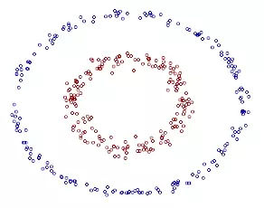
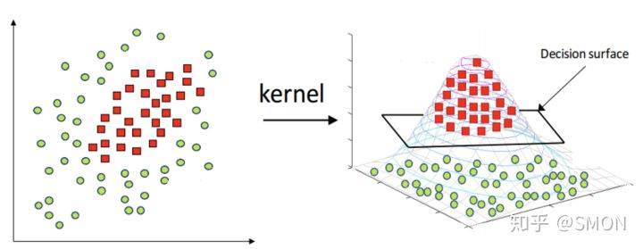
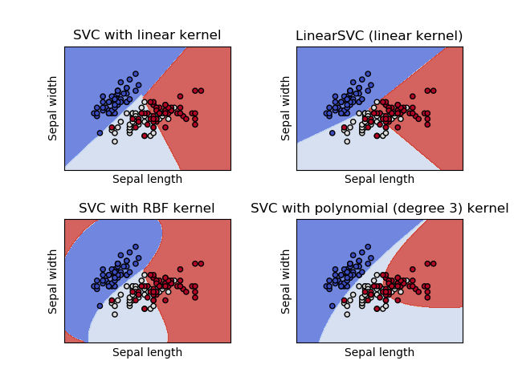

# 
Kernel

  

## 向量內积与外积意义
----
内积结果是定义在空间里（一个双线性函数，结果是一个数），外积结果是定义在另外的空间（为什么欧氏三维空间两个向量外积可定义在三维空间里，是因为$$C（3,2）=3$$，导致外积空间和三维空间同构，其实结果是把外积空间嵌入三维空间。）。 可以这样理解“内外”：两个向量内积只需知道它们生成的平面性质就可确定，而外积须在平面外才有意义，否则是一个数（还可用内积表示）。 

在线性不可分情况下，支持向量机首先在低维空间中完成计算，然后通过核函数将输入空间映射到高维特征空间，最终在高维特征空间中构造出最优分离超平面。

利用低维输入空间，将其转换为高维空间，即它将不可分离的问题转化为可分离问题，这些函数称为核。

> 不仅仅是SVM，很多线性模型都可用核技巧。

  

## 线性不可分
----

二维空间中，每个数据点可用一个二维向量$$(x_1,x_2)^T$$表示。可用一个椭圆形状超平面在2维空间中对数据分类，写出椭圆的一般方程：

$$
w_1x_1 + w_2x_2^2 + w_3x_2 + w_4x_2^2 + w_5x_1x_2 + w_6 = 0
$$

令：

$$
\sum_{i=1}^{5}w_iz_i + w_6 = 0
$$

其中$$z_1 = x_1$$，$$z_2 = x_1^2$$，$$z_3 = x_2$$，$$z_4 = x_2^2$$，$$z_5 = x_1x_2$$。可发现，2维向量$$x$$被映射成另一个5维向量$$z$$后，分类超平面是一个线性超平面，数据点变得线性可分。也即是下面的变换：

$$
z = \begin{pmatrix} x_1\\ x_1^2\\ x_2\\ x_2^2 \\ x_2^2\\ x_1x_2 \end{pmatrix} = \phi(x) = \phi \begin{bmatrix} \begin{pmatrix} x_1\ x_2 \end{pmatrix} \end{bmatrix}
$$

  

## 低维到高维映射
----
考虑SVM原始优化问题：

$$
\min_{w,b}\frac{1}{2} \lVert w \rVert^2 \\  s.t. y_i(w·x_i + b) \ge 1, \forall x_i
$$

上式中$$x_i$$对应数据集中样本点。把每个点映射到5维空间，变成了下式：

$$
\min_{w,b}\frac{1}{2} \lVert w \rVert^2 \\  s.t. y_i(w\dot\phi(x_i) + b) \ge 1, \forall x_i
$$

根据上式可知，对一个线性不可分数据集，只要把$$x_i$$替换成相应的映射后的点就可。所以，原来二维空间中分类决策函数：

$$
\mathcal{f}(x) = sign\left( \sum_{i=1}^{N}\alpha_iy_i(x·x_i) + b \right) \tag{B1}
$$

变成5维空间中分类决策函数：

$$
\mathcal{f}(x) = sign\left( \sum_{i=1}^{N}\alpha_iy_i\left(\phi(x)·\phi(x_i)\right) + b \right) \tag{B2}
$$

$$x$$的映射函数已知，所以能轻松根据上式得到决策超平面。

  

## 核函数
----
考虑到只是实现二维空间线性可分，就要映射到5维空间。如果数据维度很高，映射后空间维度会更高。所以，应找一个合适的二元函数，输入是原空间两个向量，输出是映射到高维空间的两个向量的内积。这个二元函数就叫核函数。

要求出式B2两个映射函数的内积，所以要构造一个二元函数，输入是原二维空间中的$$x$$和$$x_i$$两个向量，输出是映射到5维空间的两个向量内积：

$$
(x\dot x_i) \dashrightarrow f \dashrightarrow (\phi({x})\dot\phi({x_i}))
$$

这样避免了求映射函数，只通过一个核函数就可在低维空间完成高维空间中才能完成的事。

考虑一个例子：现在有两个二维空间中的数据点和二元函数：

$$
\begin{eqnarray}  x&=\begin{pmatrix}x_1\\ x_2\end{pmatrix} \\ y&=\begin{pmatrix}y_1\\ y_2\end{pmatrix} \\  f(x,y) &= (x\dot y)^2 \tag{B3}  \end{eqnarray}
$$

把$$x$$和$$y$$代表式B3，得：

$$
\begin{split} f(x,y) &= (x·y)^2 \\  &= (x_1y_1 + x_2y_2)^2 \\  &= x_1^2y_1^2 + x_2^2y_2^2 + 2x_1x_2y_1y_2\\  &= \left( x_1^2,x_2^2, \sqrt{2}x_1x_2\right) \cdot \left( y_1^2,y_2^2, \sqrt{2}y_1y_2\right) \\  &= p \cdot q \end{split} \tag{B4}
$$

最后函数值等于两个向量$$p$$和$$q$$内积，且两个向量分别是二维空间数据点$$x$$和$$y$$在三维空间的映射。联想定义的核函数，易想到$$f(x,y)$$是一个核函数。它给出一个二维表达式，使得$$x$$和$$y$$代入即可求值，而不需要先把$$x$$和$$y$$映射成3维空间中向量$$p$$和$$q$$再求内积。

这正是核函数目的，即虽没有显式给出原空间中向量映射函数，但可在原空间中计算映射后的向量内积。

对式B4，假设不知5维映射是什么，但要求映射后向量内积。所以构造核函数$$K(x,x_i)$$代替映射后向量内积，即得到决策分类面：

$$
f(x) = sign(\sum_{i=1}^{N}\alpha_iy_iK(x,x_i) + b) \tag{B5}
$$

  

## 核函数选择
----
* 线性核函数：$$k(x_i,x_j) = x_i^Tx_j$$
* 多项式核函数：$$k(x_i,x_j) = (x_i^Tx_j)^d } \qquad d \ge 0 $$   
* 高斯核函数：$$k(x_i,x_j) = exp (-\frac{\lVert x_i - x_j \rVert^2}{2 \sigma^2}) \qquad \sigma \gt 0$$
* 拉普拉斯核函数：$$k(x_i,x_j) = exp (-\frac{\lVert x_i - x_j \rVert}{2 \sigma}) \qquad \sigma \gt 0$$
* Sigmoid核函数：$$k(x_i,x_j) = tanh(\beta x_i^Tx_j + \theta) \qquad \beta \gt 0, \theta \lt 0$$

不同的核函数在 SVM 差生的分类边界：

  

## 正定核
----
如果不通过映射$$\phi(x)$$判断给定的一个函数$$K(x,z)$$是不是核函数呢？或者说，$$K(x,z)$$需满足什么条件才是核函数。

通常所说的核函数是正定核函数，下面不加证明的给出正定核的充要条件：

    设$$\mathcal{X} \subset R^n,K(x,z)$$是定义在$$\mathcal{X} \times \mathcal{X}$$上的对称函数，如果对任意$$x_i \in \mathcal{X}, i=1,2,...,m$$，$$K(x,z)$$对应的Gram矩阵$$K = [K(x_i, x_j)]_{m \times m}$$是半正定矩阵，则$$K(x,z)$$是正定核。

虽然有上述定义，但实际应用时验证$$K(x,z)$$是否正定核不容易。因此一般使用已有核函数，下面给出一些常用的核函数：

* 多项式核函数（polynomial kernel function）

$$
K(x,z) = (x \cdot z + 1)^p \tag{4.2.1} 
$$

* 高斯核函数（Guassian kernel function）

$$
K(x,z) = exp(- \frac {||x-z||^2} {2 \sigma^2} ) \tag{4.2.2}
$$

  

## 非线性支持向量机
----
利用核技巧可把线性支持向量机扩展到非线性支持向量机，只需将线性支持向量机中的內积换成核函数即可。下面简述非线性支持向量机学习算法。

首先选取适当核函数$$K(x,z)$$和参数$$C$$，构造最优化问题

$$\begin{aligned} & \underset{\alpha}{min} \quad \frac 1 2 \sum_{i=1}^n \sum_{j=1}^n \alpha_i \alpha_j y_i y_j K(X_i,X_j) \ - \ \sum_{i=1}^n \alpha_i \\ & s.t. \quad \sum_{i=1}^n \alpha_i y_i = 0 \\ & \qquad 0 \le \alpha_i \le C, i=1,2,...,n. \end{aligned} \tag{4.3.1}
$$

再利用二次规划问题或SMO算法求得最优解$$\hat{\alpha}$$。选择$$\hat{\alpha}$$的一个满足$$0 < \hat{\alpha}_j < C$$的分量$$\hat{\alpha}_j$$，计算\

$$
\hat{b} = y_j-\sum_{i \in SV} \hat{\alpha}_i y_i K(X_j,X_i) \tag{4.3.2}
$$

构造决策函数：

$$
f(x)=sign(\sum_{i \in SV}\hat{\alpha}_i y_i K(X_j,X_i) + \hat{b}) \tag{4.3.3}
$$
