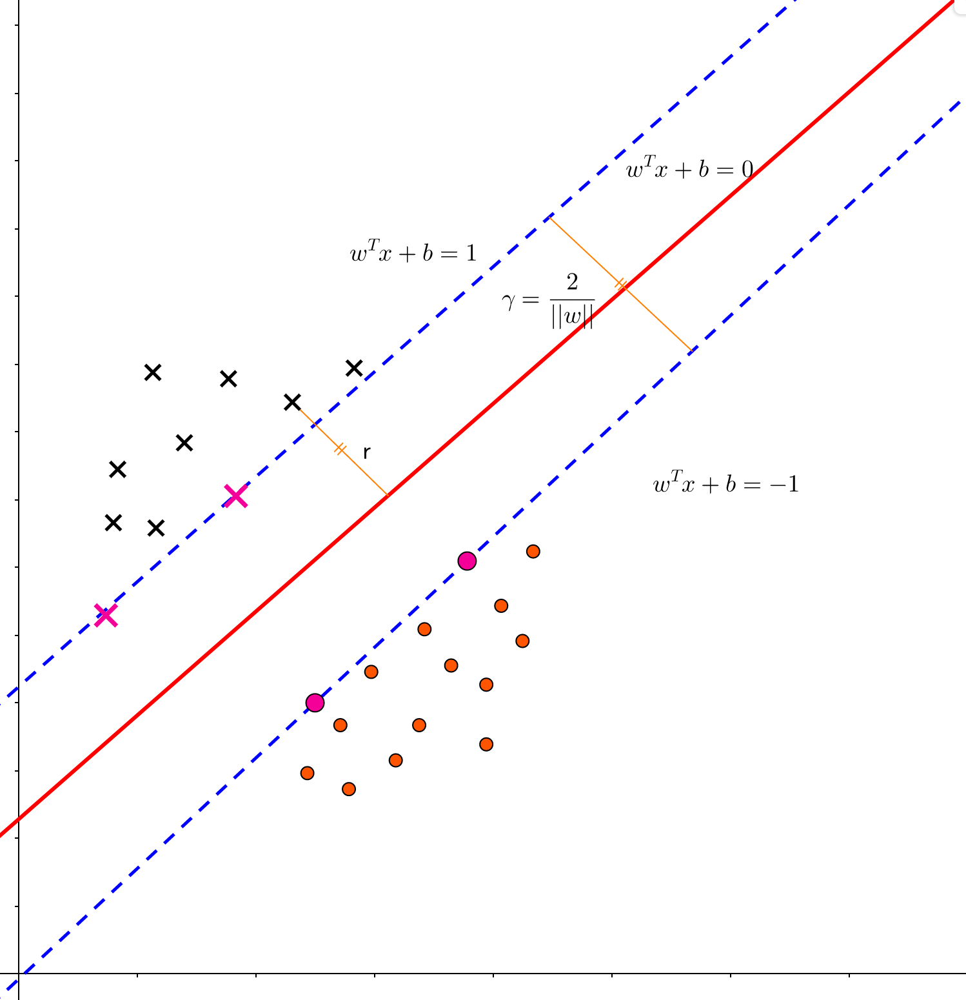
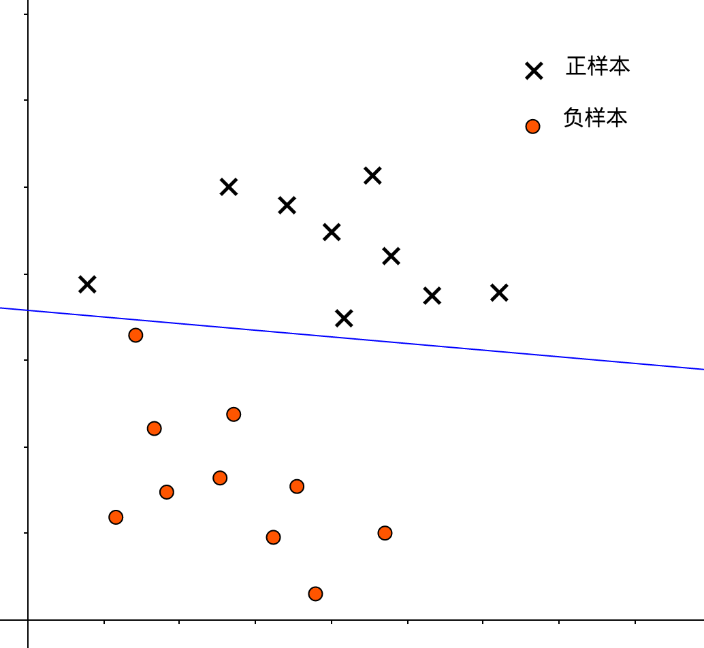
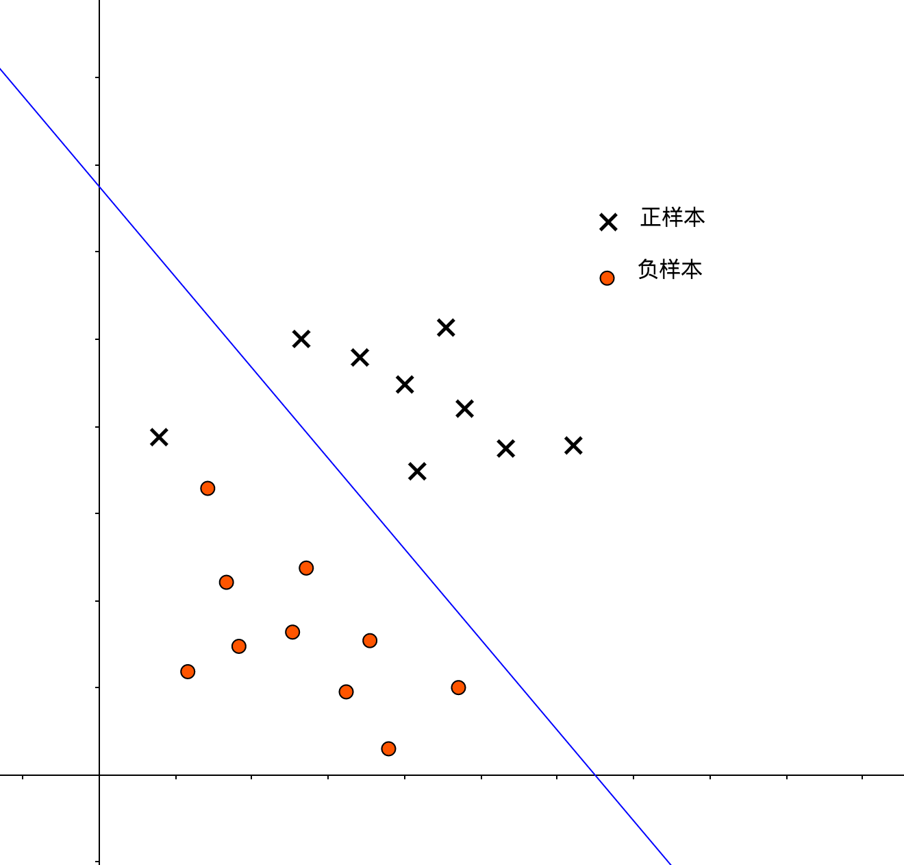
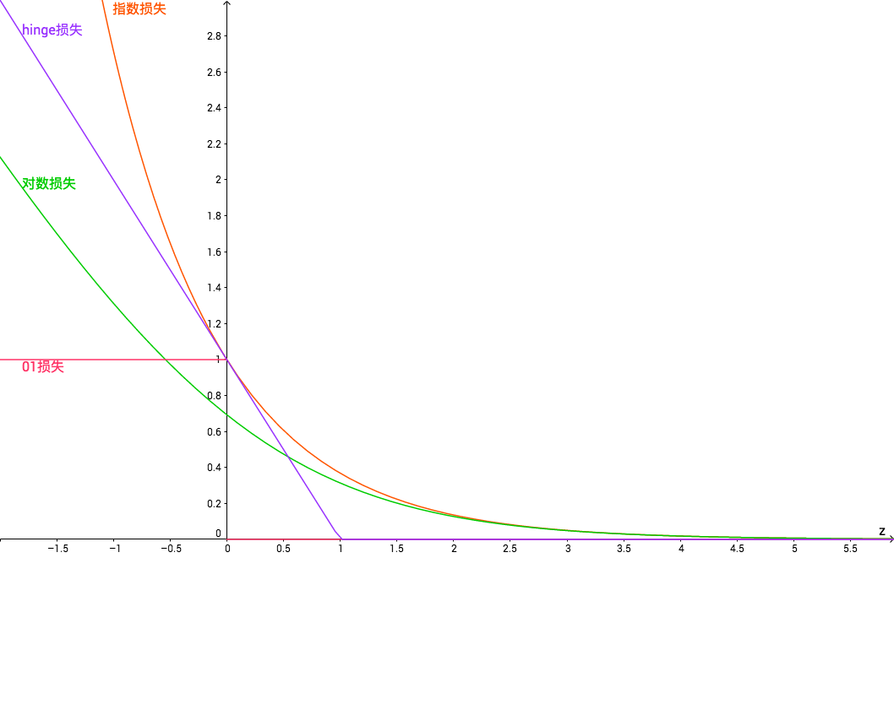
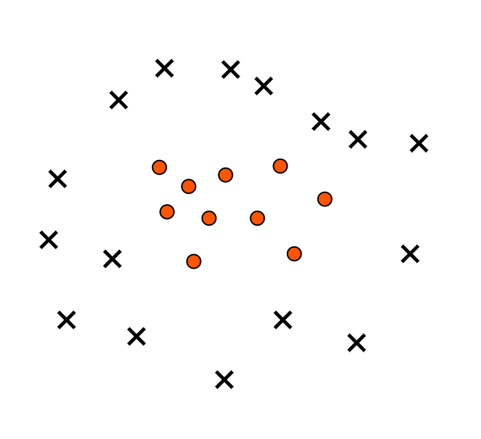

# 
Reference

  

## 决策边界
----
首先，用传统的权值定义式描述SVM决策边界（划分超平面）：

$$
w^Tx + b = 0 \tag{1}
$$

* $$w$$表示权值向量，对应了决策边界的法向量。
* $$b$$表示偏置，也称位移项，表示决策边界距坐标原点距离。

将决策边界记为$$(w,b)$$，那么样本$$x$$到决策边界距离为：

$$
r = \frac{|w^Tx + b|}{||w||} \tag{2}
$$

将正样本标为1，负样本标为-1，则SVM期望预测可重新描述为：

$$
\begin{cases}
w^Tx^{(i)} + b \geq +1, \quad \mbox{if $y^{(i)} = +1$} \\
w^Tx^{(i)} + b \leq -1, \quad \mbox{if $y^{(i)} = -1$}
\end{cases}
\tag{3}
$$

即：

$$
y^{(i)} (w^Tx^{(i)} + b) \geq 1 \tag {4}
$$

使等号成立的样本称为支持向量（Support Vectors），两个异类支持向量到决策边界的距离和为：

$$
\gamma = \frac{2}{||w||} \tag{5}
$$

$$\gamma$$称为间隔。

</img>

SVM就是力图使$$\gamma$$够大，从而获得更好的泛化：

$$
\begin{align*}
& \max_{w, b} \frac{2}{||w||} \\
\mbox{s.t}. \quad & y^{(i)}(w^Tx^{(i)} + b) \geq 1, \quad i = 1,2,...,m
\end{align*}
\tag{6}
$$

可转为二次优化问题：

$$
\begin{align*}
& \min_{w,b} \frac{1}{2} ||w||^2 \\
\mbox{s.t.} \quad & y^{(i)}(w^Tx^{(i)} + b) \geq 1, \quad i = 1,2,...,m
\end{align*}
\tag{7}
$$

  

## 硬间隔与软间隔
----
红色决策边界表示一种较硬的间隔划分，能将所有正负样本区分：

</img>

**硬间隔不一定好，只是对训练样本作出极佳拟合，易造成过拟合**。下图则展示较软的间隔，决策边界允许部分分类异常，避免过拟合。但如果过软，易造成欠拟合：

</img>

鉴于此，在优化过程中添加参数$$C$$控制间隔“软硬”：

$$
\begin{align*}
& \min_{w,b}\frac{1}{||w||^2} + C\sum_{i=1}^m \ell(y^{(i)}(w^Tx^{(i)})-1) \\
\mbox{s.t.} \quad & y^{(i)}(w^Tx^{(i)} + b) \geq 1, \quad i = 1,2,...,m
\end{align*}
\tag{8}
$$

其中，$$\ell(z)$$是损失函数，衡量样本$$x$$与真实值$$y^{(i)}$$近似程度。当$$C$$取值越大，为最优化问题，需$$\ell(z)$$越小，即各样本都要尽可能分类正确，这提高训练准确率，但也面临过拟合的问题。

| $$C$$ 取值 | 优势           | 可能面临问题 |
|:-----------|:---------------|:-------------|
| 大         | 提高训练精度   | 过拟合       |
| 小         | 解决过拟合问题 | 欠拟合       |

故而，$$C$$扮演回归问题中正则化参数$$\frac{1}{\lambda}$$角色。当$$C$$取值趋于$$\infty$$时，模型变为硬间隔支持向量机。

常见损失函数：

| 名称      | 函数式                                                                                       |
|:----------|:---------------------------------------------------------------------------------------------|
| 0/1 损失   | $$ \ell(z) = \begin{cases} 1, \quad \mbox{if $z \lt 0$} \\ 0, \mbox{otherwise} \end{cases}$$ |
| hinge 损失 | $$ \ell(z) = max(0, 1-z) $$                                                                  |
| 指数损失  | $$\ell(z) = exp(-z)$$                                                                        |
| 对数损失  | $$ \ell(z) = log(1+exp(-z)) $$                                                               |

若采用hinge损失函数，式8可具体为：

$$
\min_{w,b} \frac{1}{2}||w||^2 + C\sum_{i=1}^m max(0, 1- y^{(i)}(w^Tx^{(i)} + b)) \tag{9}
$$

</img>

引入松弛变量（slack variables）$$\xi^{(i)} \geq 0$$，将式9改写为：

$$
\begin{align*}
& \min_{w,b,\xi^{(i)}} \frac{1}{2}||w||^2 +C\sum_{i=1}^m\xi^{(i)} \\
\mbox{s.t.} \quad & y^{(i)}(w^Tx^{(i)} + b) \geq 1 - \xi^{(i)} \\
& \xi^{(i)} \geq 0, i=1,2,3,...,m
\end{align*}
\tag{10}
$$

这就构成 软间隔支持向量机。

**松弛变量，就是控制每个样本受到约束的程度。$$\xi^{(i)}$$越大，则受约束程度越小（越松弛）。**

- 当$$\xi^{(i)} > 1$$，则$$max(0, 1- y^{(i)}(w^Tx^{(i)} + b)) > 1$$，即$$y^{(i)}$$与$$(w^Tx^{(i)} + b))$$异号，分类错误。
- 当$$\xi^{(i)}=0$$，则$$max(0, 1- y^{(i)}(w^Tx^{(i)} + b)) = 0$$，即$$ 1- y^{(i)}(w^Tx^{(i)} + b) = 0$$，样本落在最大间隔边界。
- 当$$ 0 \lt \xi^{(i)} \leq 1$$，则$$max(0, 1- y^{(i)}(w^Tx^{(i)} + b)) \leq 1$$，即$$ 0 \leq 1- y^{(i)}(w^Tx^{(i)} + b) \ 1$$，样本落在最大间隔与决策边界间。

  

## 对偶问题
----
对式10的优化模型，应用[拉格朗日乘子法](https://en.wikipedia.org/wiki/Lagrange_multiplier)获得拉格朗日函数如下：

$$
\begin{align*}
L(w,b,\alpha,\xi,\mu) =& \frac{1}{2}||w||^2 + C\sum_{i=1}^m\xi^{(i)} \\
& +\sum_{i=1}^m\alpha^{(i)}(1-\xi^{(i)}-y_i(w^Tx_i + b)) - \sum_{i=1}^m \mu^{(i)} \xi^{(i)}
\end{align*}
\tag{11}
$$

其中，$$\alpha^{(i)} \geq 0$$，$$\mu^{(i)} \geq 0$$是拉格朗日乘子。令$$L(w,b,\alpha,\xi,\mu)$$对$$w$$，$$b$$，$$\xi^{(i)}$$的偏导为0得：

$$
\begin{align*}
w &= \sum_{i=1}^m \alpha^{(i)} y^{(i)} x^{(i)} \tag{12} \\
0 &= \sum_{i=1}^m \alpha^{(i)} y^{(i)} \tag{13} \\
C &= \alpha^{(i)} + \mu^{(i)} \tag{14}
\end{align*}
$$

带入式1得：

$$
\begin{align*}
f(x) &= w^Tx + b \\
    &= \sum_{i=1}^m\alpha^{(i)} y^{(i)} (x^{(i)})^T x + b
\end{align*}
\tag{15}
$$

将式12-14代入式11，得式10对偶问题：

$$
\begin{align*}
& \max_{\alpha} \sum_{i=1}^m\alpha^{(i)} - \frac{1}{2}\sum_{i=1}^m\sum_{j=1}^m \alpha^{(i)} \alpha^{(j)} y^{(i)} y^{(j)} (x^{(i)})^T x^{(j)} \\
\mbox{s.t.} \quad & \sum_{i=1}^m \alpha^{(i)} y^{(i)} = 0, \\
& 0 \leq \alpha^{(i)} \leq C, i=1,2,...,m
\end{align*}
\tag{16}
$$

对软间隔支持向量机，[KKT 条件](https://en.wikipedia.org/wiki/Karush%E2%80%93Kuhn%E2%80%93Tucker_conditions)要求：

$$
\begin{cases}
\alpha^{(i)} \geq 0, \mu^{(i)} \geq 0, \\
y^{(i)}f(x^{(i)}) - 1 + \xi_i \geq 0, \\
\alpha^{(i)}(y^{(i)}f(x^{(i)})-1+\xi^{(i)})) = 0, \\
\xi^{(i)} \geq 0, \mu^{(i)}\xi^{(i)} = 0
\end{cases}
\tag{17}
$$

由$$\alpha^{(i)}(y^{(i)}f(x^{(i)}-1+\xi^{(i)})) = 0$$得，对任意训练样本$$(x^{(i)}, y^{(i)})$$，有$$\alpha^{(i)} = 0$$或$$y^{(i)}f(x^{(i)}) = 1 - \xi^{(i)}$$。

- 若$$\alpha^{(i)} = 0 $$，由$$C = \mu^{(i)} + \alpha^{(i)}$$得$$\mu^{(i)} = C$$，进而知$$\xi^{(i)} = 0$$：

$$
y^{(i)}f(x^{(i)}) - 1 \geq 0 \tag{18}
$$

> 此时，$$x^{(i)}$$不会对模型$$f(x)$$产生影响。

- 若$$0 < \alpha^{(i)} < C$$，则有$$y^{(i)}f(x^{(i)}) -1 + \xi^{(i)} = 0$$，由$$C = \mu^{(i)} + \alpha^{(i)}$$得，$$\mu^{(i)} > 0$$，则$$\xi^{(i)} = 0$$，综合得：

$$
y^{(i)}f(x^{(i)}) - 1 = 0 \tag{19}
$$

> 此时，样本$$x^{(i)}$$为支持向量。

- 若$$\alpha^{(i)} = C$$，有$$y^{(i)}f(x^{(i)}) -1 + \xi^{(i)} = 0$$，由$$C = \mu^{(i)} + \alpha^{(i)}$$得$$\mu^{(i)} = 0$$，此时$$\xi^{(i)} \geq 0$$，得：

$$
y^{(i)}f(x^{(i)}) - 1 \leq 0 \tag{20}
$$

> 此时，样本$$x^{(i)}$$落在最大间隔与决策边界间（$$\xi^{(i)} \leq 1$$），或分类错误（$$\xi^{(i)} > 1$$）。即，样本异常不会被模型$$f(x)$$考虑。

综上，不但可将KKT条件写为：

$$
\begin{align*}
& \alpha^{(i)}=0\Leftrightarrow y^{(i)}f(x^{(i)})\geq1,\\
& 0<\alpha^{(i)}<C\Leftrightarrow y^{(i)}f(x^{(i)})=1,\\
& \alpha^{(i)}=C\Leftrightarrow y^{(i)}f(x^{(i)})\leq 1.
\end{align*}
\tag{21}
$$

且还知道采用hinge损失函数最终模型$$f(x)$$仅与支持向量有关。

  

## 核函数
----
假定数据分布不是线性可分：

</img>

逻辑回归通过多项式扩展创建新的高维特征，从而将低维线性不可分转为高维线性可分。SVM仍考虑将低维不可分转换到高维可分：

$$
f(x) = w^T\phi(x)+b \tag{22}
$$

$$\phi(x)$$对应$$x$$高维度特征向量。此时，SVM优化模型的对偶问题为：

$$
\begin{align*}
& \max_{\alpha} = \sum_{i=1}^m\alpha^{(i)}
- \frac{1}{2}\sum_{i=1}^m\sum_{j=1}^m \alpha^{(i)} \alpha^{(j)} y^{(i)} y^{(j)} \phi(x^{(i)})^T \phi(x^{(i)}) \\
\mbox{s.t.} \quad & \sum_{i=1}^m \alpha^{(i)} y^{(i)} = 0, \\
& 0 \leq \alpha^{(i)} \leq C, \quad i=1,2,3,...,m
\end{align*}
\tag{23}
$$

令$$\kappa(x^{(i)}, x^{(j)})$$表示$$x^{(i)}$$与$$x^{(j)}$$内积：

$$
\kappa(x^{(i)}, x^{(j)}) = \langle \phi(x^{(i)}, \phi(x^{(j)})) \rangle = \phi(x^{(i)})^T \phi(x^{(j)}) \tag{24}
$$

函数$$\kappa$$表示了核函数（kernel function），引入后，优化模型可写为：

$$
\begin{align*}
& \max_{\alpha} = \sum_{i=1}^m\alpha^{(i)}
- \frac{1}{2}\sum_{i=1}^m\sum_{j=1}^m \alpha^{(i)} \alpha^{(j)} y^{(i)} y^{(j)} \kappa(x^{(i)}, x^{(j)}) \\
\mbox{s.t.} \quad & \sum_{i=1}^m \alpha^{(i)} y^{(i)} = 0, \\
& 0 \leq \alpha^{(i)} \leq C, \quad i=1,2,3,...,m
\end{align*}
\tag{26}
$$

求解后，得模型：

$$
\begin{align*}
f(x)  &= w^T\phi(x) + b \\
&= \sum_{i=1}^m\alpha^{(i)}y^{(i)}\phi(x^{(i)})^T\phi(x) + b \\
&= \sum_{i=1}^m\alpha^{(i)}y^{(i)}\kappa(x, x^{(i)}) + b
\end{align*}
\tag{27}
$$

| 核函数     | 表达式（$$\kappa(x^{(i)}, x^{(j)})$$）     | 参数                                                                                          |
|:-----------|:-------------------------------------------|:----------------------------------------------------------------------------------------------|
| 线性核     | $$(x^{(i)})^T x^{(j)}$$                    |                                                                                               |
| 高斯核     | $$exp(-\frac{                              | |x^{(i)} - x^{(j)}||^2}{2\delta^2})$$ | $$\delta$$ 为高斯核带宽                               |
| 多项式核   | $$((x^{(i)})^T x^{(j)})^d$$                | $$ d \geq 1$$ 为多项式次数                                                                    |
| 拉普拉斯核 | $$exp(-\frac{                              | |x^{(i)} - x^{(j)}||^2}{\delta})$$                                      |     $$\delta > 0 $$ |
| Sigmoid 核  | $$tanh(\beta(x^{(i)})^Tx^{(j)} + \theta)$$ | $$tanh$$为双曲正切函数，$$\beta > 0, \theta < 0$$                                             |
