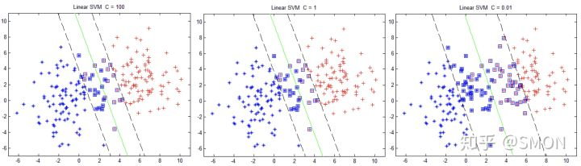

# 
Soft Margin

  

## 线性SVM——软间隔
----
假设训练数据不是严格线性可分：

解决办法是允许SVM在少量样本上出错，即将硬间隔最大化条件放宽，为此引入软间隔（soft margin）概念，即允许少量样本不满足约束

$$
y_i(x_i^Tw+b) \ge 1 \tag{3.1.1}
$$

在最化大间隔同时，不满足约束样本应尽可能少，于是优化目标：

$$
\min_{\omega,b}\frac{1}{2}\Arrowvert \omega \Arrowvert^2 + C\sum_{i=1}^{m}\ell_{0/1}(y_i(\boldsymbol{\omega}^{T}\boldsymbol{x}_i + b) - 1) \tag{18}
$$

其中$$C>0$$是常数，$$\ell_{0/1}$$是0/1损失函数：

$$
\ell_{0/1}(z)
\begin{cases}
  1,&if\;z \lt 0 \\
  0,&otherwise
\end{cases}
$$

C无穷大时，式18会迫使所有样本满足约束式3.1.1，于是式18等价于式2.2.4；当C取有限值时，式18允许一些样本不满足约束。

  

## 替代损失
----
为使不满足条件的样本点尽可能少，需在优化目标函数2.2.2里面新增一个对这些点的惩罚项。通常使用一些函数替代$$\ell_{0/1}$$损失函数，称为替代损失（surrogate loss）。替代函数一般由较好的数学性质，如通常是凸连续函数且是$$\ell_{0/1}$$上界，常用的替代函数有：

* hinge损失：$$\ell_{hinge}(z)=max(0, 1-z)$$
* 指数损失函数（exponential loss）：$$\ell_{exp}(z)=exp(-z)$$
* 对率损失函数（logistic loss）：$$\ell_{log}(z)=log(1+exp(-z))$$

损失函数的对比图如下：

使用hinge损失函数来做惩罚，即若样本点满足约束条件损失就是0，否则是$$1-z$$。则优化目标2.2.2变成

$$
\underset{w,b}{\mathrm{min}} \frac 1 2 ||w||^2 + C \sum_{i=1}^n max(0, 1 - y_i(x_i^Tw+b)) \tag{3.1.3}
$$

其中$$C > 0$$称为惩罚参数，C越小时对误分类惩罚越小，越大时对误分类惩罚越大。当C取正无穷时，变成硬间隔优化。实际应用时C越小越容易欠拟合，C越大越容易过拟合。引入松弛变量（slack variable）$$\xi_i \ge 0$$，那么式3.1.3可重写成

$$
\underset{W,b,\xi}{min} \quad \frac 1 2 ||W||^2 + C \sum_{i=1}^n \xi_i\\ s.t.\ y_i(X_i^TW+b) \ge 1-\xi_i \\ \xi_i \ge 0, i=1,2,...n. \tag{3.1.4}
$$

上式所述问题即软间隔支持向量机。

引入非负参数$$\xi_i$$后，允许某些样本点函数间隔小于1，即在最大间隔区间里，或者函数间隔是负数，即样本点在对方区域。放松限制条件后，需重新调整目标函数，以对离群点处罚。目标函数后加上第二项表示离群点越多，目标函数值越大，而要求的是尽可能小目标函数值。这里C是离群点权重，是一个事先确定好的常量。C越大表明离群点对目标函数影响越大，也就是越不希望看到离群点。这时，间隔也会很小。目标函数控制了离群点的数目和程度，使大部分样本点仍遵守限制条件。

  

## 对偶问题
式3.1.4表示的软间隔支持向量机是凸二次规划问题，和硬间隔支持向量机类似，可通过拉格朗日乘子法将其转换为对偶问题求解。式3.1.4对应的拉格朗日函数为

$$
L(w,b,\xi,\alpha,\beta)=\frac 1 2 ||w||^2 + C \sum_{i=1}^n \xi_i - \sum_{i=1}^n \alpha_i [y_i(x_i^Tw+b) - 1 + \xi_i] - \sum_{i=1}^n \beta_i \xi_i \tag{3.2.1}
$$

其中$$\alpha_i \ge 0$$，$$\alpha_i \ge 0$$是拉格朗日乘子。为求得对偶问题解，先求$$L(W,b,\xi,\alpha,\beta)$$对$$W$$、$$b$$和$$\xi$$的极小，再求对$$\alpha$$和$$\beta$$的极大。

* 求$$\underset{W, b, \xi}{min} L(W,b,\xi,\alpha,\beta)$$

将$$L(W,b,\xi,\alpha,\beta)$$分别对$$W$$、$$b$$和$$\xi$$求偏导并令为0可得
    
$$
W=\sum_{i=1}^n \alpha_i y_i X_i \tag{3.2.2}
$$
$$
\sum_{i=1}^n \alpha_i y_i = 0 \tag{3.2.3}
$$
$$
C = \alpha_i + \beta_i \tag{3.2.4}
$$

将三个式子代入式3.2.1并进行类似式2.4.8的推导得

$$
\underset{W, b, \xi}{min} L(W,b,\xi,\alpha,\beta) = -\frac 1 2 \sum_{i=1}^n \sum_{j=1}^n \alpha_i \alpha_j y_i y_j X_i^T X_j \ + \ \sum_{i=1}^n \alpha_i \tag{3.2.5}
$$

注意其中$$\beta$$被消去了。

* 求$$\underset{W, b, \xi}{min} L(W,b,\xi,\alpha,\beta)$$对$$\alpha$$极大

式3.2.5对$$\alpha$$求极大等价于式3.2.5取负数后对$$\alpha$$求极小，即
    
$$
\underset{\alpha}{min} \quad \frac 1 2 \sum_{i=1}^n \sum_{j=1}^n \alpha_i \alpha_j y_i y_j X_i^T X_j \ - \ \sum_{i=1}^n \alpha_i \tag{3.2.6}
$$

同时满足约束条件
    
$$
\sum_{i=1}^n \alpha_i y_i = 0 \\ \quad 0 \le \alpha_i \le C, i=1,2,...,n. \tag{3.2.7}
$$

至此，得到了原始最优化问题3.1.4和对偶最优化问题3.2.6、3.2.7。

假设通过通用二次规划求解方法或SMO算法求得式3.2.6和式3.2.7最优解$$\hat{\alpha}$$，则根据式3.2.2可求得最优$$\hat{W}$$：

$$
\hat{W}= \sum_{i=1}^n \hat{\alpha}_i y_i X_i \tag{3.2.8}
$$

  

## KKT条件
----
软间隔支持向量机的KKT条件要求：

$$
\begin{cases} 乘子非负: \alpha_i \ge 0 ,\enspace \beta_i \ge 0 (i=1,2,...n.下同)\\ 约束条件: y_i(X_i^TW+b) - 1\ge \xi_i \\ 互补条件: \alpha_i [y_i(X_i^TW+b) - 1+\xi_i]=0, \enspace \beta_i \xi_i=0 \end{cases} \\
$$

可求得整个软间隔SVM的解：

$$
\hat{w}= \sum_{i \in SV} \hat{\alpha}_i y_i x_i \tag{3.2.9}
$$
$$
\hat{b} = y_j-\sum_{i \in SV} \hat{\alpha}_i y_i x_j^T x_i \tag{3.2.10}
$$

其中$$j$$需满足$$0 < \hat{\alpha}_j < C$$。

对任意样本$$(X_i, y_i)$$：
* 若$$\alpha_i=0$$，此样本点不是支持向量，不会对$$f(\boldsymbol{x})$$有任何影响；
* 若$$\alpha_i>0$$，则必有$$y_if(\boldsymbol{x}_i)=1-\xi_i$$，是支持向量。

若满足$$\alpha_i>0$$，进一步地，若$$0 < \alpha_i < C$$，由式3.2.4得$$\beta_i = 0$$。即刚好$$y_i(X_i^TW+b) =1$$，样本恰好在最大间隔边界上；若$$\alpha_i = C$$，有$$\beta_i > 0$$，此时若$$\beta_i < 1$$则该样本落在最大间隔内部；若$$\beta_i > 1$$，则该样本落在最大间隔内部即被错误分类。

如下图所示。

  

### 惩罚参数C
对不同惩罚参数C，SVM结果如图所示：

回忆原始目标函数：

$$
\underset{w,b,\xi}{min} \frac 1 2 ||w||^2 + C \sum_{i=1}^n \xi_i \\
$$

对于一般化问题，可将上述式子抽象成：

$$
\underset{f}{min} \Omega(f) + C \sum_{i=1}^n l(f(x_i),y_i) \tag{3.3.1}
$$

* 前一项可理解为结构风险（structural risk），描述所求模型某些性质。比如SVM要求间隔最大；
* 第二项称为经验风险（empirical risk），描述模型与训练数据契合程度，即误差。

参数C是对二者折中，即一方面要求模型满足某种性质，另一方面想使模型与训练数据契合。从正则化角度讲，$$\Omega(f)$$称为正则化项，$$C$$称为惩罚参数。$$C$$越大即对误分类惩罚越大，要求模型对训练模型更契合，可能存在过拟合；C越小，即相对更看重正则化项，可能存在欠拟合。

  