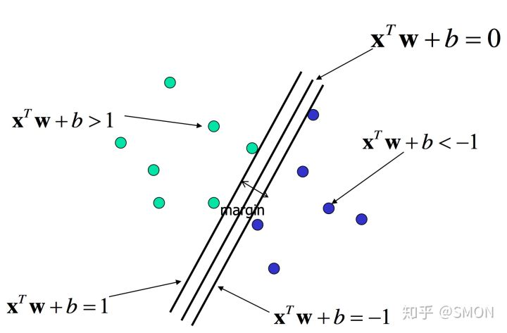
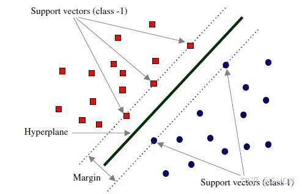
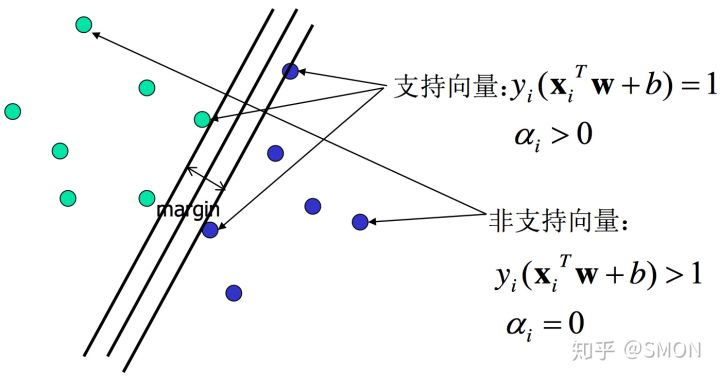
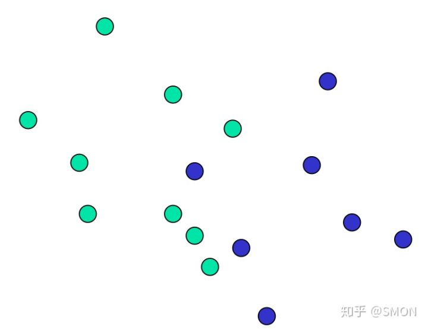
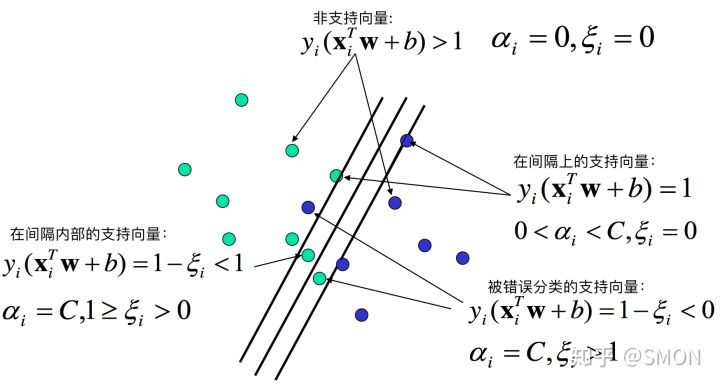
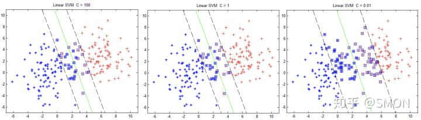

# 
SVM

  

优点：
* 由于SVM是凸优化问题，求得的解一定是全局最优。
* 不仅适用于线性线性问题还适用于非线性问题（用核技巧）。
* 高维样本空间数据也能用SVM。因为数据集复杂度只取决于支持向量而不是数据集维度，这在某种意义上避免了维数灾难。
* 理论基础完善，而神经网络像黑盒子。

缺点：
* 二次规划问题求解涉及$$m$$阶矩阵计算，其中$$m$$为样本个数。因此SVM不适用于超大数据集。(SMO算法可缓解这个问题)
* 只适用二分类问题。

  

## What
----

如果三条直线代表三个分类器，哪一个较好？直观感受应该是H3。H2分割线与最近数据点只有很小间隔，如果测试数据有噪声，可能会被H2错误分类（即对噪声敏感、泛化能力弱）。

对于支持向量机，数据点若是$$p$$维向量，用$$p-1$$维超平面分开这些点。但可能有许多超平面可把数据分类。最佳超平面合理选择是以最大间隔把两个类分开的超平面。因此，SVM选择能使离超平面最近的数据点的到超平面距离最大的超平面。

SVM的模型:

* 线性可分SVM
    
    当训练数据线性可分，通过硬间隔（hard margin）最大化可学习得到一个线性分类器，即硬间隔SVM，如上图H3。

* 线性SVM

    当训练数据不能线性可分但近似线性可分时，通过软间隔（soft margin）最大化也可学到一个线性分类器，即软间隔SVM。

* 非线性SVM

    当训练数据线性不可分，通过核技巧（kernel trick）和软间隔最大化，可以学到一个非线性SVM。

  

## 线性可分SVM——硬间隔
----
考虑如下线性可分训练数据集：

$$
(X_{1}, y_{1}), (X_{2}, y_{2}), ..., (X_{n}, y_{n})
$$

其中$$X_i$$是含有$$d$$个元素的列向量, 即$$X_i \in \mathbf{R}^d$$；$$y_i$$是标量，$$y \in {+1,-1}$$，$$y_i = 1$$时表示$$X_i$$属于正类别，$$y_i = -1$$时表示$$X_i$$属于负类别。

> $$X$$、$$X_i$$、$$W$$等都是列向量。

感知机使用误分类最小法求得超平面，不过解有无穷多个（如H2和H3及它俩任意线性组合）。线性可分SVM利用间隔最大化求最优分离超平面，这时解唯一。

 

### 超平面与间隔
一个超平面由法向量$$W$$和截距$$b$$决定，方程为$$X^T W+b=0$$。可规定法向量指向的一侧为正类，另一侧为负类。下图画出三个平行超平面，法方向取左上方向。

> 如果$$X$$和$$W$$都是列向量，即$$X^TW$$会得到$$X$$和$$W$$点积（dot product，标量），等价于$$X \cdot W$$和$$W \cdot X$$。

为找到最大间隔超平面，可先选择分离两类数据两个平行超平面，使它们距离尽可能大。这两个超平面范围内的区域称为间隔（margin），最大间隔超平面是位于它们正中间的超平面。

 

### 间隔最大化
将求两平行直线距离公式推广到高维可得图中margin的$$\rho$$：

$$
margin = \rho = \frac 2 {||W||} \tag{2.2.1}
$$

目标是使$$\rho$$最大，等价于使$$\rho^2$$最大：

$$
\underset{W,b}{max} \rho \iff \underset{W,b}{max} \rho^2 \iff \underset{W,b}{min}\frac 1 2 ||W||^2 \tag{2.2.2}
$$

> 上式$$\frac{1}{2}$$是为后续求导后刚好能消去，没有特殊意义。

约束条件：

$$
X_i^TW+b \ge +1, y_i=+1 \\ X_i^TW+b \le -1, y_i=-1 \tag{2.2.3}
$$

总结，间隔最大化数学表达是

$$
\underset{W,b}{min}J(W) = \underset{W,b}{min}\frac 1 2 ||W||^2 \\ s.t.\quad y_i(X_i^TW+b) \ge 1, i=1,2,...n. \tag{2.2.4}
$$

通过求解上式可得最优超平面$$\hat{W}$$和$$\hat{b}$$。

 

### 支持向量
在线性可分情况下，训练数据集的样本点中与分离超平面距离最近的数据点称为支持向量（support vector），支持向量是使式2.2.4中约束条件取等的点，即满足

$$
y_i(X_i^TW+b) = 1 \tag{2.3.1}
$$

的点，也即所有在直线$$X^TW+b = 1$$或直线$$X^TW+b = -1$$的点。如下图所示：

在决定最佳超平面时只有支持向量起作用，其他数据点不起作用。如果移动非支持向量，甚至删除非支持向量都不会对最优超平面产生影响，即支持向量对模型起决定作用，这是SVM名称的由来。

 

### 对偶问题
称式2.2.4所述问题为原始问题（primal problem），可应用拉格朗日乘子法构造拉格朗日函数（Lagrange function），再通过求解其对偶问题（dual problem）得到原始问题最优解。转换为对偶问题来求解原因是：

* 对偶问题更易求解，只需优化变量$$\alpha$$且约束条件简单；
* 更自然地引入核函数，进而推广到非线性问题。

首先构建拉格朗日函数。为此需引进拉格朗日乘子（Lagrange multiplier）$$\alpha_i \ge 0, i=1,2,...n$$。则拉格朗日函数为：

$$
L(W,b,\alpha)=\frac 1 2 ||W||^2 - \sum_{i=1}^n \alpha_i [y_i(X_i^TW+b)-1] \tag{2.4.1}
$$

给定$$W$$和$$b$$，若不满足式2.2.4约束条件，有

$$
\underset{\alpha}{max} L(W,b,\alpha) = +\infty \tag{2.4.2}
$$

否则，若满足式2.2.4约束条件，有

$$
\underset{\alpha}{max} L(W,b,\alpha) = J(W) = \frac 1 2 ||W||^2 \tag{2.4.3}
$$

结合式2.4.2和2.4.3知，优化问题

$$
\underset{W, b}{min} \underset{\alpha}{max} L(W,b,\alpha)\tag{2.4.4}
$$

与式2.2.4所述问题等价。

根据拉格朗日对偶性，式2.4.4所述问题即原始问题的对偶问题：

$$
\underset{\alpha}{max} \underset{W, b}{min} L(W,b,\alpha) \tag{2.4.5}
$$

为求得对偶问题解，需先求得$$L(W,b,\alpha)$$对$$W$$和$$b$$的极小再求对$$\alpha$$的极大。

* 求$$\underset{W, b}{min} L(W,b,\alpha)$$

    对拉格朗日函数求导并令导数为0，有
    
$$
\nabla_W L(W,b,\alpha) = W - \sum_{i=1}^n \alpha_i y_i X_i = 0 \implies W= \sum_{i=1}^n \alpha_i y_i X_i\tag{2.4.6}
$$

$$
abla_b L(W,b,\alpha) = - \sum_{i=1}^n \alpha_i y_i = 0 \implies \sum_{i=1}^n \alpha_i y_i = 0 \tag{2.4.7}
$$

    将上面两式代入$$L(W,b,\alpha)$$：

$$
\begin{split}
L(w,b,\alpha) &= \frac{1}{2} ||W||^{2} - \sum^{n}_{i=1} [y_{i}(x^{T}_{i}+b)-1] \\
&=\frac{1}{2} \sum^{n}_{i=1} \alpha_{i}y_{i}x^{T}_{i} \sum^{n}_{j=1} \aalpha_{j}y_{j}x_{j} - \sum^{n}_{i=1}\alpha_{i}y_{i}x^{T}_{i} \sum^{n}_{j=1}\alpha_{j}y_{j}x_{j} - b\sum^{n}_{i=1}\alpha_{i}y_{i} + \sum^{n}_{i=1}\alpha_{j} \\
&= \sum^{n}_{i=1}\alpha_{i} - \frac{1}{2}\sum^{n}_{i=1}\alpha_{i}y_{i}x_{i}^{T} \sum^{n}_{j=1}\alpha_{j}y_{j}x_{j} \\
&= \sume^{n}_{i=1}\alha_{i} - \frac{1}{2}\sum^{n}_{i,j=1}y_{i}y_{j}\alpha_{i}\alpha_{j}x^{T}_{i}
\end{split}
$$

    所以，

$$
\underset{W, b}{min} L(W,b,\alpha) = -\frac 1 2 \sum_{i=1}^n \sum_{j=1}^n \alpha_i \alpha_j y_i y_j X_i^T X_j \ + \ \sum_{i=1}^n \alpha_i \tag{2.4.8}
$$

* 求$$\underset{W, b}{min} L(W,b,\alpha)$$对$$\alpha$$的极大：

    等价于式2.4.8对$$\alpha$$求极大，也等价于式2.4.8取负数后对$$\alpha$$求极小，即

$$
\underset{\alpha}{min} \quad \frac 1 2 \sum_{i=1}^n \sum_{j=1}^n \alpha_i \alpha_j y_i y_j X_i^T X_j \ - \ \sum_{i=1}^n \alpha_i \tag{2.4.9}
$$

    同时满足约束条件：

$$
\sum_{i=1}^n \alpha_i y_i = 0 \\ \alpha_i \ge 0, i=1,2,...,n. \tag{2.4.10}
$$

至此，得到原始最优化问题2.2.4和对偶最优化问题2.4.9、2.4.10。

由slater条件知，因为原始优化问题目标函数和不等式约束条件都是凸函数，且该不等式约束严格可行（因为数据线性可分），所以存在$$\hat{W}$$、$$\hat{b}$$和$$\hat{\alpha}$$，使得$$\hat{W}$$和$$\hat{b}$$是原始问题解，$$\hat{\alpha}$$是对偶问题解。意味着求解原始最优化问题2.2.4可转换为求解对偶最优化问题2.4.9、2.4.10。

> slater条件：原始问题一般性表达为
>  
> $$
> \underset{x}{min} \quad f(x) \\ s.t. \ c_i(x) \le 0, i=1,2,...k \\ \quad \quad h_j(x) = 0, j=1,2,...,l
> $$
> 则其拉格朗日函数为
> $$
> L(x,\alpha,\beta)=f(x) + \sum_{i=1}^k \alpha_i c_i(x) + \sum_{j=1}^l \beta_j h_j(x), \quad \alpha_i \ge 0
> $$
> 假设原始问题目标函数$$f(x)$$和不等式约束条件$$c_i(x)$$是凸函数，原始问题等式约束$$h_j(x)$$是仿射函数，且不等式约束$$c_i(x)$$严格可行，即存在$$x$$对所有$$i$$都有$$c_i(x) < 0$$，则存在$$\hat{x}$$、$$\hat{\alpha}$$和$$\hat{\beta}$$，使$$\hat{x}$$是原始问题解，$$\hat{\alpha}$$和$$\hat{\beta}$$是对偶问题解。

如何求解优化问题2.4.9、2.4.10的最优解$$\hat{\alpha}$$？不难发现这是一个二次规划问题，有现成通用算法来求解。

> 通用的求解二次规划问题算法复杂度正比于训练数据样本数，所以实际应用中需寻求更高效算法，例如序列最小优化（Sequential Minimal Optimiation，SMO）算法。

假设现在求得2.4.9、2.4.10最优解$$\hat{\alpha}$$，则根据式2.4.6可求得最优$$\hat{W}$$：

$$
\hat{W}= \sum_{i=1}^n \hat{\alpha}_i y_i X_i \tag{2.4.11}
$$

因为至少存在一个$$\hat{\alpha}_j > 0$$（若不存在，即$$\hat{\alpha}$$全为0，则$$\hat{W}=0$$，即$$margin = \frac 2 {||\hat{W}||}= \infty$$，显然不行），再根据KKT条件：

$$
\begin{cases} 乘子非负: \alpha_i \ge 0 (i=1,2,...n.下同) \\ 约束条件: y_i(X_i^TW+b) - 1\ge 0 \\ 互补条件: \alpha_i (y_i(X_i^TW+b) - 1)=0 \end{cases} \\
$$

所以至少存在一个$$j$$，使$$y_j(X_j^T \hat{W}+\hat{b}) - 1=0$$。可求得最优$$\hat{b}$$：

$$
\begin{aligned} \hat{b} & = \frac 1 {y_j} -X_j^T \hat{W} \\ & = y_j -X_j^T \hat{W} \\ & = y_j-\sum_{i=1}^n \hat{\alpha}_i y_i X_j^T X_i \end{aligned} \tag{2.4.12}
$$

至此，求得了整个线性可分SVM解。求得的分离超平面为：

$$
\sum_{i=1}^n \hat{\alpha}_i y_i X^TX_i + \hat{b}=0 \tag{2.4.13}
$$

分类决策函数为

$$
f(X) = sign(\sum_{i=1}^n \hat{\alpha}_i y_i X^TX_i + \hat{b}) \tag{2.4.14}
$$

再来分析KKT条件里的互补条件。对任意样本$$(X_i, y_i)$$，总有$$\alpha_i=0$$或$$y_if(X_i)=y_i(X_i^T \hat{W}+b) = 1$$。若$$\alpha_i=0$$，此样本点不是支持向量，对模型没有作用；若$$\alpha_i>0$$，此样本点位于最大间隔边界上，是一个支持向量，如下图所示。

此外，当样本点是非支持向量时，因为$$\alpha_i=0$$，所以SVM的解中的求和项中第$$i$$项为0，所以SVM的解2.4.11、2.4.12可简化为：

$$
\hat{W}= \sum_{i \in SV} \hat{\alpha}_i y_i X_i \tag{2.4.15}\hat{b} = y_j-\sum_{i \in SV} \hat{\alpha}_i y_i X_j^T X_i \tag{2.4.16}
$$

类似，判别函数也可转换成如下形式：

$$
f(X) = sign(\sum_{i \in SV} \hat{\alpha}_i y_i X^TX_i + \hat{b}) \tag{2.4.17}
$$

所以，整个SVM解只与支持向量有关。

  

## 线性SVM——软间隔
----
假设训练数据不是严格线性可分：

解决办法是允许SVM在少量样本上出错，即将硬间隔最大化条件放宽，为此引入软间隔（soft margin）概念，即允许少量样本不满足约束

$$
y_i(X_i^TW+b) \ge 1 \tag{3.1.1}
$$

为使不满足条件的样本点尽可能少，需在优化目标函数2.2.2里面新增一个对这些点的惩罚项。常用的是hinge损失：

$$
l_{hinge}(z) = max(0, 1-z) \tag{3.1.2}
$$

即若样本点满足约束条件损失就是0，否则是$$1-z$$。则优化目标2.2.2变成

$$
\underset{W,b}{min} \quad \frac 1 2 ||W||^2 + C \sum_{i=1}^n max(0, 1 - y_i(X_i^TW+b)) \tag{3.1.3}
$$

其中$$C > 0$$称为惩罚参数，C越小时对误分类惩罚越小，越大时对误分类惩罚越大。当C取正无穷时，变成硬间隔优化。实际应用时C越小越容易欠拟合，C越大越容易过拟合。

如果引入松弛变量$$\xi_i \ge 0$$，那么式3.1.3可重写成

$$
\underset{W,b,\xi}{min} \quad \frac 1 2 ||W||^2 + C \sum_{i=1}^n \xi_i\\ s.t.\ y_i(X_i^TW+b) \ge 1-\xi_i \\ \xi_i \ge 0, i=1,2,...n. \tag{3.1.4}
$$

上式所述问题即软间隔支持向量机。

 

## 对偶问题
式3.1.4表示的软间隔支持向量机是凸二次规划问题，和硬间隔支持向量机类似，可通过拉格朗日乘子法将其转换为对偶问题求解。式3.1.4对应的拉格朗日函数为

$$
L(W,b,\xi,\alpha,\beta)=\frac 1 2 ||W||^2 + C \sum_{i=1}^n \xi_i - \sum_{i=1}^n \alpha_i [y_i(X_i^TW+b) - 1 + \xi_i] - \sum_{i=1}^n \beta_i \xi_i \tag{3.2.1}
$$

为求得对偶问题解，先求$$L(W,b,\xi,\alpha,\beta)$$对$$W$$、$$b$$和$$\xi$$的极小，再求对$$\alpha$$和$$\beta$$的极大。

* 求$$\underset{W, b, \xi}{min} L(W,b,\xi,\alpha,\beta)$$

    将$$L(W,b,\xi,\alpha,\beta)$$分别对$$W$$、$$b$$和$$\xi$$求偏导并令为0可得
    
$$
W=\sum_{i=1}^n \alpha_i y_i X_i \tag{3.2.2}
$$
$$
\sum_{i=1}^n \alpha_i y_i = 0 \tag{3.2.3}
$$
$$
C = \alpha_i + \beta_i \tag{3.2.4}
$$

    将三个式子代入式3.2.1并进行类似式2.4.8的推导得

$$
\underset{W, b, \xi}{min} L(W,b,\xi,\alpha,\beta) = -\frac 1 2 \sum_{i=1}^n \sum_{j=1}^n \alpha_i \alpha_j y_i y_j X_i^T X_j \ + \ \sum_{i=1}^n \alpha_i \tag{3.2.5}
$$

    注意其中$$\beta$$被消去了。

* 求$$\underset{W, b, \xi}{min} L(W,b,\xi,\alpha,\beta)$$对$$\alpha$$极大

    式3.2.5对$$\alpha$$求极大等价于式3.2.5取负数后对$$\alpha$$求极小，即
    
$$
\underset{\alpha}{min} \quad \frac 1 2 \sum_{i=1}^n \sum_{j=1}^n \alpha_i \alpha_j y_i y_j X_i^T X_j \ - \ \sum_{i=1}^n \alpha_i \tag{3.2.6}
$$

    同时满足约束条件
    
$$
\sum_{i=1}^n \alpha_i y_i = 0 \\ \quad 0 \le \alpha_i \le C, i=1,2,...,n. \tag{3.2.7}
$$

至此，得到了原始最优化问题3.1.4和对偶最优化问题3.2.6、3.2.7。

假设通过通用二次规划求解方法或SMO算法求得式3.2.6和式3.2.7最优解$$\hat{\alpha}$$，则根据式3.2.2可求得最优$$\hat{W}$$：

$$
\hat{W}= \sum_{i=1}^n \hat{\alpha}_i y_i X_i \tag{3.2.8}
$$

再根据KKT条件，即
$$
\begin{cases} 乘子非负: \alpha_i \ge 0 ,\enspace \beta_i \ge 0 (i=1,2,...n.下同)\\ 约束条件: y_i(X_i^TW+b) - 1\ge \xi_i \\ 互补条件: \alpha_i [y_i(X_i^TW+b) - 1+\xi_i]=0, \enspace \beta_i \xi_i=0 \end{cases} \\
$$

可求得整个软间隔SVM的解：

$$
\hat{W}= \sum_{i \in SV} \hat{\alpha}_i y_i X_i \tag{3.2.9}\hat{b} = y_j-\sum_{i \in SV} \hat{\alpha}_i y_i X_j^T X_i \tag{3.2.10}
$$

其中$$j$$需满足$$0 < \hat{\alpha}_j < C$$。

对任意样本$$(X_i, y_i)$$：
* 若$$\alpha_i=0$$，此样本点不是支持向量；
* 若$$\alpha_i>0$$，此样本是支持向量。

若满足$$\alpha_i>0$$，进一步地，若$$0 < \alpha_i < C$$，由式3.2.4得$$\beta_i = 0$$。即刚好$$y_i(X_i^TW+b) =1$$，样本恰好在最大间隔边界上；若$$\alpha_i = C$$，有$$\beta_i > 0$$，此时若$$\beta_i < 1$$则该样本落在最大间隔内部；若$$\beta_i > 1$$，则该样本落在最大间隔内部即被错误分类。

如下图所示。

 

### 惩罚参数C
对不同惩罚参数C，SVM结果如图所示：

回忆原始目标函数：

$$
\underset{W,b,\xi}{min} \quad \frac 1 2 ||W||^2 + C \sum_{i=1}^n \xi_i \\
$$

对于一般化问题，可将上述式子抽象成：

$$
\underset{f}{min} \quad \Omega(f) + C \sum_{i=1}^n l(f(x_i),y_i) \tag{3.3.1}
$$

* 前一项可理解为结构风险（structural risk），描述所求模型某些性质。比如SVM要求间隔最大；
* 第二项称为经验风险（empirical risk），描述模型与训练数据契合程度，即误差。

参数C是对二者折中，即一方面要求模型满足某种性质，另一方面想使模型与训练数据契合。从正则化角度讲，$$\Omega(f)$$称为正则化项，$$C$$称为惩罚参数。$$C$$越大即对误分类惩罚越大，要求模型对训练模型更契合，可能存在过拟合；C越小，即相对更看重正则化项，可能存在欠拟合。

  

## 非线性SVM——核技巧
----
经常遇到非线性的问题（如异或问题），此时需用到核技巧（kernel trick）将线性支持向量机推广到非线性支持向量机。

> 不仅仅是SVM，很多线性模型都可用核技巧。

 

### 核函数
如下所示，核技巧基本思路为两步：
1. 使用一个变换将原空间数据映射到新空间，例如更高维甚至无穷维空间；
2. 在新空间用线性方法从训练数据中学习得到模型。

核函数定义是设$$\mathcal{X}$$是输入空间（欧式空间$$R^n$$子集或离散集合），又设$$\mathcal{H}$$是特征空间（希尔伯特空间）。如果存在一个$$\mathcal{X}$$到$$\mathcal{H}$$映射$$\phi(x): \mathcal{X} \to \mathcal{H}$$使得对所有$$x,z \in \mathcal{X}$$，函数$$K(x,z)$$满足条件$$K(x,z)=\phi(x) \cdot \phi(z)$$，则称$$K(x,z)$$为核函数，$$\phi(x)$$为映射函数。式中$$\phi(x) \cdot \phi(z)$$为$$\phi(x)$$和$$\phi(z)$$內积。

通常，直接计算$$K(x,z)$$较容易而通过$$\phi(x)$$和$$\phi(z)$$计算$$K(x,z)$$不容易。幸运的是，在线性支持向量机对偶问题中，无论目标函数还是决策函数都只涉及输入样本与样本间內积，因此不需显式定义映射$$\phi(x)$$是什么而只需事先定义核函数$$K(x,z)$$即可。即，在核函数$$K(x,z)$$给定的情况下，可利用解线性问题方法求解非线性问题支持向量机，此过程是隐式地在特征空间中进行的。

 

### 正定核
如果不通过映射$$\phi(x)$$判断给定的一个函数$$K(x,z)$$是不是核函数呢？或者说，$$K(x,z)$$需满足什么条件才是核函数。

通常所说的核函数是正定核函数，下面不加证明的给出正定核的充要条件：

    设$$\mathcal{X} \subset R^n,K(x,z)$$是定义在$$\mathcal{X} \times \mathcal{X}$$上的对称函数，如果对任意$$x_i \in \mathcal{X}, i=1,2,...,m$$，$$K(x,z)$$对应的Gram矩阵$$K = [K(x_i, x_j)]_{m \times m}$$是半正定矩阵，则$$K(x,z)$$是正定核。

虽然有上述定义，但实际应用时验证$$K(x,z)$$是否正定核不容易。因此一般使用已有核函数，下面给出一些常用的核函数：

* 多项式核函数（polynomial kernel function）

$$
K(x,z) = (x \cdot z + 1)^p \tag{4.2.1} 
$$

* 高斯核函数（Guassian kernel function）

$$
K(x,z) = exp(- \frac {||x-z||^2} {2 \sigma^2} ) \tag{4.2.2}
$$

 

### 非线性支持向量机
利用核技巧可把线性支持向量机扩展到非线性支持向量机，只需将线性支持向量机中的內积换成核函数即可。下面简述非线性支持向量机学习算法。

首先选取适当核函数$$K(x,z)$$和参数$$C$$，构造最优化问题

$$\begin{aligned} & \underset{\alpha}{min} \quad \frac 1 2 \sum_{i=1}^n \sum_{j=1}^n \alpha_i \alpha_j y_i y_j K(X_i,X_j) \ - \ \sum_{i=1}^n \alpha_i \\ & s.t. \quad \sum_{i=1}^n \alpha_i y_i = 0 \\ & \qquad 0 \le \alpha_i \le C, i=1,2,...,n. \end{aligned} \tag{4.3.1}
$$

再利用二次规划问题或SMO算法求得最优解$$\hat{\alpha}$$。选择$$\hat{\alpha$$}的一个满足$$0 < \hat{\alpha}_j < C$$的分量$$\hat{\alpha}_j$$，计算\

$$
\hat{b} = y_j-\sum_{i \in SV} \hat{\alpha}_i y_i K(X_j,X_i) \tag{4.3.2}
$$

构造决策函数：

$$
f(x)=sign(\sum_{i \in SV}\hat{\alpha}_i y_i K(X_j,X_i) + \hat{b}) \tag{4.3.3}
$$

5. 总结
任何算法都有其优缺点，支持向量机也不例外。

