# 
SVM

  

## 线性分类器起源
----
给定数据点，属于两类，找到一个线性分类器把数据分成两类。

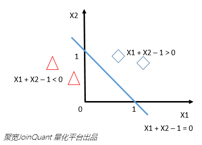

用一条直线把空间切割开，左边点属于类别-1（三角），右边点属于类别1（方块）。即，由$$X_1$$和$$X_2$$组成的二维空间，直线方程是$$X_1+X_2 = 1$$，向量符号表示为$$[1,1]^{T}[X_1,X_2]-1=0$$。点$$x$$在左边指，当把$$x$$放入方程左边，计算结果小于0。

在二维空间，用一条直线可把空间分割。三维空间需一个平面把空间切成两半，方程是$$X_1+X_2+X_3=1$$，即$$[1,1,1]^{T}[X_1,X_2,X_3]-1=0$$。

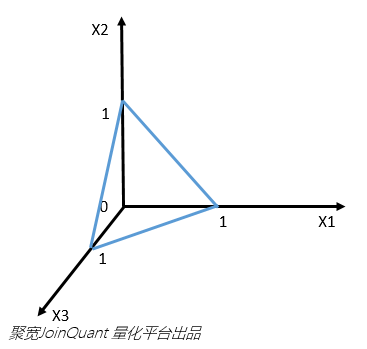

依此类推，高维空间需$$n-1维$$超平面将空间切割。抽象归纳如下：

$$x$$表示数据点，$$y$$表示类别（1或-1，代表两个类），线性分类器学习目标是要在$$n$$维数据空间中找到一个超平面（hyper plane），把空间切割开，超平面方程表示为：

$$
W^{T}X+b=0
$$

  

## 感知器模型和逻辑回归
----
常见线性分类器有感知器模型和逻辑回归。感知器模型直接分好类。有时，除了知道分类结果，还希望知道分类器对这次分类成功概率。逻辑回归就可以。

逻辑回归将线性分类器超平面方程计算结果通过Logistic函数从正负无穷映射到0或1。映射结果可认为是分类器将$$x$$判定为类别1的概率。

举例，感知器天气预报只会告诉明天下雨（$$y=1$$）或不下（$$y=-1$$）；逻辑回归天气预报能告诉明天有90%概率要下雨。

逻辑回归公式是$$g(z)=\frac{1}{1+e^{-z}}$$：

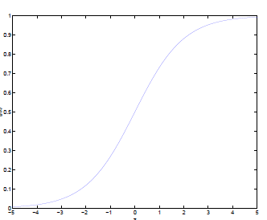

感知器模型中，将特征代入判别方程，如果得-3，可判定类别是-1。逻辑回归中，将-3代入$$g(z)$$，就知道该数据属于类别1概率是0.05。

  

## SVM
----
在多维空间下，用一个超平面可把数据分为两类。这个超平面称为分离超平面。但分离超平面有很多个，用哪个呢？

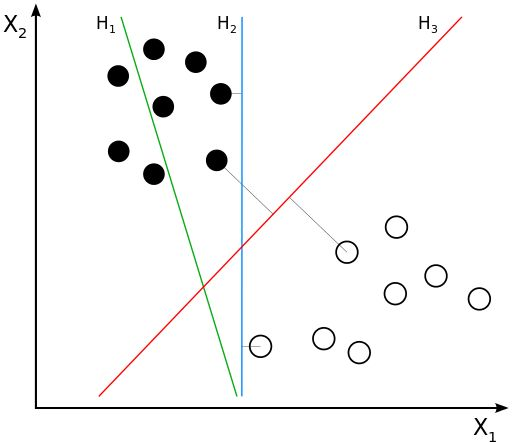

训练数据中，每个元素距离分离超平面都有一个距离。在添加超平面时，尽可能使最靠近分离超平面那个元素与超平面距离变大。这样，加入新数据时，准确分类概率会最大化。感知器模型和逻辑回归都不能完成这个工作，而SVM就可以。

对于支持向量机，数据点若是$$p$$维向量，用$$p-1$$维超平面分开这些点。但可能有许多超平面可把数据分类。最佳超平面合理选择是以最大间隔把两个类分开的超平面。因此，SVM选择能使离超平面最近的数据点的到超平面距离最大的超平面。

> 这条直线/超平面位置由距离最近的几个点决定的，其它样本点没有关系。即，该直线/超平面由几个样本点支撑（Support），而每个样本点是一个多维向量（Vector），并且算法本质上是分类器（Classification Machine），所以叫Support Vector Machines。

SVM的模型:

* 线性可分SVM
    
    当训练数据线性可分，通过硬间隔（hard margin）最大化可学习得到一个线性分类器，即硬间隔SVM。

* 线性SVM

    当训练数据不能线性可分但近似线性可分时，通过软间隔（soft margin）最大化也可学到一个线性分类器，即软间隔SVM。

* 非线性SVM

    当训练数据线性不可分，通过核技巧（kernel trick）和软间隔最大化，可以学到一个非线性SVM。

  

## 优缺点
----
优点：
* 由于SVM是凸优化问题，求得的解一定是全局最优。
* 不仅适用于线性线性问题还适用于非线性问题（用核技巧）。
* 高维样本空间数据也能用SVM。因为数据集复杂度只取决于支持向量而不是数据集维度，这在某种意义上避免了维数灾难。
* 理论基础完善，而神经网络像黑盒子。
* 决策函数（称为支持向量）只使用训练样本点一小部分，内存比较有效率。

缺点：
* 二次规划问题求解涉及$$m$$阶矩阵计算，其中$$m$$为样本个数。因此SVM不适用于超大数据集。(SMO算法可缓解这个问题)
* 只适用二分类问题。
* 不支持直接概率评估，而是通过代价昂贵的五折交叉样本计算而来

  

## 多分类
----
SVM中的多分类的问题可通过DAG SVM解决：

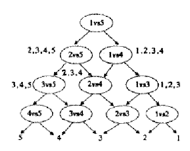

分类时，先问分类器“1对5”（意思是它能回答“是第1类还是第5类”）。如果5，往左走，再问“2对5”分类器。如果还是“5”，继续左走。这样下去，可得到分类结果。时间复杂度最坏是$$O(N^3)$$。

  

## Cost Function
----
逻辑回归的预测函数为：

$$
h_{\theta}(x) = \frac{1}{1+e^{-\theta{T}x}}
$$

代价函数为：

$$
cost = -y \mathrm{log} h_{\theta}(x) + (1-y)\mathrm{log}(1-h_{\theta}(x))
$$
 
$$y=1$$时，代价函数为：

$$
cost=−\mathrm{log}h_{\theta}(x)=−\mathrm{log}\frac{1}{1+e^{-z}}, \quad z=\theta^{T}x
$$
 
此时，代价函数随$$z$$变化曲线如下：

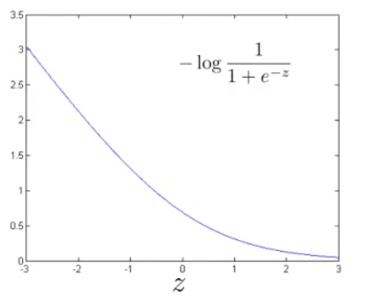

$$y=1$$时，随$$z$$变大，预测代价变小。因此，逻辑回归要在面对正样本$$y=1$$时，获得高预测精度，就希望$$z=\theta^{T}x >> 0$$。SVM则将上图曲线拉直为下图中折线，构成$$y=1$$时的代价函数曲线$$cost_{1}(z)$$：

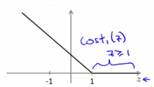

$$y=1$$时，为预测精度够高，SVM希望$$\theta^{T}x \ge 1$$。同样，$$y=0$$时，SVM定义了代价函数$$cost_{0}(z)$$，为预测精度足够高，SVM希望$$\theta^{T}x \le −1$$：

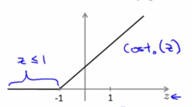

 

### 最小化预测代价
SVM定义最小化预测代价过程为：

$$
\underset{\theta}\min  C [\sum^{m}_{i=1}y^{(i)} \mathrm{cost}_{1}(\theta^{T}x^{(i)}) + (1-y^{(i)})\mathrm{cost}_{0}(\theta^{T}x^{(i)})] + \frac{1}{2}\sum^{n}_{j=1}\theta_{j}^{2}
$$

逻辑回归最小化预测代价过程为：

$$
\underset{\theta}\min\frac{1}{m} [\sum^{m}_{i=1}y^{(i)} (-\mathrm{log}h_{\theta}(x^{(i)})) + (1-y^{(i)})(-\mathrm{log}(1-h_{\theta}(x^{(i)})))] + \frac{\lambda}{2m}\sum^{n}_{j=1}\theta^{2}_{j}
$$

可将逻辑回归代价函数简要描述为：

$$
cost = A + \lambda B
$$

而 SVM 的代价函数描述为：

$$
cost = CA + B
$$

即，
* 逻辑回归通过正规化参数$$\lambda$$调节A和B所占的权重，且A权重与$$\lambda$$取值成反比。
* SVM通过参数C调节A和B所占的权重，且A权重与C取值成反比。即，参数C可认为是扮演了$$\frac{1}{\lambda}$$的角色。

 

### 预测函数
训练得到$$\theta$$后，可代入SVM预测函数进行预测：

$$
h_{\theta}(x) =
  \begin{cases}
    1  & \quad \text{if } \theta^{T}x \ge 0\\
    0  & \quad \text{otherwise}
  \end{cases}
$$

  

## 大间距分类器
----
SVM最小化代价函数过程为：

$$
\underset{\theta}\min C [\sum^{m}_{i=1} y^{(i)} \mathrm{cost}_{1} (\theta^{T}x^{(i)}) + (1-y^{(i)}) \mathrm{cost}_{0}(\theta^{T}x^{(i)})] + \frac{1}{2}\sum^{n}_{j=1}\theta_{j}^{2}
$$

且当$$y^{(i)} = 1$$时，SVM希望$$\theta^{T}x^{(i)} \ge 1$$；当$$y^{(i)} = 0$$时，SVM希望$$\theta^{T}x^{(i)} \le -1$$。所以，最小化代价函数过程可描述为：

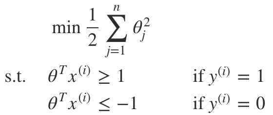

SVM最终决策边界是图中黑色直线所示的决策边界。该决策边界保持与正、负样本足够大距离，因此，SVM是大间距分类器（large margin classifier）。

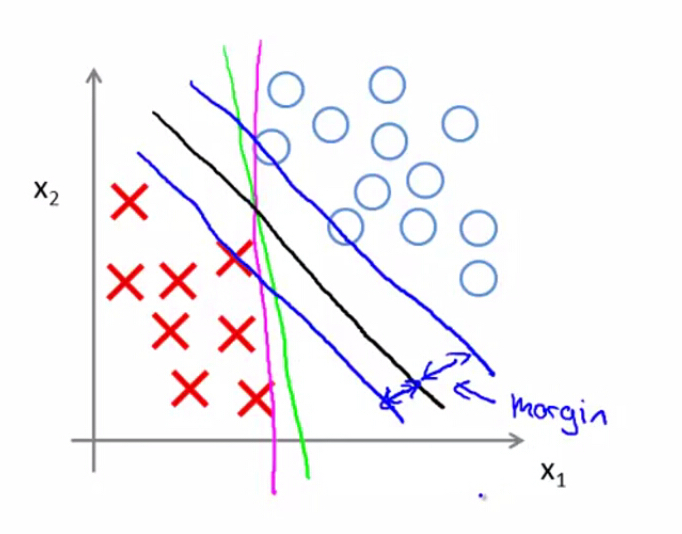

 

### 推导
假定有两个2维向量：

$$
u = \begin{pmatrix} u_{1} \\ u_{2} \end{pmatrix}, v = \begin{pmatrix} v_{1} \\ v_{2} \end{pmatrix}
$$

令$$p$$为$$v$$投影到$$u$$的线段长（该值可正可负）：

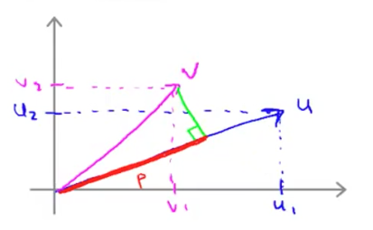

则$$u$$和$$v$$内积为：

$$
u^{T}v = p * \|u\| = u_{1}v_{1} + u_{2}v_{2}
$$

其中，$$\|u\|$$为$$u$$的范数，即$$u$$长度。

假设$$\theta = \begin{pmatrix} \theta_{1} \\ \theta_{2} \end{pmatrix}$$，且令$$\theta_{0} = 0$$，以使得向量$$\theta$$过原点，则：

$$
\begin{split}
\underset{\theta}\min\frac{1}{2}\sum^{2}_{j=1}\theta^{2}_{j} &= \underset{\theta}\min\frac{1}{2}(\theta_{1} + \theta_{2})^{2} \\
&= \underset{\theta}\min\frac{1}{2}(\sqrt{\theta_{1}^{2} + \theta_{2}^{2}})^{2} \\
&= \underset{\theta}\min\frac{1}{2} \|\theta\|^{2}
\end{split}
$$

由向量内积公式得：

$$
\theta^{T}x^{(i)} = p^{(i)} \dot \|\theta\|
$$

其中，$$p^{(i)}$$为特征向量$$x^{(i)}$$在$$\theta$$上的投影：

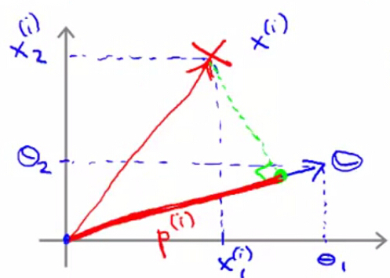

$$y^{(i)} = 1$$时，希望$$\theta^{T}x^{(i)} \ge 1$$，即$$p^{(i)} \dot \|\theta\| \ge q$$，此时考虑两种情况：
1. $$p^{(i)}$$很小，则需$$\|\theta\|$$很大，这与$$\underset{\theta}\min\frac{1}{2}\|\theta\|^{2}$$矛盾。
2. $$p^{(i)}$$很大，如图所示，即样本与决策边界距离够大，此时才能在既要$$\|\theta\|$$足够小情况下，又能有$$\theta^{T}x^{(i)} \ge 1$$，保证预测精度够高。这解释了为什么SVM具有大间距分类器性质。

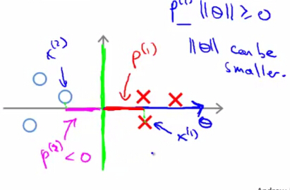

  

## 核函数
----
逻辑回归会通过多项式扩展处理非线性分类问题，但多项式回归带来的高阶项不一定作用明显。SVM不会引入高阶项作为新特征，而选择一些标记点（landmark），并将样本$$x$$与标记点$$l^{(i)}$$相似程度作为新的训练特征$$f_i$$：

$$
f = similarity(x, l^{(i)})
$$

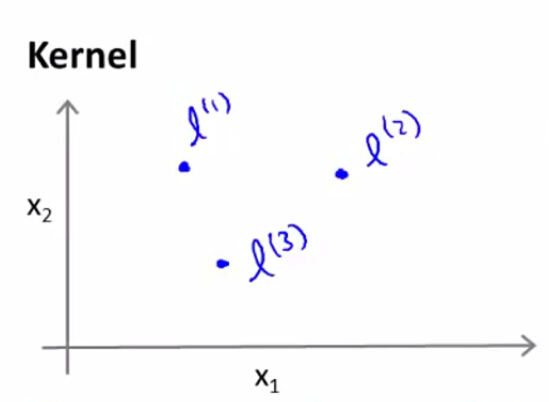

距离度量方式称为核函数（Kernel），最常见是高斯核函数（Gaussian Kernel）：

$$
f_{i} = exp(-\frac{\|x-l^{(i)}\|^{2}}{2\epsilon})
$$

> 使用高斯核函数前，需做特征缩放（feature scaling），以使SVM同等程度关注不同的特征。

 

### 标记点选取
假定有数据集：

$$
(x^{(1)}, y^{(1)}), (x^{(2)}, y^{(2)}), (x^{(3)}, y^{(3)}), ... (x^{(m)}, y^{(m)})
$$

将每个样本作为一个标记点：

$$
l^{(1)} = x ^{(1)}, l^{(2)} = x ^{(2)}, l^{(3)} = x ^{(3)}, ... l^{(m)} = x ^{(m)}
$$

则对样本$$(x^{(i)}, y^{(i)})$$，计算其与各标记点距离：

$$
f_{1}^{(i)} = sim(x^{(i)}, l^{(1)}) \\
f_{2}^{(i)} = sim(x^{(i)}, l^{(2)}) \\
\vdots
f_{m}^{(i)} = sim(x^{(i)}, l^{(m)})
$$

得到新的特征向量：$$f \in R^{m+1}$$

$$
f = \begin{pmatrix} f_{0} f_{1} \vdot f_{m} \edn{pmatrix} \\
f_0 = 1
$$

则具备核函数的SVM训练过程为：

$$
\underset{\theta}\min C [\sum^{m}_{i=1}y^{(i)} cost_{1}(\theta^{T}f^{9i}) + (1-y^{(i)})cost_{0}(\theta^{T}f^{(i)})] + \frac{1}{2}\sum^{n}_{j=1}\theta^{2}_{j}
$$

