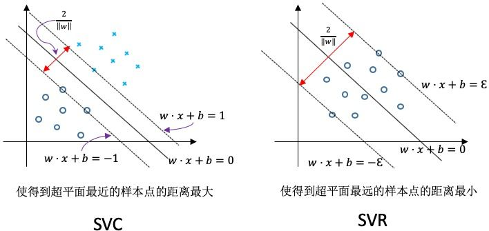
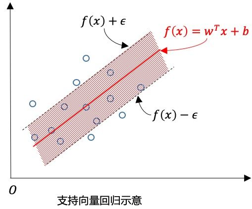
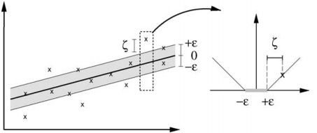
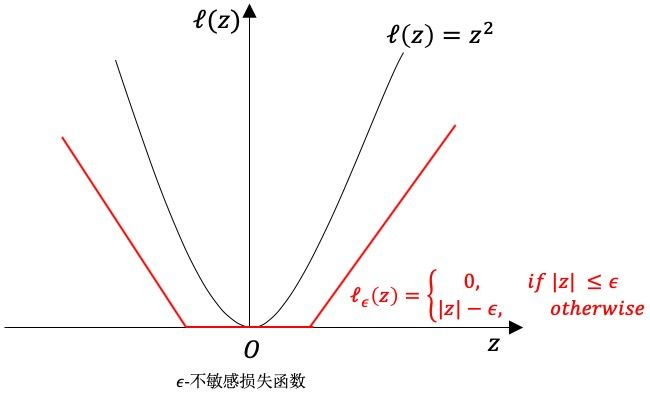
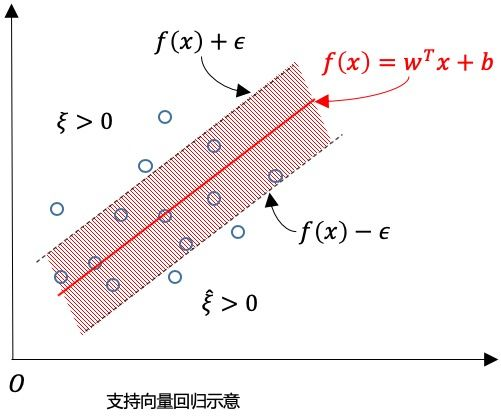

# 
SVR

  

## What
----
SVM分类（SVC Support Vector Classification）与 SVR（Support Vector Regression）图形上区别如下：

对样本$$(x,y)$$，传统回归模型直接输出$$f(x)$$与输出$$y$$之间差别来计算损失。当且仅当$$f(x)$$与$$y$$相同时，损失是零。SVR假设能容忍$$f(x)$$与$$y$$之间最多有$$\epsilon$$偏差，即仅当$$f(x)$$与$$y$$差别绝对值大于$$\epsilon$$时才计算损失。相当于以$$f(x)$$为中心 构建一个宽为$$2\epsilon$$的间隔带，若样本落入此间隔带，则认为是预测正确的：

  

## 数学形式
----

SVR问题可形式化为：

$$
\min_{\omega,b}\frac{1}{2}\Arrowvert \omega \Arrowvert^2 + C\sum_{i=1}^{m}\ell_{\epsilon}(f(x_i) - y_i) \tag{C1}
$$

其中C为正则化常数，$$\ell_{\epsilon}$$是下图ε-不敏感损失（ε-insensitive loss）函数：

$$
\ell_{\epsilon}(z) = 
begin{cases}
    0,&if\;|z|\le \epsilon \\
    |z|-\epsilon,&otherwise
\end{cases}
\tag{C2}
$$

引入松弛变量$$\xi_i$$和$$\hat{\xi}_i$$(间隔两侧的松弛程度可能不同)，将式C2重写为：

$$
\begin{split}
&\min_{\omega,b}\frac{1}{2}\Arrowvert \omega \Arrowvert^2 + C\sum_{i=1}^{m}(\xi_i + \hat{\xi}_i) \\
s.t.\;& f(x_i) - y_i \le \epsilon + \xi_i \\
& y_i - f(x_i) \le \epsilon + \hat{\xi}_i \\
& \xi_i \gt 0\; \hat{\xi}_i \gt 0\;i=1,2,3...m
\end{split}
\tag{C3}
$$

  

## 拉格朗日对偶形式
----
通过引入$$\mu_i \ge 0$$，$$\hat{\mu}_i \ge 0$$，$$\alpha_i \ge 0$$和$$\hat{\alpha}_i \ge 0$$，由拉格朗日乘子可得到式C3的拉格朗日函数：

$$
\begin{split}
&L(\omega,b,\alpha,\hat{\alpha},\xi,\hat{\xi},\mu,\hat{\mu}) \\
&= \frac{1}{2}\Arrowvert\omega\Arrowvert^2 +  C\sum_{i=1}^{m}(\xi_i + \hat{\xi}i) -\sum_{i=1}^{m}\mu_i\xi_i - \sum_{i=1}^{m}\hat{\mu}i\hat{\xi}_i \\
& + \sum{i=1}^{m}\alpha_i\left(f(x_{i}) - y_i - \epsilon - \xi_i\right) \\
& + \sum{i=1}^{m}\hat{\alpha}_i(y_i - f(x_i) - \epsilon - \hat{\xi}_i)
\end{split}
\tag{C4}
$$

将$$f(x_i) = w^{T}x + b$$带入上式，并令$$L(\omega,b,\alpha,\hat{\alpha},\xi,\hat{\xi},\mu,\hat{\mu})$$对$$\omega$$，$$b$$，$$\xi_i$$和$$\hat{\xi}_i$$的偏导为零，得到：

$$
\begin{split}
\omega &= \sum_{i=1}^{m}(\hat{\alpha}i - \alpha_i)x_i \\
0 &= \sum{i=1}^{m}(\hat{\alpha}_i - \alpha_i) \\
C &= \alpha_i + \mu_i \\
C &= \hat{\alpha}_i + \hat{\mu}_i 
\end{split}
\tag{C5}
$$

将式C5带入式C4可得SVR对偶问题：

$$
\begin{split}
    &\max_{\alpha,\hat{\alpha}}\;\; \sum_{i=1}^{m}y_i(\hat{\alpha}i - \alpha_i) - \epsilon(\hat{\alpha}_i + \alpha_i) - \frac{1}{2} \sum_{i=1}^{m}\sum_{j=1}^{m}(\hat{\alpha}i - \alpha_i)(\hat{\alpha}_j - \alpha_j)x_i^{T}x_j \\
    &s.t.\;\; \sum_{i=1}^{m}(\hat{\alpha}_i - \alpha_i) = 0 \\
    &\qquad\quad 0 \le \alpha_i,\;\hat{\alpha}_i \le C
\end{split}
\tag{C6}
$$

  

## KKT与最终决策函数
----
上述过程满足的KKT条件为：

$$
\begin{cases}
    \alpha_i(f(x_i) - y_i - \epsilon - \xi_i) = 0 \\
    \hat{\alpha}_i(y_i - f(x_i) - \epsilon - \hat{\xi}_i) = 0 \\
    \alpha_i\hat{\alpha}_i = 0,\;\;\xi_i\hat{\xi}_i = 0 \\ 
    (C - \alpha_i)\xi_i = 0,\;\;(C - \hat{\alpha}_i)\hat{\xi}_i = 0
\end{cases}
\tag{C7}
$$

可看出：

* 当且仅当$$f(x_i) - y_i - \epsilon - \xi_i = 0$$时，$$\alpha_i$$能取非零值；
* 当且仅当$$y_i - f(x_i) - \epsilon - \hat{\xi}_i = 0$$时，$$\hat{\alpha}_i$$能取非零值。

换言之，仅当样本$$(x_i, y_i)$$不落入ε-间隔带，相应的$$\alpha_i$$和$$\hat{\alpha}_i$$才能取非零值。此外，约束$$f(x_i) - y_i - \epsilon - \xi_i = 0$$与$$y_i - f(x_i) - \epsilon - \hat{\xi}_i = 0$$不能同时成立，因此$$\alpha_i$$和$$\hat{\alpha}_i$$中至少有一个为零。

将式C5第一项带入决策函数，可得最终决策函数：

$$
f(x) = \sum_{i=1}^n (\hat{\alpha}_i - \alpha_i)x_i^{T}x_j + b \tag{C8}
$$

能使上式中$$\hat{\alpha}_i - \alpha_i \neq 0$$成立的样本即为SVR的支持向量，必然落在ε-间隔带外。显然SVR支持向量仅是训练样本一部分，即其解仍具有稀疏性。

由KKT条件可看出，对每个样本$$(x_i, y_i)$$都有$$(C - \alpha_i)\xi_i = 0$$且$$\alpha_i(f(x_i) - y_i - \epsilon - \xi_i) = 0$$，于是在得到$$\alpha_i$$后，若$$0 \lt \alpha_i \lt C$$，则有$$\xi_i = 0$$，继而有：

$$
b = y_i + \epsilon -  \sum_{i=1}^n (\hat{\alpha}_i - \alpha_i)x_i^{T}x_j \tag{C9}
$$

因此，若求解式C6得到$$\alpha_i$$后，理论上说可任意选取满足$$0 \lt \alpha_i \lt C$$的样本，通过式C9求得b。实践中采用更鲁棒的办法：选择多个（或所有）满足条件$$0 \lt \alpha_i \lt C$$的样本求解b后去平均值。

核函数形式最终决策函数为：

$$
f(x) = \sum_{i=1}^n (\hat{\alpha}_i - \alpha_i) \kappa(x, x_i) + b \tag{C9}
$$

其中$$\kappa(x_i, x_j) = \phi(x_i)^{T}\phi(x_j)$$为核函数。
