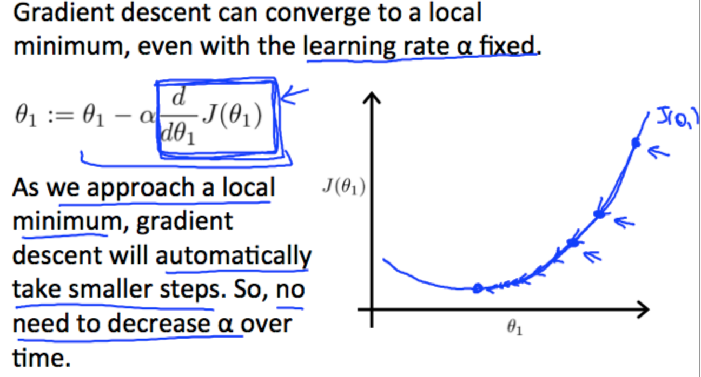

# 
Learning Rate

  

We make steps down the cost function in the direction with the steepest descent. The size of each step is determined by the parameter $$\alpha$$, which is called **learning rate**.

> 学习速率决定参数值变化速率，即“走多少距离”。偏导部分决定下降方向，即“下一步往哪走”。

Regardless of the slope's sign for $$\frac{\partial}{\partial \theta_j} \text{J}(\theta_1)$$, $$\theta_1$$ eventually converges to its minimum value. The following graph shows that when the slope is negative, the value of $$\theta_1$$ increases and when it is positive, the value of $$\theta_1 $$decreases.

  

We should adjust parameter $$\alpha$$ to ensure that the gradient descent converges in a reasonable time. 

  

学习速率只需选定即可，不需运行时动态改变。随着斜率接近0，代价函数变化幅度会越小，直到收敛局部极小值：

  

  