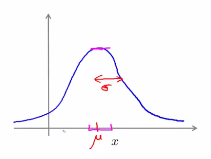
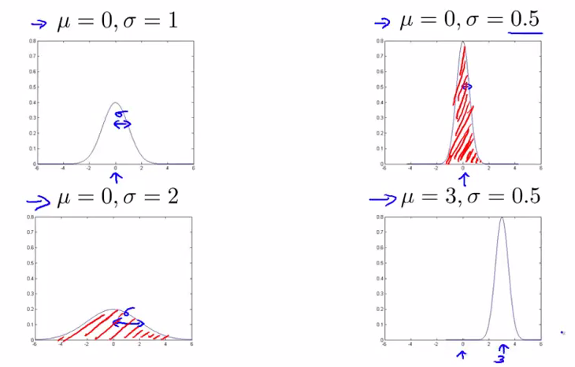
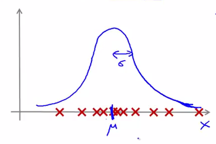

# 
Gaussian Distribution

  

## What
----
异常检测核心在于找到一个概率模型，检测样本落入正常样本的概率，从而分正常和异常样本。**高斯分布（Gaussian Distribution）**模型是异常检测常用的概率分布模型。

称$$X \sim N(\mu,\delta^2)$$为：$$X$$服从均值为$$\mu$$且方差为$$\delta^2$$的高斯分布（也称正态分布）。高斯分布[概率密度函数](https://zh.wikipedia.org/wiki/%E6%A9%9F%E7%8E%87%E5%AF%86%E5%BA%A6%E5%87%BD%E6%95%B8)为：

$$
f(x)=\frac{1}{\sqrt{2\pi}\delta}e^{-\frac{(x-\mu)^2}{2}}
$$

概率密度函数图像为：

    </img>

此时，概率模型可描述为：

$$
p(x; \mu, \delta^2)=\frac{1}{\sqrt{2\pi}\delta}e^{-\frac{(x-\mu)^2}{2}}
$$

  

## 参数
----
均值$$\mu$$决定高斯分布函数的**对称轴位置**，而方差$$\delta$$衡量各样本与平均位置差异，决定概率密度函数**宽窄**。$$\delta^2$$越大，各样本差异越大（各样本偏离均值位置远），意味样本取$$\mu$$附近位置概率越低，亦即概率$$P(\mu-\epsilon<x<\mu+\epsilon)$$很小。此时，概率密度函数很宽。

    </img>

  

## 参数估计
----
假定特征$$x_j$$分布如下：

    </img>

该分布中间稠密，越向两边越稀疏，于是认为数据服从高斯分布，即：

$$
x_j \sim N(\mu,\delta^2)
$$

但不知该分布$$\mu_j$$和$$\delta_j$$参数，可根据有限个样本进行**参数估计**：

$$
\begin{align*}
\mu_j &= \frac{1}{m}\sum\limits_{i=1}^mx_j^{(i)} \\
\delta^2_j &= \frac{1}{m}\sum\limits_{i=1}^m(x_j^{(i)}-\mu_j)^2
\end{align*}
$$

这里对参数$$\mu$$和$$\delta^2$$估计是二者的[极大似然估计](https://zh.wikipedia.org/wiki/%E6%9C%80%E5%A4%A7%E4%BC%BC%E7%84%B6%E4%BC%B0%E8%AE%A1)。

假定有数据集：

$$
{x^{(1)},x^{(2)},\cdots,x^{(m)}}, x \in R^n
$$

且各特征服从高斯分布：

$$
x_j \sim N(\mu,\delta^2)
$$

完成对各特征服从分布的参数估计后，得到：

$$
\begin{align*}
p(x) &= p(x_1;\mu_1, \delta^2_1)p(x_2;\mu_2, \delta^2_2) \cdots p(x_n;\mu_n, \delta^2_n) \\
&= \prod\limits_{j=1}^np(x_j;\mu_j,\delta_j^2) \\
&= \prod\limits_{j=1}^n\frac{1}{\sqrt{2\pi}\delta_j}exp(-\frac{(x_j-\mu_j)^2}{2\delta_j^2})
\end{align*}
$$
