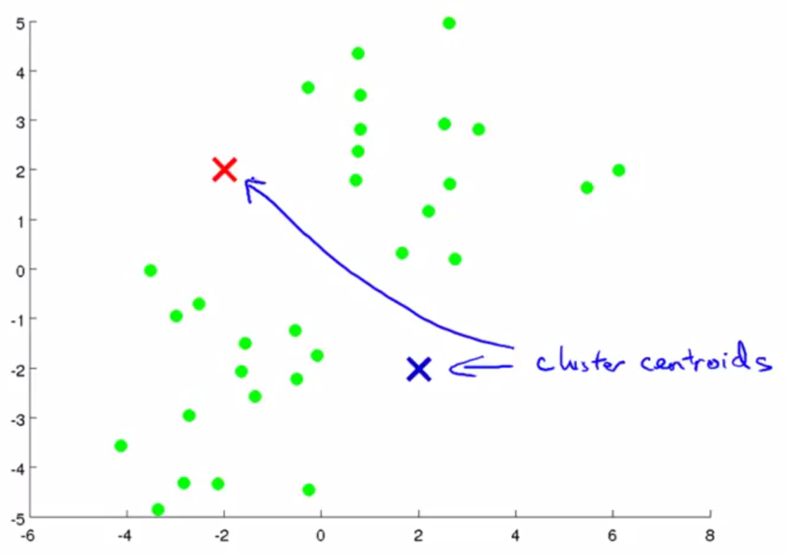
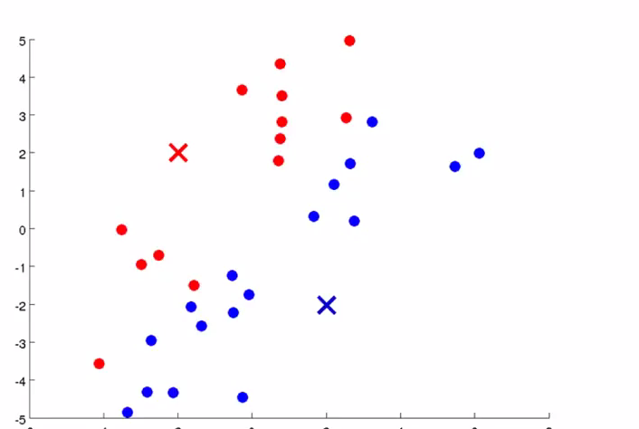
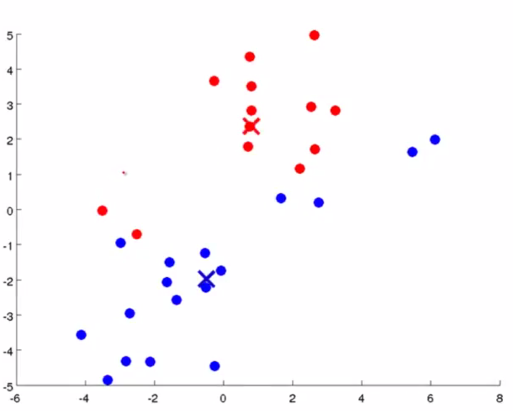
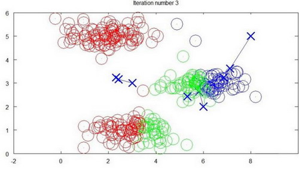
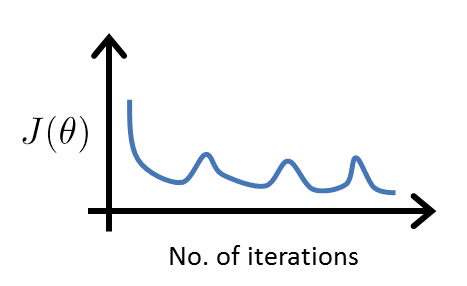
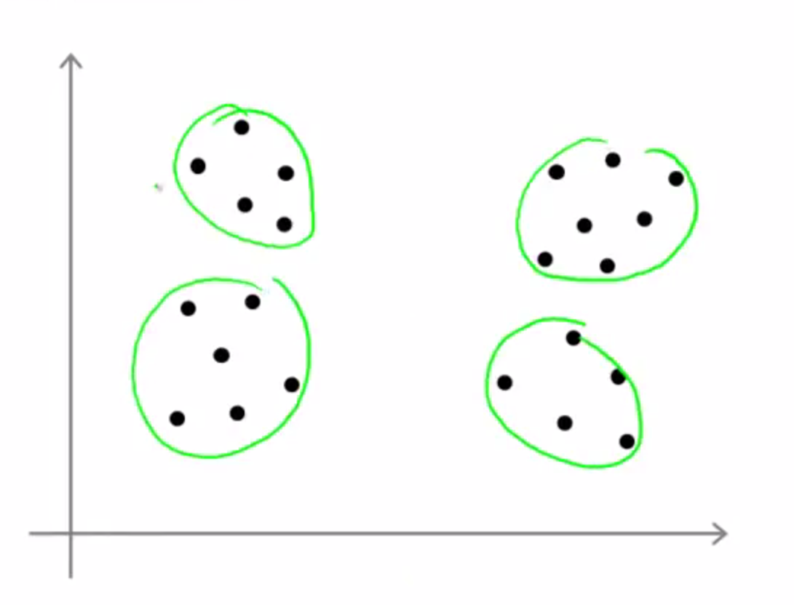
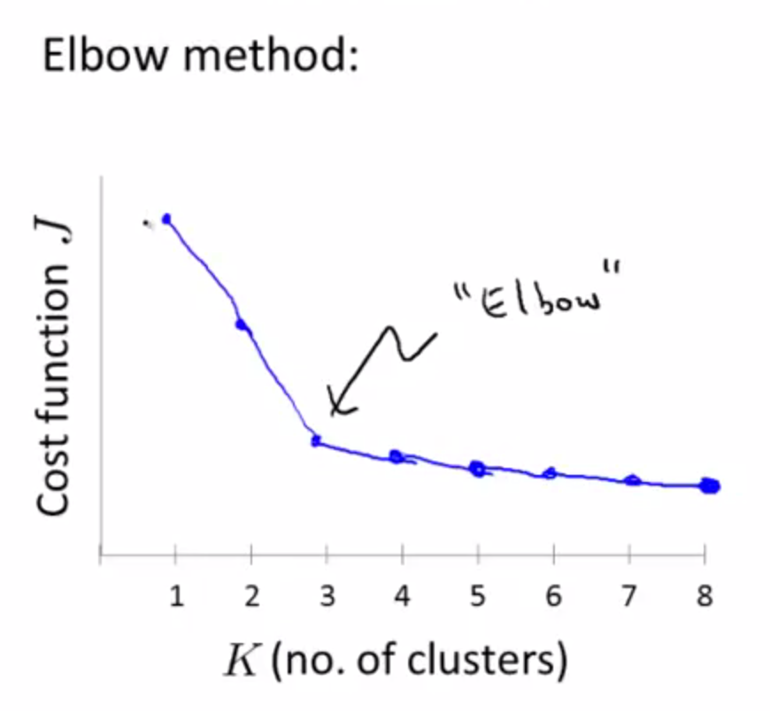
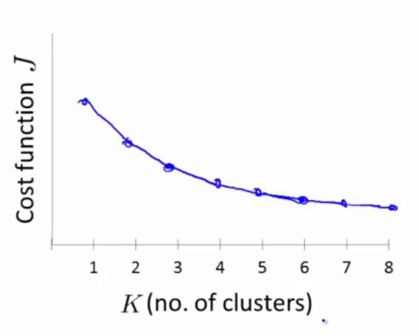
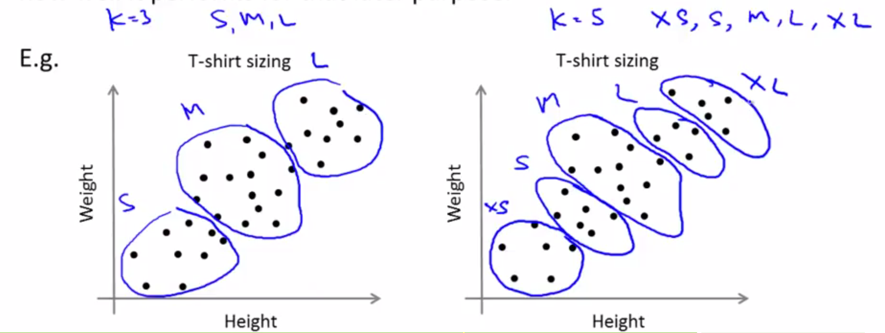

# <center>K-Means</center>

<br></br>


## What
----
1. 根据设定的聚类数$$K$$，随机选择$$K$$个聚类中心（Cluster Centroid）。

    <p align="center">
        
    </p>

2. 评估各样本到聚类中心距离，如果样本距第$$i$$个聚类中心近，则认为其属于第$$i$$簇。

    <p align="center">
        
    </p>

3. 计算每个簇中样本平均（Mean）位置，将聚类中心移动至该位置。

    <p align="center">
        
    </p>

4. 重复以上步骤直至各聚类中心位置不再改变。

代码表示：
```
Repeat {
​   for i = 1 to m
​       c(i) := index (form 1 to K) of cluster centroid closest to x(i)
​       for k = 1 to K
​           μk := average (mean) of points assigned to cluster k
}
```

1. 第一个for循环是赋值步骤，即对每个样例，计算其应属于的类。
2. 第二个for循环是聚类中心的移动，即对每个类，计算该类质心。

<br>


### Example
一个聚类示例：


迭代3次：


迭代10次：


<br></br>


## 优化
----
和其它机器学习算法一样，K-Means也要评估且最小化聚类代价。定义：

$$
\mu^{(i)}_{c} = \mathrm{样本}x^{(i)}\mathrm{被分配的聚类中心}
$$

引入代价函数：

$$
J(c^{(1)}, c^{(2)}, ..., c^{(m)}; \mu_{1}, \mu_{2}, ..., \mu_{k}) = \frac{1}{m}\sum^{m}_{i=1}\|x^{(i)}-\mu_{c}(i)\|^{2}
$$

$$J$$也称为失真代价函数（Distortion Cost Function）。

实际上，K-Means的两步已完成最小化代价函数过程：

1. 样本分配时，固定了$$(\mu_1,\mu_2,...,\mu_k)$$，$$(c^{(1)},c^{(2)},...,c^{(m)})$$最小化了$$J$$。

2. 中心移动时，$$(\mu_1,\mu_2,...,\mu_k)$$最小化$$J$$。

由于K-Means每次迭代过程都在最小化$$J$$，所以下面的代价函数变化曲线不会出现：

<p align="center">
  
</p>

因为第一个for循环减小$$c^{(i)}$$引起的代价，而第二个for循环减小$$\mu_i$$引起的代价。迭代过程一定是每次迭代都在减小代价函数，不然是出现了错误。

<br></br>


## 初始化聚类中心
----
通常随机选取$$K$$个样本作为$$K$$个聚类中心（$$K < m$$）。但不同的初始化引起不同结果，往往得到的是局部最优（local optimal）。


为解决这问题，需多次运行K-均值算法，每次都重新随机初始化，最后再比较多次结果，选择代价函数最小的。这种方法在$$K$$较小时（2--10）可行，如果$$K$$较大，可能不会有明显改善。

<br></br>


## 确定聚类数
----
实际上，一开始很难确定聚类数，比如下图两种聚类数似乎都可行：

<p align="center">
  
</p>

存在一种称为肘部法则（Elbow Method）方法来选定$$K$$值：

<p align="center">
  
</p>

“肘关节”部分对应的$$K$$值是最恰当的$$K$$值，但并不是所有代价函数曲线都存在明显“肘关节”，如：

<p align="center">
  
</p>

K-Means的结果是服务后续目的（如通过聚类进行市场分析），所以不能脱离实际而单纯以数学方法选择$$K$$值。假定衣服要分为S/M/L三个尺码，就设$$K=3$$。如果要XS\S\M\L\XL五个尺码，就设$$K=5$$：



<br></br>


## 二分K-Means
----
常规K-Means误差通常只收敛到局部最小。二分K-Means（bisecting k-means）较于常规K-Means，不急于开始就随机$$K$$个聚类中心，而首先把所有点归为一个簇，然后将簇一分为二。计算各个所得簇的失真函数（即误差），选择误差最大的再划分（即最大程度地减少误差）。重复该过程直至达到期望的簇数目。

流程：
1. 初始时，所有样本看做在同一个簇：

$$
c^{(1)} = c^{(2)} =...= c^{(m)}
$$
 
2. 当`while num < k`，其中$$num$$表示当前簇数，`for  i=1  to  num`，即对每个簇：

    1. 计算误差
    2. 在该簇上进行K-Means聚类，其中$$k=2$$
    3. 计算将该簇一分为二后的总误差，该误差在之后用于比较
    4. 选择使总误差最小的簇进行划分。

虽然二分K-Means能带来全局最优，但该算法是贪心算法，计算量不小。

<br></br>


## 距离计算方法
----
* 闵可夫斯基距离 Minkowski（其中欧式距离：$$p = 2$$)

$$
dist(X,Y) = (\sum^{n}_{i=1}|x_{i} - y_{i}|^{p})^{\frac{\lambda}{p}}
$$

* 杰卡德相似系数 Jaccard：

$$
J(A, B) = \frac{|A \cap B|}{|A \cup B|}
$$

* 余弦相似度 Cosine Similarity：

    $$n$$维向量$$x$$和$$y$$的夹角记做$$\theta$$，根据余弦定理，其余弦值为：

$$
\mathrm{cos}(\theta) = \frac{x^{T}y}{|x| \dot |y|} = \frac{\sum^{n}_{i=1} x_{i}y_{i}}{\sqrt{\sum^{n}_{i=1}x_{i}^{2}} \sqrt{\sum^{n}_{i=1}y_{i}^{2}}}
$$

* 皮尔逊相关系数 Pearson：

$$
\rho_{XY} = \frac{\mathrm{cov}(X,Y)}{\sigma_{X}\sigma_{Y}} = \frac{E[(X-\mu_{X})(Y-\mu_{U})]}{\sigma_{X}\sigma_{Y}} = \frac{\sum^{n}_{i=1}(x - \mu_{X}(y - \mu_{Y}))}{\sqrt{\sum^{n}_{i=1}(x-\mu_{X})^{2}} \sqrt{\sum_{i=1}^{n}(y - \mu_{Y})^{2}}}
$$

