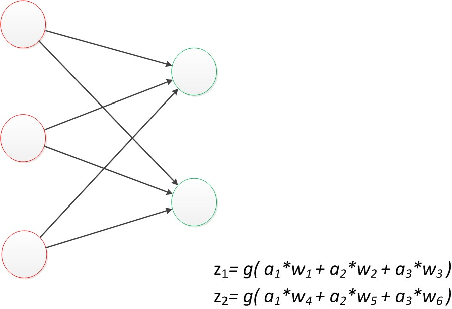
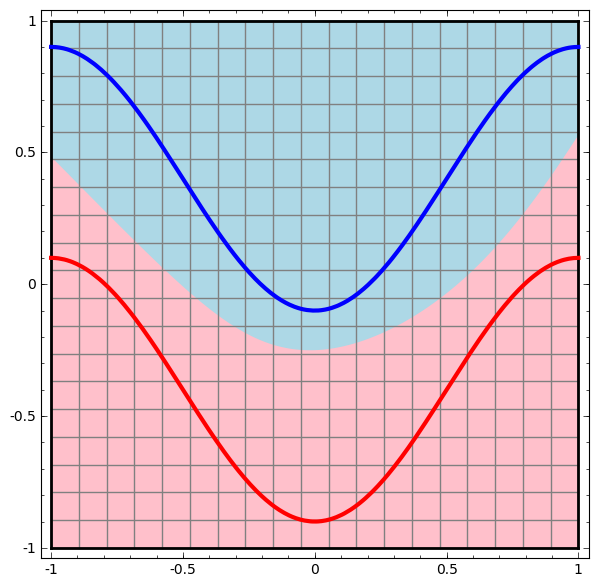
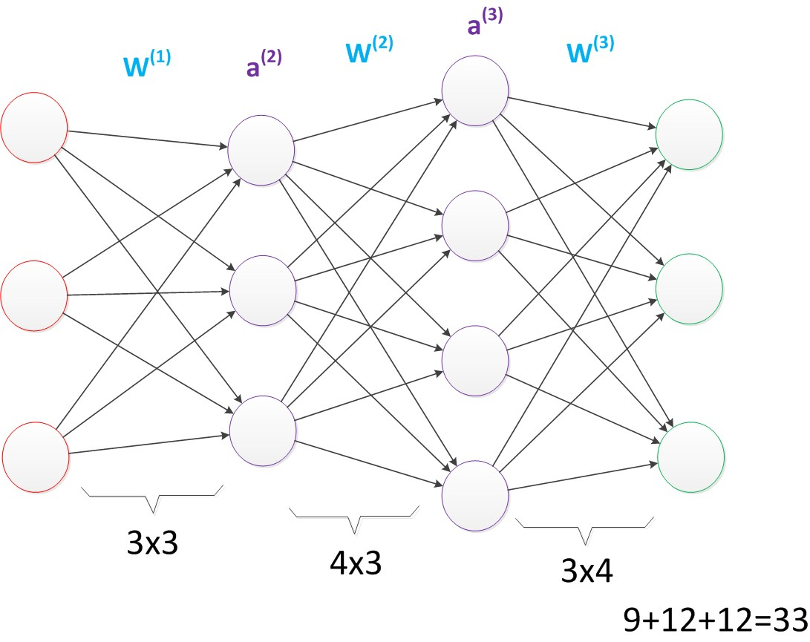

# 
Artificial Neural Networks

  

  

  

## Types of Neural Networks
----
1. Feedforward
    
    **The information moves in only one directio, forward. There are no cycles or loops in the network.** Single-layer Perceptron, Multi-layer perceptron, and Convolutional Neural Network (CNN) are this type.

    

2. Feedback
    
    In Feedback, loops are allowed. They are used in content addressable memories. Recurrent Neural Network (RNN) is this type.

    

  

## Neuron 神经元
----
神经元模型是一个包含输入，输出与计算功能的模型。

  

<i>典型的神经元模型：3个输入，1个输出，及2个计算。</i>

 

神经网络训练算法就是让权重值调到最佳，使得整个网络预测效果最好。

使用_a_表示输入，_w_表示权值。连接的有向箭头可理解为在初端，传递的信号大小是_a_，端中间有加权参数_w_，加权后信号变成 $$ a * w $$。因此在连接末端，信号大小变成 $$ a*w $$。如果将神经元图中所有变量用符号表示，且写出输出计算公式：

  

<i>神经元计算</i>

 

对神经元模型图进行扩展。首先将sum函数与sgn函数合并，代表神经元内部计算。其次，一个神经元可以引出多个输出的有向箭头，但值是一样的。神经元可看作计算与存储单元。计算是神经元对其的输入进行计算功能。存储是神经元暂存计算结果，并传递下一层。

> 描述网络中某个神经元时，更多用“单元”（unit）指代，有时也会用“节点”（node）表达。

  

<i>神经元扩展</i>

 

其中，**函数_f_是非线性的且称作激活函数（Activation Function）。激活函数的目的是把神经元的输出变成非线性的，因为现实世界中绝大部分数据都是非线性的。**

激活函数种类有：
* Sigmoid: takes a real-valued input and squashes it to range between 0 and 1.
$$
\sigma(x) = \frac{1}{1 + \mathrm{e}^{-x}}
$$

* tanh: takes a real-valued input and squashes it to the range [-1, 1].
$$
tanh(x) = 2 \sigma(2x) - 1
$$

* ReLU (Rectified Linear Unit): takes a real-valued input and thresholds it at zero (replaces negative values with zero).
$$
f(x) = max(0, x)
$$

  

<i>Different Activation Functions</i>

  

## 单层神经网络 Single-layer Perceptron
----
假要预测的不是一个值，是一个向量，如$$[2,3]$$，那么输出层增加一个输出单元。

  

<i>单层神经网络</i>

 

可以看到，$$z_1$$计算跟原先_z_没有区别。$$z_2$$计算中除三个新的权值$$w_4$$，$$w_5$$和$$w_6$$外，其他与$$z_1$$一样。改用二维下标，用$$w_{x,y}$$表达权值。_x_代表后一层神经元序号，_y_代表前一层神经元的序号。例如，$$$w_{1,2}$$代表后一层第1个神经元与前一层第2个神经元的连接的权值。

  

<i>单层神经网络（扩展）</i>

 

发现这两个公式是线性代数方程组。因此可用矩阵乘法表达。例如，输入变量是$$[a_1，a_2，a_3]^T$$ 代表由$$a_1$$，$$a_2$$，$$a_3$$组成的列向量），用向量_a_表示。方程左边是$$[z_1，z_2]^T$$，用向量_z_表示。系数是矩阵_W_。于是，输出公式改写成：
$$
g(W * a) = z
$$

**这个公式就是神经网络从前一层计算后一层的矩阵运算。**

  

## 两层神经网络 Multi-Layer Perceptron
----
两层神经网络除了包含输入层，输出层外，还增加了中间层。中间层和输出层都是计算层。

> 其中，$$a_x^{(y)}$$代表第_y_层的第_x_个节点。

  

<i>两层神经网络（中间层计算）</i>

 

计算最终输出_z_是用中间层$$a_1^{(2)}$$，$$a_2^{(2)}$$和第二个权值矩阵计算得到的：

  

<i>两层神经网络（输出层计算）</i>

 

### 偏置节点（Bias Unit）
偏置节点是默认存在的。它本质上是一个只含有存储功能，且存储值永远为1的单元。在神经网络的每个层次中，除了输出层外，都含有一个偏置单元。

  

<i>两层神经网络（考虑偏置节点）</i>

 

偏置节点很好认，因为其没有输入。有些神经网络的结构图中会把偏置节点画出来，有些不会。考虑了偏置后的神经网络矩阵运算如下：
$$
g(W^{(1)} * a^{(1)} + b^{(1)}) = a^{(2)} 
g(W^{(2)} * a^{(2)} + b^{(2)}) = z
$$

**A bias value allows you to shift the activation function to the left or right.**

  

<i>1-input, 1-output network with no bias</i>

 

The output is computed by multiplying input _x_ by weight $$w_0$$ and passing result through activation function:

  

Changing weight $$w_0$$ essentially changes the "steepness" of the sigmoid. That's useful, but what if you wanted to output 0 when _x_ is 2? Just changing steepness of sigmoid won't really work -- you want to be able to shift entire curve to right.

That's exactly what bias to do. If we add a bias, like so:

  

 

Output becomes $$sig(w_0*x + w_1*1.0)$$. Here is what the output looks like for various values of $$w_1$$:

  

 

### 效果
与单层神经网络不同。理论证明，两层神经网络可无限逼近任意连续函数。也就是说，面对复杂非线性分类任务，两层神经网络可以分类的很好。

  

<i>两层神经网络（决策分界）</i>

 

其中，红线与蓝线代表数据。红色区域和蓝色区域代表由神经网络划开的区域，两者的分界线就是决策分界。

两层神经网络决策分界是平滑的曲线。单层网络只能做线性分类任务，而两层网络中后一层也是线性分类层。为什么两个线性分类任务结合就可做非线性分类任务？

把输出层决策分界单独拿出来看：

  

<i>两层神经网络（空间变换）</i>

 

可看到，输出层决策分界仍然是直线。关键是从输入层到隐藏层时，数据发生了空间变换。也就是说，隐藏层对原始数据进行空间变换，使其可被线性分类。然后输出层决策分界划出了一个线性分类分界线，对其进行分类。联想到推导出的矩阵公式，矩阵和向量相乘，本质上是对向量坐标空间进行变换。**因此，隐藏层参数矩阵的作用是使得数据原始坐标空间从线性不可分，转换成了线性可分。**

**两层神经网络通过两层线性模型模拟数据内真实的非线性函数。因此，多层神经网络本质是复杂函数拟合。**

 

### 训练
首先，给所有参数赋上随机值。使用随机生成的参数值，预测训练数据中的样本。样本的预测目标为$$y_p$$，真实目标为_y_。那么，定义一个值_loss_，计算公式如下：
$$
loss = (y_p - y)^2
$$

目标就是使对所有训练数据的损失和尽可能小。如果将神经网络预测矩阵公式带入$$y_p$$中（因为$$z=y_p$$），那么可把损失写为关于参数的函数。这个函数称为损失函数（loss function）。

下面的问题就是求如何优

此时问题转化为优化化参数，让损失函数值最小。一般解决这个问题使用**梯度下降算法**。梯度下降算法每次计算参数在当前的梯度，然后让参数向梯度反方向前进一段距离，不断重复，直到梯度接近零时截止。这时，所有参数恰好达到使损失函数达到最低值的状态。

在神经网络模型中，由于结构复杂，每次计算梯度代价很大。因此还需使用**反向传播算法**。反向传播算法利用神经网络结构进行计算。不一次计算所有参数梯度，而是从后往前。首先计算输出层梯度，然后是第二个参数矩阵梯度，接着中间层梯度，再是第一个参数矩阵梯度，最后是输入层梯度。计算结束后，所要的两个参数矩阵的梯度就有了。

  

## 多层神经网络 Deep Learning
----
### 普通多层神经网络结构
可看出$$W^{(1)}$$有6个参数，$$W^{(2)}$$有4个参数，$$ W^{(3)}$$有6个参数，所以整个神经网络中参数有16个（不考虑偏置节点）。

  

<i>多层神经网络（较少参数）</i>

 

将中间层节点数做一下调整。第一个中间层改为3个单元，第二个中间层改为4个单元。调整后，整个网络参数变成33个。

  

<i>多层神经网络（较多参数）</i>

 

虽然层数不变，但第二个神经网络参数数量是第一个两倍，从而带来了更好的表示能力。在参数一致的情况下，可以获得一个“更深”的网络：

  

<i>多层神经网络（更深的层次）</i>

 

虽然参数仍是33，但有4个中间层。意味着一样的参数数量，可用更深的层次去表达。

 

### 效果
增加更多层次的好处是：
1. 更深入的表示特征

    指着网络层数增加，每一层对于前一层次抽象表示更深入。在神经网络中，每一层神经元学习到的是前一层神经元值的更抽象表示。例如第一个隐藏层学习到的是“边缘”特征，第二个隐藏层学习到的是由“边缘”组成的“形状”的特征，第三个隐藏层学习到的是由“形状”组成的“图案”的特征，最后的隐藏层学习到的是由“图案”组成的“目标”的特征。通过抽取更抽象的特征来对事物进行区分，从而获得更好的区分与分类能力。

2. 更强的函数模拟能力。

    由于层数增加，整个网络参数就多。而神经网络本质是模拟特征与目标间真实关系函数的方法，更多的参数意味着模拟的函数可更加复杂，可以有更多的容量去拟合真正的关系。

 

### 训练
* 单层神经网络使用的激活函数是sgn函数。
* 两层神经网络使用sigmoid函数。
* ReLU函数在训练多层神经网络时，更容易收敛，且预测性能更好。因此，目前深度学习最流行的非线性函数是ReLU函数。

ReLU函数不是传统的非线性函数，而是分段线性函数。其表达式是$$y=max(x,0)$$。在$$x > 0$$，输出就是输入；$$x < 0$$时，输出为0。

多层神经网络训练主题仍是优化和泛化。当使用足够强的计算芯片（例如GPU）时，梯度下降算法及反向传播算法在多层神经网络中的训练中仍然工作的很好。

在深度学习中，泛化技术比以往更加重要。因为神经网络层数增加，参数也增加，表示能力大幅增强，容易出现过拟合。
