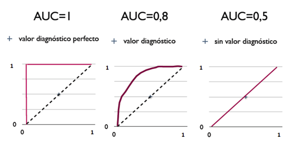
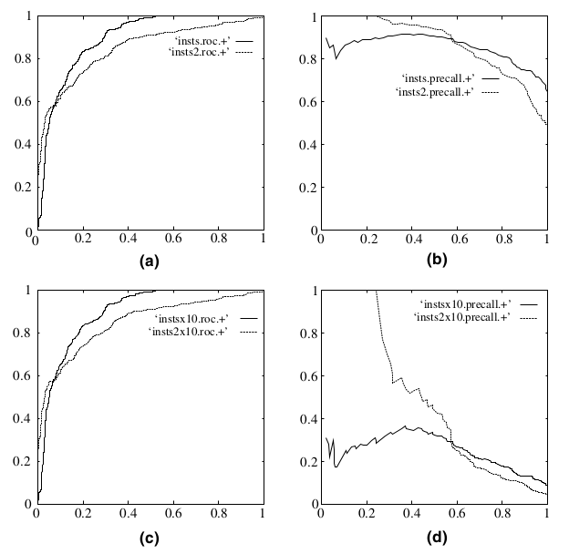

# 
Classification

  

## Confusion Matrix
----
Make following definitions:
* "Wolf" is a positive class.
* "No wolf" is a negative class.

* A **true positive** is an outcome where the model correctly predicts the positive class. Similarly, a **true negative** is an outcome where the model correctly predicts the negative class.

* A **false positive** is an outcome where the model incorrectly predicts the positive class. And a **false negative** is an outcome where the model incorrectly predicts the negative class.

  

## Accuracy, Precision, Recall & F-measure
----

 

### Accuracy
**Accuracy** is the fraction of predictions model got right:

$$
\mathrm{Accuracy} = \frac{\mathrm{Number\ of\ correct\ predictions}}{\mathrm{Total\ number\ of\ predictions}}
$$

For binary classification, accuracy can be calculated as follows:

$$
\mathrm{Accuracy} = \frac{TP + TN}{TP + TN + FP + FN}
$$

For the following model that classified 100 tumors as malignant (positive class) or benign (negative class):

$$
\mathrm{Accuracy} = \frac{TP + TN}{TP + TN + FP + FN} = \frac{1 + 90}{1 + 90 + 1 + 8} = 0.91
$$

 

### Precision
**Precision** attempts to answer what proportion of positive identifications was actually correct?

$$
\mathrm{Precision} = \frac{TP}{TP + FP}
$$

For the example:
$$
\mathrm{Precision} = \frac{TP}{TP + FP} = \frac{1}{1+1} = 0.5
$$

 

### Recall
**Recall** attempts to answer what proportion of actual positives was identified correctly?

$$
\mathrm{Recall} = \frac{TP}{TP + FN}
$$

For the example:
$$
\mathrm{Recall} = \frac{1}{1+8} = 0.11
$$

  

## ROC
----
An ROC curve is a graph showing the performance of a classification model at all classification thresholds. This curve plots two parameters:
1. True Positive Rate
2. False Positive Rate

**True Positive Rate (TPR)** is a synonym for recall and is therefore defined as follows:

$$
TPR = \frac{TP}{TP+FN}
$$

**False Positive Rate (FPR)** is defined as follows:

$$
FPR = \frac{FP}{FP + TN}
$$

An ROC curve plots TPR vs. FPR at different classification thresholds. Lowering the classification threshold classifies more items as positive, thus increasing both False Positives and True Positives.

  

To compute the points in an ROC curve, we could evaluate a logistic regression model many times with different classification thresholds, but this would be inefficient. Fortunately, there's an efficient, sorting-based algorithm that can provide this information, called AUC.

  

## AUC
----

  

One way of interpreting AUC is as the probability that the model ranks a random positive example more highly than a random negative example. For example, given the following examples, which are arranged from left to right in ascending order of logistic regression predictions:

AUC represents the probability that a random positive (green) example is positioned to the right of a random negative (red) example. AUC is desirable for two reasons:
1. AUC is scale-invariant. It measures how well predictions are ranked, rather than their absolute values.
2. AUC is classification-threshold-invariant. It measures the quality of the model's predictions irrespective of what classification threshold is chosen.

AUC判断分类器（预测模型）优劣的标准：
* $$AUC = 1$$，完美分类器。采用这个预测模型时，存在至少一个阈值能得出完美预测。
* $$0.5 < AUC < 1$$，优于随机猜测。这个分类器妥善设定阈值，能有预测价值。
* $$AUC = 0.5$$，跟随机猜测一样（例：丢铜板），模型没有预测价值。

三种AUC值示例：

  

## Why AuC and ROC?
----
这么多评价标准，为什么还要ROC和AUC？因为ROC曲线有个特性：当测试集正负样本分布变化时，ROC曲线保持不变。在实际数据集中经常出现类不平衡（class imbalance）现象，即负样本比正样本多或相反，且测试数据正负样本分布也可能随时间变化。下图是ROC曲线和Precision-Recall曲线对比：

a和b展示分类在原始测试集（正负样本分布平衡）的结果。c和d将测试集中负样本数量增加到原来10倍后的结果。可看出，ROC曲线基本保持原貌，而Precision-Recall曲线变化较大。