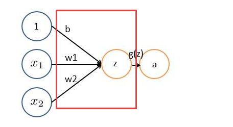

# 
Convolutional Neural Network

  

## 卷积神经网络层级结构
----
* 数据输入层 Input Layer
* 卷积计算层 CONV Layer - 线性乘积求和。
* ReLU激励层 ReLU Layer
* 池化层 Pooling Layer - 取区域平均或最大。
* 全连接层 Fully Coonected Layer

  

  

## 数据输入层 Input Layer
----
该层要对原始数据预处理：
1. 去均值：把输入数据各维度中心化为0，把样本中心拉回坐标系原点。
2. 归一化：幅度归一化到同样的范围，即减少各维度数据取值范围的差异而带来的干扰。
3. PCA/白化：用PCA降维；白化是对数据各个特征轴上的幅度归一化。

  

<i>去均值与归一化</i>

  

<i>去相关与白化效果</i>

  

## 卷积计算层 CONV Layer
----
给定一个"X"图案，计算机怎么识别这个图案是“X”呢？一个办法是存储一张标准的“X”图案，然后把未知图案跟标准"X"图案比对。如果一致，则判定未知图案即是"X"图案。即便未知图案有平移或变形，依然能辨别。如此，CNN是把未知图案和标准X图案一个局部一个局部的对比：

  

 

**未知图案局部和标准X图案局部一个个比对时的计算过程，便是卷积操作。**卷积计算结果为1表示匹配，否则不匹配。

  

 

### 卷积介绍
**对不同的数据窗口数据和滤波矩阵（一组固定的权重，因为每个神经元的多个权重固定，所以可看做一个恒定的滤波器filter）做内积（逐个元素相乘再求和）的操作就是卷积操作。**

红框部分可理解为一个滤波器，即带一组固定权重神经元。多个滤波器叠加便成了卷积层。

  

 

下图中，左边是原始数据，中间部分是滤波器，右边是输出的新的二维数据。中间滤波器与数据窗口做内积，计算过程是 $$ 4*0 + 0*0 + 0*0 + 0*0 + 0*1 + 0*1 + 0*0 + 0*1 + -4*2 = -8 $$。

  

 

### 图像上的卷积
左边是图像输入，中间是滤波器，不同的滤波器得到不同的输出，比如颜色深浅、轮廓。相当于如果想提取图像不同特征，则用不同的滤波器。

  

 

### 卷积计算介绍
在CNN中，滤波器对局部输入数据进行卷积计算。每计算完一个数据窗口后，数据窗口平移滑动，直到计算完所有数据。有这么几个参数： 
* 深度 $$ depth $$：神经元个数，决定输出的depth厚度，同时代表滤波器个数。
* 步长 $$ stride $$：决定滑动多少步可以到边缘。
* 填充值 $$ zero - padding $$：在外围边缘补充若干圈0，为了总长能被步长整除。 

  

  <iframe height=690 width=860 src="./Images/cnn10.gif">

 

可以看到：
* 两个神经元，即 $$ depth=2 $$，有两个滤波器。
* 数据窗口每次移动两个步长，取 $$ 3*3 $$局部数据，即 $$ stride=2 $$。
* $$ zero - padding = 1 $$
* 左边是输入。 $$ 7*7*3 $$中， $$ 7*7 $$代表图像的像素，即长宽，3代表RGB三个颜色通道。
* 中间是两个不同的滤波器 $$ w_0 $$和 $$ w_1 $$。
* 右边是两个不同的输出。分别以两个滤波器为轴滑动数组进行卷积计算，得到两组不同结果。

介绍详细计算过程。首先，分解下上述动图：

  

 

类似 $$ wx + b $$，_w_对应滤波器 $$ w_0 $$，_x_对应不同的数据窗口，_b_对应Bias $$ b_0 $$。相当于滤波器 $$ w_0 $$与一个个数据窗口相乘再求和后，最后加上Bias $$ b_0 $$得到结果1：

  

 

然后滤波器 $$ w_0 $$不变，数据窗口向右移动2步，继续做内积计算，得到0的输出结果：

  

 

最后，另一个滤波器 $$ w_1 $$、不同的偏置 $$ b_1 $$，再跟图中左边的数据窗口做卷积，得到另一个输出：

  

 

在图像处理中，往往把图像表示为像素向量，比如1000×1000图像，表示为1000000的向量。如果隐含层数目与输入层一样，即也是1000000时，那么输入层到隐含层的参数数据为 $$ 1000000×1000000=10^12 $$，太多了。**所以，卷积神经网络使用局部感知、参数共享和池化减少参数加快训练速度。**

 

### 局部感知
每次滤波器都是针对某一局部数据窗口进行卷积，这就是**局部感知机制**。每个神经元没必要对全局图像感知，只需对局部进行感知，然后在更高层将局部信息综合就得到全局信息。

> 滤波器像眼睛，人类视角有限，一眼望去只能看到世界的局部。如果一眼就看到全世界，会累死，且一下子接受所有信息，大脑接收不过来。即便看局部，针对局部信息双眼也是有偏重。比如看美女，对脸、胸、腿是重点关注，所以这3个输入的权重相对较大。

  

 

### 参数共享
即使用了局部感知，参数仍然过多。在局部连接中，每个神经元都对应100个参数，共1000000个神经元。如果这1000000个神经元的100个参数是相等的，那么参数数目就变为100了。

把这100个参数（也就是卷积操作）看成是提取特征的方式，该方式与位置无关。原理是图像的一部分统计特性与其他部分是一样的。意味着在这一部分学习的特征也能用在另一部分上，所以对于图像上所有位置，能使用同样的学习特征。

当数据窗口滑动时，输入在变化，但中间滤波器 $$ w_0 $$的权重（即每个神经元连接数据窗口的权重）是不变的。**这个权重不变即所谓的CNN中参数（权重）共享机制。**

  <iframe height=384 width=526 src="./Images/cnn17.gif">

 

  

## ReLU激励层
----
激活函数sigmoid在实际梯度下降中，容易饱和、造成终止梯度传递，且没有0中心化。ReLU则收敛快，求梯度简单。其对于输入的负值，输出全为0，对于正值，原样输出。

  

  

对整幅图操作之后，结果如下：

  

 

  

## 池化层 Pooling Layer
----
通过卷积获得了特征 后，下一步希望用特征做分类，但面临计算量的挑战。

例如，对于 $$ 96 * 96 $$像素图像，假设已得到400个定义在 $$ 8 * 8 $$输入上的特征，每个特征和图像卷积会得到一个 $$ (96 − 8 + 1) * (96 − 8 + 1) = 7921 $$ 维的卷积特征。由于有400个特征，所以每个样例都会得到一个 $$ 7921 * 400 = 3168400 $$维的卷积特征向量。学习超过3百万特征输入的分类器十分不便，且容易出现过拟合。

为解决这问题，先回忆一下，之所以使用卷积后特征是因为图像有一种静态属性，意味着在一个图像区域有用的特征极可能在另一个区域适用。因此，为了描述大的图像，一个自然的想法是对不同位置特征进行聚合统计。这些概要统计特征不仅具有低得多的维度，同时不易过拟合。**这种聚合的操作叫池化 (pooling)。**

  

 

### 池化操作例子
假设输入数据用不用feature进行同样的操作，最后得到的结果：

  

池化操作如下：

  

  

经过最大池化操作后，一幅图就缩小为四分之一：

  

 

> 因为最大池化（max-pooling）保留了每一个小块内最大值，相当于保留这一块最佳匹配结果（值越接近1表示匹配越好）。意味着不会具体关注窗口内到底哪一个地方匹配，而只关注是不是有某个地方匹配上。能够看出，CNN能发现图像中是否具有某种特征，而不在意到底在哪具有这种特征。这就解决逐一像素匹配的死板做法。

  

## Deep Learning = Convolution + ReLU + Pooling
----

  

加大网络的深度，增加更多的层，就得到深度神经网络了：

  

  

## 全连接层 Fully Coonected Layer
----

  

  

  

根据结果判定为"X"：

  

全连接层也能够有很多个：

  

  

## 总结
----

  

 

**整个过程，从前到后，被称作”前向传播“，得到一组输出，然后通过反向传播来不断纠正错误，进行学习。**

CNN由于需要局部通用的特征，因此适合于：
1. 声音
2. 图像
3. 文字

但对于一些不具备这样特征的数据，效果不佳：

  

