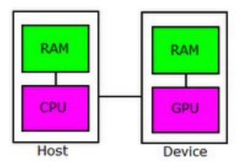
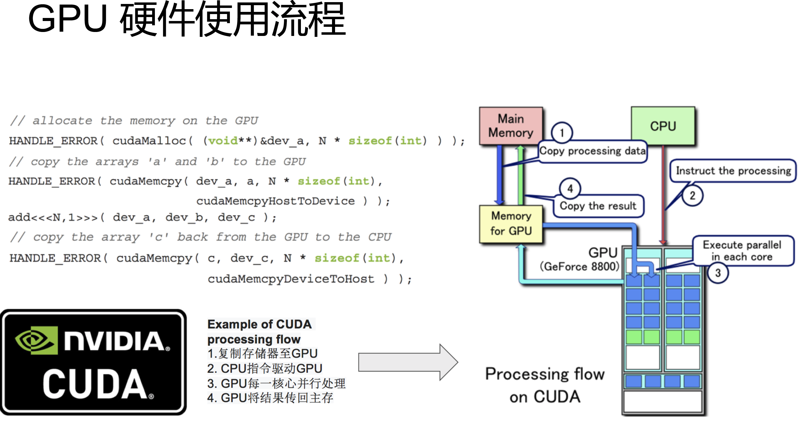
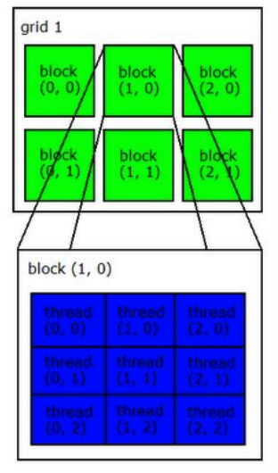

# <center>CUDA</center>

<br></br>


## 架构
----
使用C为基础，以C写出在显示芯片上执行的程序。

在CUDA架构下，程序分为两部份：
1. host端：在CPU上执行的部份。
2. device端：在显示芯片上执行的部份，又称为kernel。

通常host端程序将数据准备好后，复制到显卡内存，再由显示芯片执行device端程序。完成后由host端程序将结果从显卡内存取回。

<p align="center">
  
</p>

<p align="center">
  
</p>

由于CPU存取显卡内存时只能透过PCI Express接口，因此速度较慢（PCI Express x16理论带宽是双向各4GB/s），因此不能太常进行这类动作。

> CUDA执行时让host的kernel按照线程网格（Grid）在GPU执行。每一个线程网格包含多个线程块（block），每一个线程块中包含多个线程（thread）。

在CUDA架构下，显示芯片执行时最小单位是thread。数个thread可组成一个block。一个block中thread能存取同一块共享内存，且可进行同步动作。每一个block能包含的thread数目是有限的。不过，执行相同程序的block可组成grid。不同block中thread无法存取同一个共享内存，无法直接互通或同步。

因此，不同block中thread合作程度较低。不过，利用这个模式，可让程序不用担心显示芯片实际上能同时执行的thread数目限制。例如，一个具有少量执行单元的显示芯片，可能会把各个block中thread顺序执行，而非同时执行。不同grid则可执行不同的程序（即kernel）。

每个thread都有自己一份register和local memory空间。同一个block中每个thread有共享的一份share memory。此外，所有thread（包括不同block的thread）都共享一份global memory、constant memory和texture memory。不同grid则有各自global memory、constant memory和texture memory。

<p align="center">
  
</p>

<center><i>Grid、block和thread关系</i></center>

<br></br>


## Example
----
```c
#include<stdio.h>  
#include<cutil_inline.h>  
  
//主机端变量  
float* h_A;  
float* h_B;  
float* h_C;  
//设备端变量  
float* d_A;  
float* d_B;  
float* d_C;  
bool noprompt = false;  
  
  
//Functions  
void Cleanup(void);  
void RandomInit(float*, int);  
void ParseArguments(int, char**);  
  
//Device Code  
__global__ void VecAdd(const float* A, const float* B, float* C, int N)  
{  
    int i = blockDim.x * blockIdx.x + threadIdx.x;  
    if(i < N)  
        C[i] = A[i] + B[i];  
}  
  
//host code  
int main(int argc, char** argv)  
{  
    printf("Vector addition/n");  
    int N = 50000;  
    size_t size = N * sizeof(float);  
    ParseArguments(argc,argv);  
  
    h_A = (float*)malloc(size);  
    if(h_A == 0)  
        Cleanup();  
    h_B = (float*)malloc(size);  
    if(h_B == 0)  
        Cleanup();  
    h_C = (float*)malloc(size);  
    if(h_C == 0)  
        Cleanup();  
  
    //initalize input vectors  
    RandomInit(h_A, N);  
    RandomInit(h_B, N);  
  
    //Allocate vector in device memory  
    cutilSafeCall(cudaMalloc((void**)&d_A, size));  
    cutilSafeCall(cudaMalloc((void**)&d_B, size));  
    cutilSafeCall(cudaMalloc((void**)&d_C, size));  
  
    //copy vector from host memory to device memory  
    cutilSafeCall(cudaMemcpy(d_A, h_A, size, cudaMemcpyHostToDevice));  
    cutilSafeCall(cudaMemcpy(d_B, h_B, size, cudaMemcpyHostToDevice));  
  
    //invoke kernel  
    int threadsPerBlock = 256;  
    int blocksPerGrid = (N + threadsPerBlock - 1)/threadsPerBlock;  
    VecAdd<<<blocksPerGrid,threadsPerBlock>>>(d_A, d_B, d_C, N);  
    cutilCheckMsg("kernel launch failure");  
#ifdef _DEBUG  
    cutilSafeCall(cudaThreadSynchronize());  
#endif  
  
    //copy result from device memory to host memory  
    //h_C contains the result in host memory   
    cutilSafeCall(cudaMemcpy(h_C, d_C, size, cudaMemcpyDeviceToHost));  
      
    //verify result  
    int i;  
    for(i = 0; i < N; i++)  
    {  
        //printf("%f/t%f/t%f/n", h_A[i], h_B[i], h_C[i]);  
        float sum = h_A[i] + h_B[i];  
        if(fabs(h_C[i] - sum) > 1e-5)  
            break;  
    }  
    printf("%s /n",(i == N) ? "PASSED":"FAILED");  
  
    Cleanup();  
}  
  
void Cleanup()  
{  
    //free device memory  
    if(d_A)  
        cudaFree(d_A);  
    if(d_B)  
        cudaFree(d_B);  
    if(d_C)  
        cudaFree(d_C);  
  
    //free host memory  
    if(h_A)  
        free(h_A);  
    if(h_B)  
        free(h_B);  
    if(h_C)  
        free(h_C);  
  
    cutilSafeCall(cudaThreadExit());  
  
    if(!noprompt)  
    {  
        printf("/nPress ENTER to exit.../n");  
        fflush(stdout);  
        fflush(stderr);  
        getchar();  
    }  
    exit(0);  
}  
  
//allocates an array with random float entries  
void RandomInit(float* data, int n)  
{  
    for(int i = 0; i < n; i++)  
    {  
        data[i] = rand()/(float)RAND_MAX;  
    }  
}  
  
//parse program arguments  
void ParseArguments(int argc, char** argv)  
{  
    for(int i = 0; i < argc; i++)  
    {  
        if(strcmp(argv[i],"--noprompt") == 0 ||  
            strcmp(argv[i],"-noprompt") == 0)  
        {  
            noprompt = true;  
            break;  
        }  
    }  
}
```