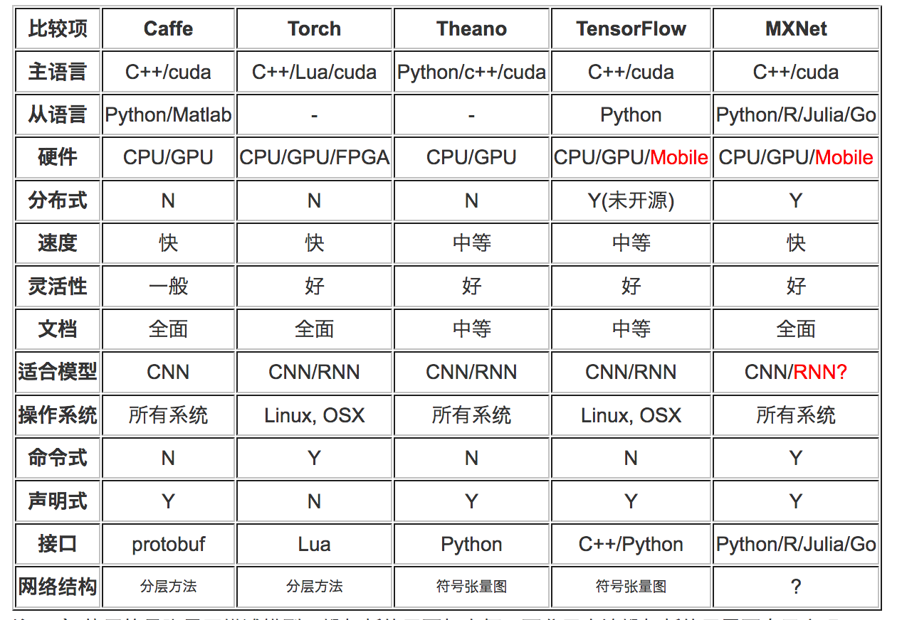
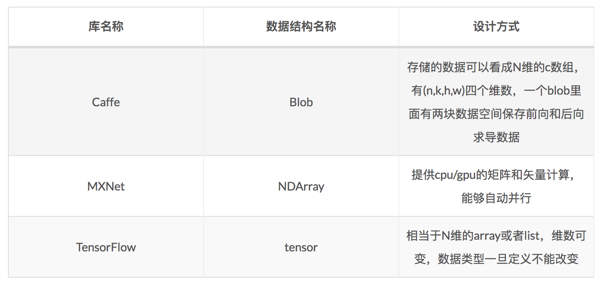
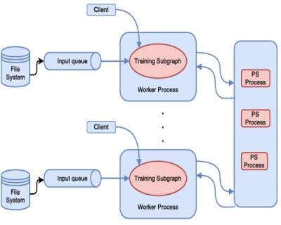
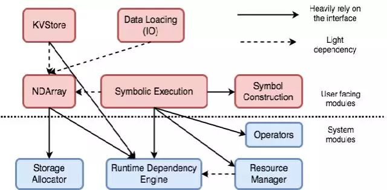
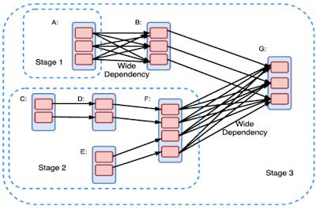
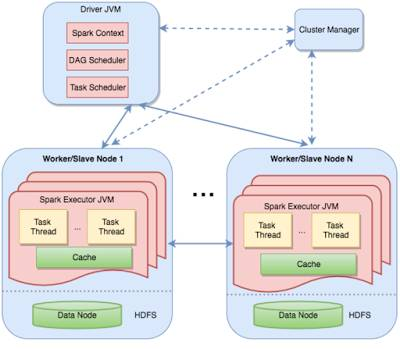
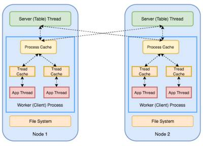

# 
Deep Learning Frameworks

  

* CNN表达空间相关性（学表示）。
* RNN/LSTM表达时间连续性（建模时序信号）。
* 命令式编程（imperative programming）：嵌入较浅，每个语句都按原来意思执行。
* 声明式语言（declarative programing）：嵌入很深，提供一整套对具体应用的迷你语言。即用户只需声明要做什么，而具体执行由系统完成。这类系统包括Caffe，Theano和TensorFlow。命令式编程易懂，但声明式更利于优化，以及自动求导，所以都保留。 

  

  

<i>Caffe/MXNet/TernsorFlow基本数据结构</i>

  

## Tensorflow
----
采用了更高级数据流处理范式，其中表示计算的图不再需要是DAG。图中可包括环，并支持可变状态。

TensorFlow将计算表示为一个由节点和边组成的有向图。节点表示计算操作或可变状态（如Variable），边表示节点间通信的多维数组，多维数据称为Tensor。TensorFlow需用户静态声明逻辑计算图，并通过将图重写和划分到机器上实现分布式计算。MXNet使用动态定义的图。这简化了编程，并提高了编程的灵活性。

  

优点：
1. Google背书，拥有产品级的高质量代码。

2. 是一个理想的RNN API和实现，TensorFlow使用向量运算的符号图方法，使得新网络的指定变得相当容易，支持快速开发。

3. 支持使用ARM/NEON指令实现model decoding。

4. TensorBoard是一个非常好用的网络结构可视化工具，对于分析训练网络非常有用。

5. 模型部署多样化。

    核心代码和Caffe一样用C++编写，简化了线上部署复杂度，并让手机这种内存和CPU资源都紧张的设备可运行复杂模型（Python会比较消耗资源）。除核心代码的C++接口，TensorFlow还有官方的Python、Go和Java接口，通过SWIG（Simplified Wrapper and Interface Generator）实现。这样可在硬件配置较好的机器中用Python进行实验，在资源紧张的嵌入式环境或需低延迟环境中用C++部署模型。

6. 支持其它机器学习算法。
    
    TensorFlow不局限于神经网络，其数据流式图支持自由算法表达，可实现深度学习外机器学习算法。只要可以将计算表示成计算图形式，就可使用TensorFlow。

7. 硬件异构形。
    
    TensorFlow支持Intel和AMD的CPU，通过CUDA支持NVIDIA GPU，通过OpenCL支持AMD GPU，支持Linux和Mac。在v0.12尝试支持Windows。同时，其在CPU上矩阵运算库使用Eigen而不是BLAS库，能够基于ARM架构编译和优化，因此在移动设备上表现得很好。

8. 原生支持分布式。
    
    目前原生支持的分布式深度学习框架不多，只有TensorFlow、CNTK、DeepLearning4J、MXNet等。

9. 原声实现应用机器学习的全流程：从训练模型、调试参数，到打包模型，最后部署服务。
    
    Google在2016年2月开源TensorFlow Serving，可将训练好的模型导出，并部署成可对外提供预测服务的RESTful接口。其他框架都缺少为生产环境部署的考虑。

缺点：
1. 速度慢，内存占用较大。

2. 支持的层没有Torch和Theano丰富，特别是没有时间序列的卷积，且卷积也不支持动态输入尺寸，这些功能在NLP中非常有用。

3. 分布式通信使用基于socket的RPC，而不是RDMA。
    
    目前在单GPU条件下，大多数深度学习框架都依赖于cuDNN。因此只要硬件计算能力或内存分配差异不大，最终训练速度不会相差太大。但对于大规模深度学习，需分布式计算，所以框架分布式性能是重要的。目前TensorFlow设计对不同设备间的通信优化得不是很好，单机reduction只能用CPU处理，分布式通信基于socket的RPC，而不是速度更快的RDMA，所以其分布式性能可能还没有达到最优。

  

## Caffe    
----
> Caffe全称为Convolutional Architecture for Fast Feature Embedding，由伯克利视觉学中心（Berkeley Vision and Learning Center，BVLC）进行维护。

Caffe核心概念是Layer，每一个神经网络模块都是一个Layer。Layer接收输入数据，同时经过内部计算产生输出数据。设计网络结构时，只需把各个Layer拼接在一起构成完整的网络。

比如卷积Layer，输入是图片像素点，内部操作是各种像素值与Layer参数卷积操作，最后输出是所有卷积核filter结果。每一个Layer需定义两种运算，一种是正向（forward）运算，即从输入数据计算输出结果，也就是模型预测过程；另一种是反向（backward）运算，从输出端gradient求解相对于输入gradient，即反向传播算法。实现新Layer时，需将正向和反向两种计算过程函数都实现，这部分需用户写C++或CUDA代码，对普通用户来说非常难上手。

优点：
1. 容易上手，网络结构都是以配置文件形式定义，不需要用代码设计网络。
2. 专精于图像处理。
3. 训练速度快，能够训练state-of-the-art模型与大规模数据。
4. 组件模块化，可以方便地拓展到新的模型和学习任务上。
5. 拥有大量的训练好的经典模型。
6. 底层是基于C++的，因此可在各种硬件环境编译并具有良好的移植性。支持Linux、Mac和Windows，也可部署到移动设备系统。

缺点：    
1. 有很多扩展，但由于遗留架构问题，不够灵活且对递归网络和语言建模支持很差。

2. 基于层的网络结构，扩展性不好。对于新增加的层，需自己实现（forward, backward and gradient update）。

3. RNN、LSTM等支持得不是特别充分。

    正如名字Convolutional Architecture for Fast Feature Embedding所描述的，Caffe设计时目标只针对图像，没考虑文本、语音或时间序列数据。因此对卷积神经网络支持非常好，但对时间序列RNN、LSTM 等支持得不是特别充分。同时，基于Layer模式也对RNN不友好，定义RNN结构麻烦。
    
4. 仅支持单机多GPU训练，没有原生支持分布式的训练。

  

## Keras
----
是一个高度模块化的神经网络库，使用Python实现，并可同时运行在TensorFlow和Theano上。Theano和TensorFlow计算图支持更通用的计算，而Keras专精于深度学习，提供了目前为止最方便的API。用户只需将高级模块拼在一起，就可设计神经网络。降低了编程开销和阅读别人代码时的理解开销。它同时支持卷积网络和循环网络，支持级联的模型或任意的图结构的模型，可让某些数据跳过某些Layer和后面Layer对接，使得创建Inception等复杂网络变得容易。

优点：
1. 从CPU上计算切换到GPU加速无须任何代码改动。
    因为底层使用Theano或TensorFlow，用Keras训练模型可享受前两者持续开发带来的性能提升，只是简化了编程的复杂度，节约了尝试新网络结构的时间。

2. 适合最前沿的研究。
    因为所有模块都是可配置、可随意插拔的，神经网络、损失函数、优化器、初始化方法、激活函数和正则化等模块都可以自由组合。Keras也包括绝大部分 state-of-the-art的Trick，包括Adam、RMSProp、Batch Normalization、PReLU、ELU、LeakyReLU等。

3. Keras中模型都是在Python中定的，不像Caffe等需额外文件定义模型，这样就可通过编程方式调试模型结构和各种超参数。

4. 构建在Python 上，有一套完整的科学计算工具链。

缺点：
1. 无法直接使用多GPU。

    对大规模的数据处理速度没其他支持多GPU和分布式框架快。

  

## MXNet
----
是DMLC（Distributed Machine Learning Community）开发的，让用户可混合使用符号编程模式和指令式编程模式。类似TensorFlow，MXNet也是数据流系统，支持具有可变状态有环计算图，并支持使用参数-服务器模型的训练计算。MXNet也对多个CPU/GPU 上数据并行提供了支持，并可实现模型并行。MXNet支持同步的和异步训练计算。在其组件中，运行时依赖引擎分析计算过程中的依赖关系，对不存在相互依赖关系的计算做并行处理。

  

MXNet使用检查点机制支持基本的容错，提供对模型save和load操作。

MXNet使用描述式编程语言表述计算为一个有向图，也支持使用指令式编程去定义tensor的计算和控制流。与TensorFlo 一样，MXNet后台核心引擎库使用C++编写。

优点：
1. AWS背书。
    是AWS官方推荐的深度学习框架。

2. 社区资源好。
    MXNet很多作者是中国人。

3. 分布式性能佳。
    是各个框架中率先支持多GPU和分布式的。MXNet核心是一个动态的依赖调度器，支持自动将计算任务并行化到多个GPU或分布式集群（支持 AWS、Azure、Yarn等)。

4. 支持非常多的语言封装，比如 C++、Python、R、Julia、Scala、Go、MATLAB和JavaScript等。

  

## Spark
----
在Spark中，计算被建模为有向无环图DAG。每个顶点表示一个RDD，每条边表示了RDD上一个操作。RDD由一系列被切分的对象（Partition）组成。被切分的对象在内存中存储并完成计算，也会在Shuffle过程中溢出（Overflow）到磁盘上。

在DAG中，一条从顶点A到B的有向边E，表示RDD B在RDD A上执行操作E的结果。操作分为转换（Transformation）和动作（Action）两类。转换操作（如map、filter和join）用于某个RDD上，转换操作输出是一个新的RDD。

  

用户将计算建模为DAG，该DAG表示了在RDD上执行的转换和动作。DAG进而被编译为多个Stage。每个Stage执行一系列并行运行的任务（Task），每个分区（Partition）对应一个任务。这里，有限（Narrow）依赖关系（一对一、多对一）有利于计算的高效执行，而宽泛（Wide）依赖关系（多对多）会引入瓶颈。因为这样的依赖关系引入通信密集Shuffle操作，打断了操作流 。

  

Spark分布是通过将DAG Stage划分到不同计算节点实的。上图展示了maste-worker架构。驱动器（Driver）包含两个调度器（Scheduler）组件，即DAG调度器和任务调度器。调度器对工作者分配任务并协调工作者。

Spark为通用数据处理而设计，并非专用于机器学习任务。要在Spark上运行机器学习任务，可用MLlib for Spark。如果采用基本设置的Spark，那么模型参数存储在驱动器节点上，在每次迭代后通过工作者和驱动器通信更新参数。如果是大规模部署机器学习任务，驱动器可能无法存储所有模型参数。这时需用RDD去容纳所有参数。这将引入大量额外开销，因为为容纳更新的模型参数，需在每次迭代中创建新RDD。更新模型会涉及在机器和磁盘间数据Shuffle，进而限制Spark扩展性。这正是基本数据流模型（即DAG）短板。Spark不能很好地支持机器学习中迭代运算。

  

## PMLS
----
专门为机器学习任务而设计，引入称为“Parameter-Server抽象，这种抽象是为了支持迭代密集的训练过程。

  

PS（图中绿色方框）以分布式key-value形式存于内存，是可复制和分片的。每个node是模型中某个分片的主节点（参数空间），并作为其它分片二级节点或复制节点。

PS节点存储并更新模型参数，并响应来自于工作者请求。工作者从自己本地PS拷贝上请求最新模型参数，并分配给它们数据集分区上执行计算。

PMLS也采用SSP（Stale Synchronous Parallelism）模型。相比于BSP（Bulk Synchronous Parellelism）模型 ，SSP放宽了每一次迭代结束时各机器需做同步的要求。为实现同步，SSP允许工作者间存在一定程度上不同步，并确保最快工作者不会领先最慢工作者s轮迭代。由于处理过程处于误差允许范围内，这种非严格一致性模型适用于机器学习。

  

## Torch
----
和TensorFlow一样使用了底层C++加上层脚本语言调用的方式，只不过使用的是Lua。

优点：    
1. Facebook背书。
2. 实现并优化基本计算单元，使用者可简单在此基础上实现自己算法，不用浪费精力在计算优化上。核心计算单元使用C或CUDA做了优化。在此基础上，使用lua构建了常见模型。
3. 速度最快。
4. 支持全面的卷积操作：
    * 时间卷积：输入长度可变，而TF和Theano都不支持，对NLP非常有用；
    * 3D卷积：Theano支持，TF不支持，对视频识别很有用

缺点：
1. 接口为lua语言，需要时间学习。
2. 没有Python接口。
3. 与Caffe一样，基于层的网络结构，扩展性不好。对于新增加的层，需要自己实现（forward, backward and gradient update）。
4. RNN没有官方支持。

  

## Theano
----
> Theano诞生于2008年，由蒙特利尔大学开发并维护，是一个高性能的符号计算及深度学习库。

是一个完全基于Python（C++/CUDA代码也打包为Python字符串）的符号计算库。用户定义的各种运算，Theano可自动求导，省去了完全手工写神经网络反向传播算法的麻烦，也不需像Caffe一样为Layer写C++或CUDA代码。核心是数学表达式的编译器，专门为处理大规模神经网络训练计算而设计。可将用户定义的各种计算编译为高效底层代码，并链接各种可以加速的库，比如BLAS、CUDA等。

优点：
1. 非常的灵活，适合做学术研究的实验，且对递归网络和语言建模有较好的支持。
2. 派生出了大量深度学习Python软件包，包括Blocks和Keras。
3. 计算稳定性好，比如可精准计算输出值很小的函数，像 $$ log(1+x) $$。
4. 动态地生成C或CUDA代码，编译成高效机器代码。

缺点：
1. 编译过程慢，但同样采用符号张量图的TF无此问题。
    运算时需将用户Python代码转成CUDA代码，再编译为二进制可执行文件。编译复杂模型时间非常久。
2. 作为开发者，很难进行改进，因为code base是Python，而C/CUDA代码被打包在Python字符串中。
3. CPU上性能较差。
4. 更多地被当作研究工具，而不是当作产品。
    虽然支持 Linux、Mac和Windows，但没有底层C++接口。因此模型部署不方便。依赖于各种Python库，且不支持移动设备。
5. 在CUDA和cuDNN上不支持多GPU，只在OpenCL和Theano自己gpuarray库上支持多GPU训练。
6. 没有分布式的实现。