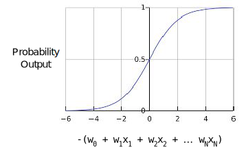
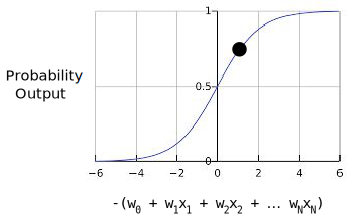
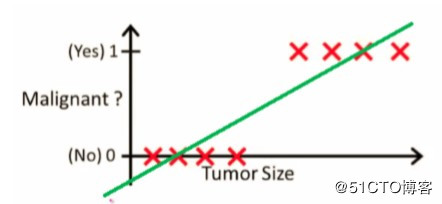
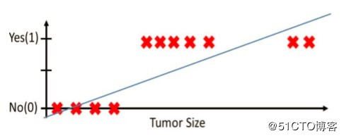

# 
Logistic Regression

  

## Probability
----
How a logistic regression model can ensure output that always falls between 0 and 1. This is because sigmoid function:

$$
y = \frac{1}{1+\mathit{e}^{-z}}
$$

where
* $$y$$ is the output of logistic regression model for a particular example.
* $$z$$ is $$b + w_{1}x_{1} + w_{2}x_{2} + ... + w_{n}x_{n}$$.
* $$w$$ is the model's learned weights and bias.
* $$x$$ is the feature values for a particular example.

If $$z$$ represents the output of linear layer of a model trained with logistic regression, then sigmoid(z) will yield a value (a probability) between 0 and 1. 

Suppose we had a logistic regression model with three features that learned the following bias and weights:
* $$b = 1$$
* $$w_{1} = 2$$
* $$w_{2} = -1$$
* $$w_{3} = 5$$

Further suppose the following feature values for a given example:
* $$x_{1} = 0$$
* $$x_{2} = 10$$
* $$x_{3} = 2$$

Therefore, the log-odds:

$$
b + w_{1}x_{1} + w_{2}x_{2} + w_{3}x_{3} = 1 + 2 * 0 + (-1) * 10 + 5 * 2 = 1
$$

Consequently, the logistic regression prediction for this particular example will be 0.731% probability:

$$
y = \frac{1}{1+\mathit{e}^{-z}} = 0.731
$$

  

## Loss Function
----
The loss function for linear regression is squared loss. The loss function for logistic regression is **Log Loss**:

$$
\textbf{Log Loss } = \sum_{(x,y)\in{D}} - y\log(y') - (1-y)\log(1-y')
$$

where:
* $$(x,y) \in{D}$$ is the data set containing many labeled examples, which are $$(x,y)$$ pairs.
* $$y$$ is the label in a labeled example. Since this is logistic regression, every value of $$y$$ must either be 0 or 1.
* $$y'$$ is the predicted value (between 0 and 1), given the set of features in $$x$$.

The equation for Log Loss is closely related to Shannon's Entropy measure from Information Theory. It is also the negative logarithm of the likelihood function, assuming a Bernoulli distribution of $$y$$. Indeed, minimizing the loss function yields a maximum likelihood estimate.

  

## Logistic Regression vs Liner Regression
----
在线性回归中，结果是连续的。它可有无限数量的可能值中任一个。在逻辑回归中，结果只有有限数量可能值。

例如，如果X包含房屋面积，Y包含房屋售价，则可用线性回归预测售价作为房屋大小的函数。虽然售价可能不是任何的，但存在许多可能值，选线性回归模型。如果根据大小预测房子是否超过2万美元，可使用逻辑回归。

所以与线性回归不同，逻辑回归主要解决分类问题。比如恶性和良性肿瘤判定。假设通过拟合数据得到线性回归方程和一个阈值，用阈值判定是良性还是恶性：

size小于某值是良性。但噪声对线性方程影响大，例如再加三个样本可使方程变成：

逻辑回归首先把样本映射到$$[0,1]$$之间数值，这归功于sigmoid函数。
