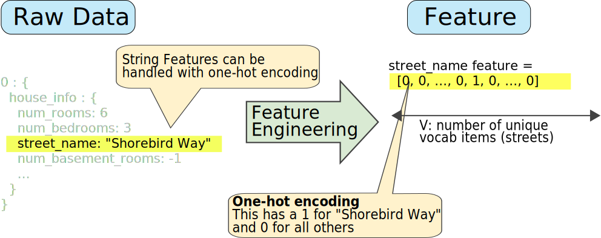
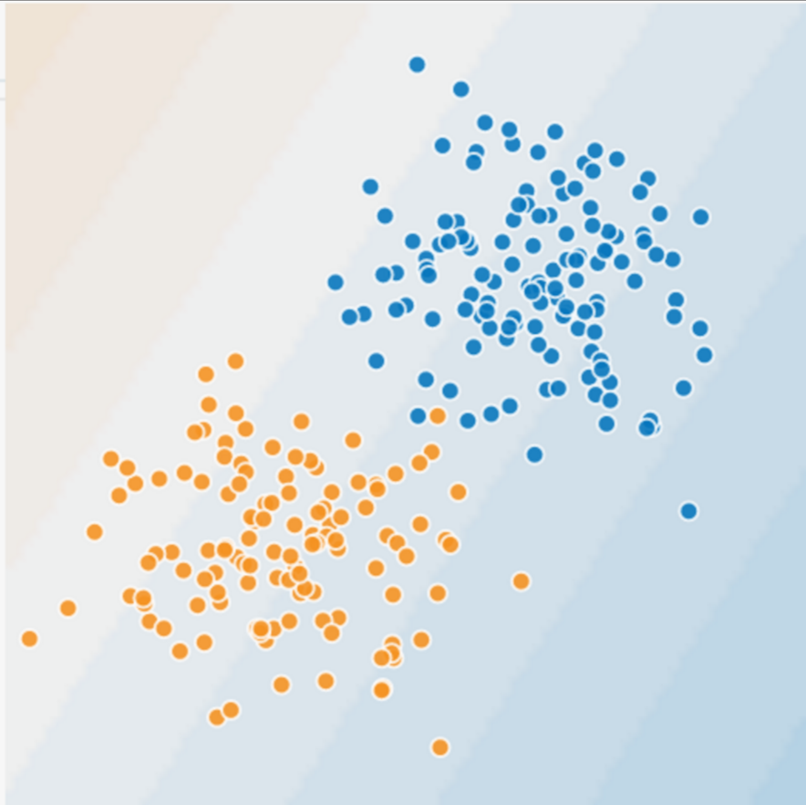
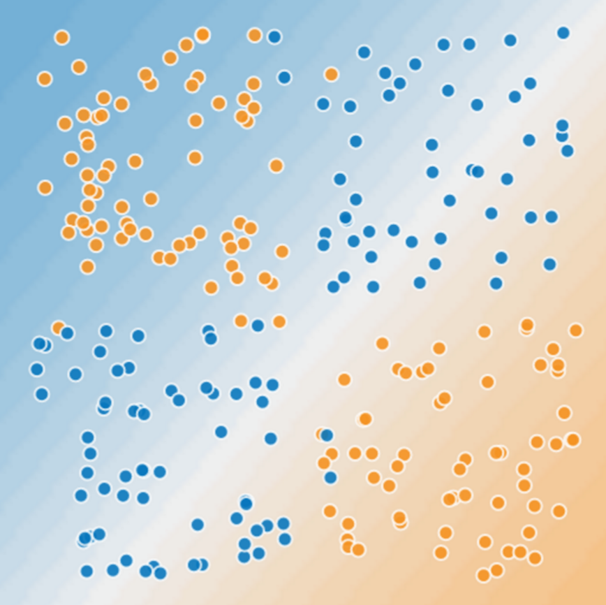
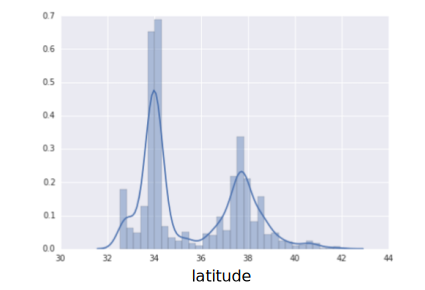

# <center>Machine Learning</center>

<br></br>


## 算法分类
----
* 有监督学习 vs 无监督学习 vs 半监督学习。

* 分类与回归 vs 聚类 vs 标注。

* 生成模型 vs 判别模型。

  * 都是有监督学习。
  
  * 生成模型是生成数据的分布的模型；判别模型是判别数据输出量的模型。从结果角度，两种模型都输出量。但生成模型处理过程会告诉数据统计信息（贝叶斯概率或数据分布等），更接近统计学。判别模型通过处理得到结果，结果可能是概率的或不是。如决策树的if then说不是这个就是那个，明显是判别。
  
  * K近邻、感知机、逻辑斯谛回归模型、最大熵模型、SVN和提升方法是判别模型。隐马尔可夫是生成模型。

<br></br>


## AI vs ML vs DL
----
<p align="center">
  
</p>

机器学习是AI子集，涵盖有关数据训练的学习算法研究：
* 线性回归（Linear Regression，数理统计中回归分析方法）；
* K均值（K-means，基于原型的目标函数聚类方法）；
* 决策树（Decision Trees，直观运用概率分析的一种图解法）；
* 随机森林（Random Forest，包含多个决策树的分类器）；
* PCA（Principal Component Analysis，主成分分析，一种多变量分析方法）；
* SVM（Support Vector Machine，支持向量机，一种监督式学习的方法）；
* ANN（Artificial Neural Networks，人工神经网络，一种运算模型）。

<br>


### Problem Solving Approach
When solving a problem using traditional Machine Learning, it is generally recommended to break the problem down into different parts, solve them individually and combine them to get the result. Deep Learning in contrast advocates to solve the problem end-to-end.

<p align="center">
  
</p>

<br>


### Interpretability
Suppose we use Deep Learning to give automated scoring to essays. The performance it gives is near human performance. But it does not reveal why it has given that score. Indeed mathematically you can find out which nodes of a deep neural network were activated, but we don’t know what there neurons were supposed to model and what these layers of neurons were doing collectively. So we fail to interpret the results.

On the other hand, Machine Learning like decision trees give us crisp rules as to why it chose what it chose, so it is particularly easy to interpret the reasoning behind it. Therefore, algorithms like decision trees and linear/logistic regression are primarily used in industry for interpretability.

<br></br>


## GPU vs CPU
----
GPU好处：
1. 显示芯片有更大内存带宽。例如GeForce 8800GTX有50GB/s内存带宽，高阶CPU内存带宽在10GB/s。
2. 显示芯片有更大量执行单元。例如GeForce 8800GTX有128个stream processors，频率为1.35GHz。CPU频率通常较高，但执行单元数目要少。

GPU缺点：
1. 显示芯片运算单元数量很多，因此对于不能高度并行化工作，带来的帮助不大。
2. 显示芯片通常只支持32 bits浮点数，且多半不能完全支持IEEE 754规格。许多显示芯片没有分开整数运算单元，因此整数运算效率差。
3. 显示芯片不具有分支预测等复杂流程控制单元，对高度分支的程序，效率差。

由于显示芯片大量并行计的特性，它处理问题方式和CPU不同：
1. 内存存取latency问题：CPU使用cache解决。GPU没有cache或很小，所以用并行化执行方式隐藏内存latency。即当第一个进程需等待内存读取结果时，则开始执行第二个进程，依此类推。
2. 分支指令问题：CPU利用分支预测等减少分支指令造成的pipeline bubble。GPU使用类似处理内存latency方式，但效率差。

<p align="center">
  
</p>

<br></br>


## Validation
----
Make sure test set meets the following two conditions:
1. Is large enough to yield statistically meaningful results?
2. Is representative of the data set as a whole? In other words, don't pick a test set with different characteristics than the training set.

Never train on test data. If seeing surprisingly good results on evaluation metrics, it might be a sign that you are accidentally training on test set. For example, high accuracy might indicate that test data has leaked into training set.

For example, consider a model that predicts whether an email is spam, using the subject line, email body, and sender's email address as features. We apportion the data into training and test sets, with an 80-20 split. After training, the model achieves 99% precision on both the training set and the test set. Take a look at the data and discover that many of the examples in the test set are duplicates of examples in the training set.

Partition data set:


Use validation set to evaluate results from training set. Then, use test set to double-check evaluation after model has "passed" the validation set.


<br></br>


## Feature Engineering
----
### Mapping categorical values
Categorical features have a discrete set of possible values. For example, there might be a feature called `street_name` with options that include:

```
{'Charleston Road', 'North Shoreline Boulevard', 'Shorebird Way', 'Rengstorff Avenue'}
```

We can accomplish this by defining a mapping from the feature values, which we'll refer to as the vocabulary of possible values, to integers. Since not every street in the world will appear in dataset, we can group all other streets into a catch-all "other" category, known as an OOV (out-of-vocabulary) bucket.

Here's how we can map our street names to numbers:
* map Charleston Road to 0
* map North Shoreline Boulevard to 1
* map Shorebird Way to 2
* map Rengstorff Avenue to 3
* map everything else (OOV) to 4

However, if we incorporate these index numbers directly into our model, it will impose some constraints:
* We'll be learning a single weight that applies to all streets. For example, if we learn a weight of 6 for street_name, then we will multiply it by 0 for Charleston Road, by 1 for North Shoreline Boulevard and so on. Consider a model that predicts house prices using `street_name` as a feature. It is unlikely that there is a linear adjustment of price based on street name, and furthermore this would assume you have ordered the streets based on their average house price. Our model needs the flexibility of learning different weights for each street that will be added to the price estimated using the other features.

* We aren't accounting for cases where `street_name` may take multiple values. For example, many houses are located at the corner of two streets, and there's no way to encode that information in the `street_name` value if it contains a single index.

To remove both constraints, we can create a binary vector for each categorical feature in model that represents values as follows:
* For values that apply to the example, set corresponding vector elements to 1.
* Set all other elements to 0.

The length of this vector is equal to the number of elements in vocabulary. This representation is called a **one-hot encoding** when a single value is 1, and a multi-hot encoding when multiple values are 1.

Figure illustrates a one-hot encoding of a particular street: Shorebird Way. The element in the binary vector for Shorebird Way has a value of 1, while the elements for all other streets have values of 0.



<br></br>


## Feature Corsses
----
### Encoding Nonlinearity
This is a linear problem.



But this is not.



To solve it, create a feature cross. **A feature cross is a synthetic feature that encodes nonlinearity in the feature space by multiplying two or more input features together.** Create a feature cross named $$x_{3}$$ by crossing $$x_{1}$$ and $$x_{2}$$:

$$
x_{3} = x_{1}x_{2}
$$

Treat newly minted $$x_{3}$$ feature cross just like any other feature. The linear formula becomes:

$$
y = b + w_{1}x_{1} + w_{2}x_{2} + w_{3}x_{3}
$$

A linear algorithm can learn a weight for $$w_{3}$$ as it would for $$w_{1}$$ and $$w_{2}$$. In other words, although $$w_{3}$$ encodes nonlinear information, you don’t need to change how the linear model trains to determine the value of $$w_{3}$$.

<br></br>


## Data Clean
----
### Binning
The plot shows the relative prevalence of houses at different latitudes in California. Notice the clustering—Los Angeles is about at latitude 34 and San Francisco is roughly at latitude 38.



`latitude` is a floating-point value. It doesn't make sense to represent `latitude` as a floating-point feature in model. Because no linear relationship exists between `latitude` and housing values. For example, houses in latitude 35 are not 35/34 more expensive (or less expensive) than houses at latitude 34.

To make `latitude` a helpful predictor, divide them into "bins":


Instead of having one floating-point feature, we now have 11 distinct boolean features. Having 11 separate features is somewhat inelegant, so let's unite them into a single 11-element vector. Doing so will enable us to represent latitude 37.4 as follows:

```
[0, 0, 0, 0, 0, 1, 0, 0, 0, 0, 0]
```

Model can now learn completely different weights for each latitude.

Another approach is to bin by quantile, which ensures that the number of examples in each bucket is equal. Binning by quantile completely removes the need to worry about outliers.

<br></br>
