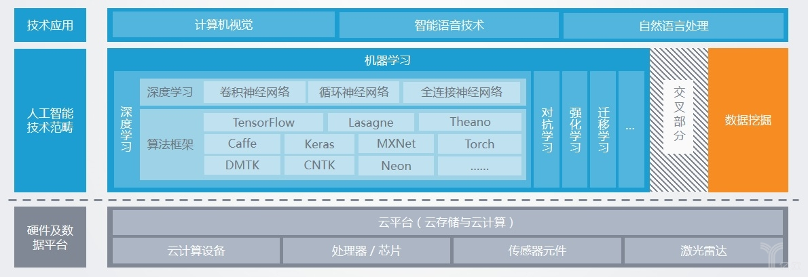
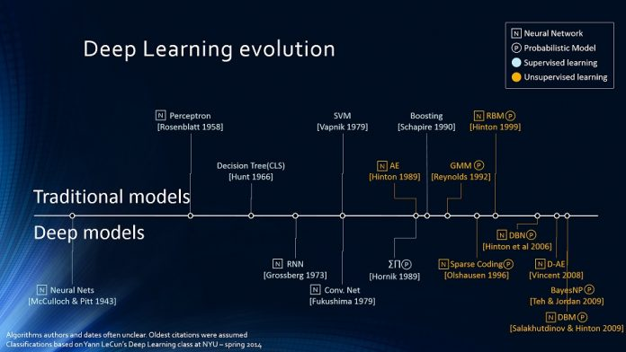
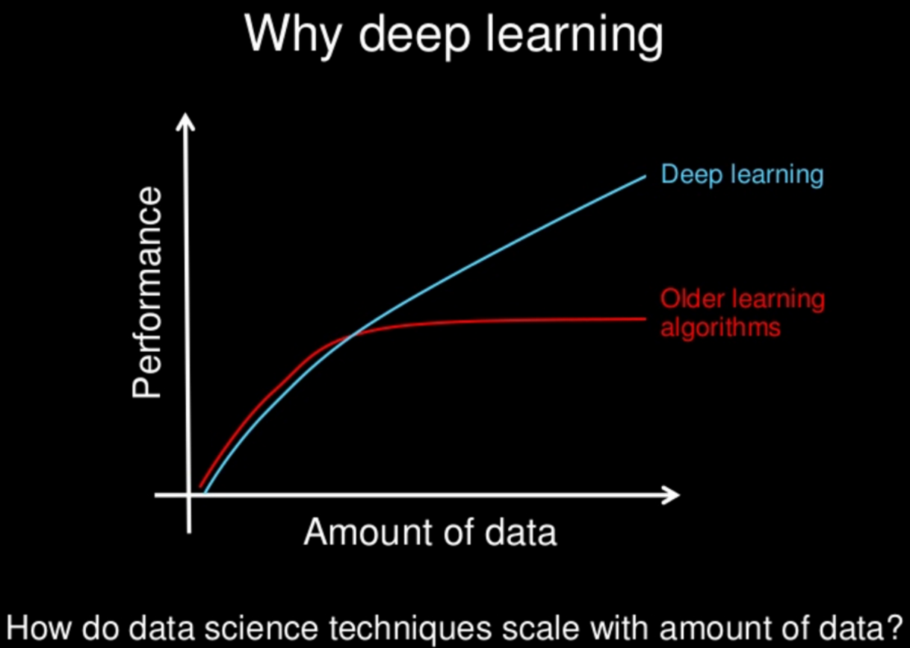
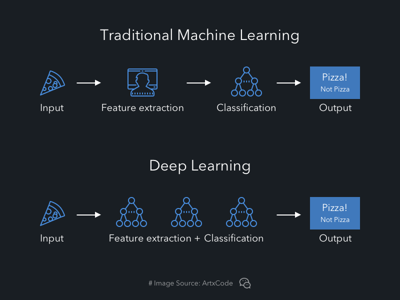
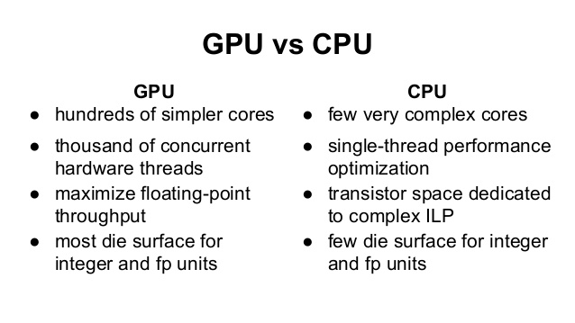

# 
Machine Learning

  

## Artificial Intelligence vs Machine Learning vs Deep Learning
----

  

 

AI是合集概念，涵盖最早老式人工智能，到深度学习。

机器学习是AI子集，涵盖有关数据训练的学习算法研究：
* 线性回归（Linear Regression，数理统计中回归分析方法）；
* K均值（K-means，基于原型的目标函数聚类方法）；
* 决策树（Decision Trees，直观运用概率分析的一种图解法）；
* 随机森林（Random Forest，包含多个决策树的分类器）；
* PCA（Principal Component Analysis，主成分分析，一种多变量分析方法）；
* SVM（Support Vector Machine，支持向量机，一种监督式学习的方法）；
* ANN（Artificial Neural Networks，人工神经网络，一种运算模型）。

深度学习起源于人工神经网络。

  

 

### Data Dependencies
When the data is small, Deep Learning doesn’t perform that well. On the other hand, traditional Machine Learning with their handcrafted rules prevail in this scenario.

  

 

### Hardware Dependencies
Deep Learning heavily depend on high-end machines, contrary to traditional Machine Learning, which can work on low-end machines. Deep Learning inherently do a large amount of matrix multiplication operations. These operations can be efficiently optimized using a GPU because GPU is built for this purpose.

 

### Feature Engineering
 > Feature engineering is a process of putting domain knowledge into the creation of feature extractors to reduce the complexity of the data and make patterns more visible to learning algorithms to work.

In Machine Learning, most of the applied features need to be identified by an expert and then hand-coded as per the domain and data type.

Deep Learning try to learn high-level features from data. **This is a very distinctive part of Deep Learning and a major step ahead of traditional Machine Learning.**

 

### Problem Solving Approach
When solving a problem using traditional Machine Learning, it is generally recommended to break the problem down into different parts, solve them individually and combine them to get the result. Deep Learning in contrast advocates to solve the problem end-to-end.

  

 

### Execution time
Deep Learning takes long time to train. Because there are so many parameters. State of the art Deep Learning algorithm ResNet takes about two weeks to train completely from scratch. Whereas Machine Learning comparatively takes much less time to train, ranging from a few seconds to a few hours.

This is turn is completely reversed on testing time. At test time, Deep Learning algorithm takes much less time to run. Whereas, if you compare it with k-nearest neighbors, test time increases on increasing the size of data. Although this is not applicable on all Machine Learning, as some of them have small testing times too.

 

### Interpretability
Let’s take an example. Suppose we use Deep Learning to give automated scoring to essays. The performance it gives is near human performance. But it does not reveal why it has given that score. Indeed mathematically you can find out which nodes of a deep neural network were activated, but we don’t know what there neurons were supposed to model and what these layers of neurons were doing collectively. So we fail to interpret the results.

On the other hand, Machine Learning like decision trees give us crisp rules as to why it chose what it chose, so it is particularly easy to interpret the reasoning behind it. Therefore, algorithms like decision trees and linear/logistic regression are primarily used in industry for interpretability.

  

## GPU vs CPU
----
GPU好处：
1. 显示芯片有更大内存带宽。例如GeForce 8800GTX有50GB/s内存带宽，高阶CPU内存带宽在10GB/s。
2. 显示芯片有更大量执行单元。例如GeForce 8800GTX有128个 "stream processors"，频率为1.35GHz。CPU频率通常较高，但执行单元数目要少。

GPU缺点：
1. 显示芯片运算单元数量很多，因此对于不能高度并行化工作，带来的帮助不大。
2. 显示芯片通常只支持32 bits浮点数，且多半不能完全支持IEEE 754规格，有些运算精确度较低。目前许多显示芯片没有分开整数运算单元，因此整数运算效率差。
3. 显示芯片通常不具有分支预测等复杂流程控制单元，因此对于具有高度分支的程序，效率差。

由于显示芯片大量并行计的特性，它处理问题方式和CPU不同：
1. 内存存取latency问题：CPU使用cache解决。显示芯片多半没有cache或很小，所以利用并行化
执行方式来隐藏内存的latency。即当第一个thread需等待内存读取结果时，则开始执行第二个thread，依此类推。
2. 分支指令问题：CPU利用分支预测等减少分支指令造成的pipeline bubble。显示芯片使用类似处理内存latency方式。不过，显示芯片处理分支效率会差。

  

  
