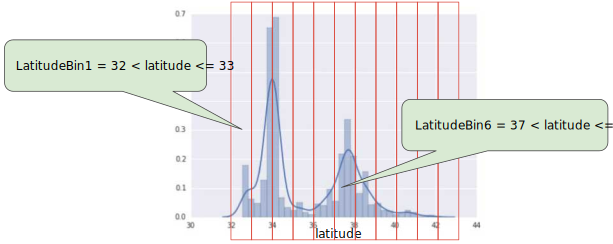

# <center>Machine Learning</center>

<br></br>


## 算法分类
----
* 有监督学习 vs 无监督学习 vs 半监督学习。

* 分类与回归 vs 聚类 vs 标注。

<br>


### Supervised Learning
> **数据集有输入和标签。**

监督学习是输入标记的数据，然后建模拟合，最后让计算机预测未知数据的结果。

一般有两种：
1. 回归问题 Regression：预测一系列**连续值**。

   

2. 分类问题 Classification：预测一系列**离散值**。

    常用的分类器有人工神经网络、SVM、高斯混合模型、朴素贝叶斯方法、决策树和径向基函数分类。

   

<br>


### Unsupervised Learning
> **数据集只有输入，没有标签。**

相对监督学习，训练集没有人为标注（无反馈），我们不会给出结果或无法得知训练集结果是什么，单纯由计算机自行分析得出结果。

Unsupervised Learning allows us to approach problems with little or no idea what our results should look like. We can derive structure from data where we don't necessarily know the effect of variables. We can derive this structure by clustering the data based on relationships among the variables in the data. With Unsupervised Learning, there is no feedback based on the prediction results.

无监督学习分为两种：
1. 聚类 Clustering
   - 新闻聚合
   - 市场细分
   - 社交网络分析
2. 非聚类
   - 鸡尾酒问题。在鸡尾酒会上，说话声音彼此重叠，很难分辨面前的人说什么。我们很难对这个问题数据标注，而通过无监督学习算法，可将说话者声音同背景音乐分离。

<br>


### Semi-supervised Learning
半监督学习就是利用数据集上已有的模型，对未知数据打标签。

<br></br>


## GPU vs CPU
----
GPU好处：
1. 显示芯片有更大内存带宽。
2. 显示芯片有更大量执行单元。例如GeForce 8800GTX有128个stream processors，频率为1.35GHz。CPU频率通常较高，但执行单元数目少。

GPU缺点：
1. 显示芯片运算单元数量多，对于不能高度并行化工作帮助不大。
2. 显示芯片通常只支持32 bits浮点数，且多半不完全支持IEEE 754规格。许多显示芯片没有分开整数运算单元，因此整数运算效率差。
3. 显示芯片不具有分支预测等复杂流程控制单元，对高度分支的程序，效率差。

由于显示芯片大量并行计的特性，它处理问题方式和CPU不同：
1. 内存存取latency问题：CPU使用cache解决。GPU没有cache或很小，所以用并行化执行方式隐藏内存latency。即当第一个进程需等待内存读取结果时，则开始执行第二个进程，依此类推。
2. 分支指令问题：CPU利用分支预测等减少分支指令造成的pipeline bubble。GPU使用类似处理内存latency方式，但效率差。

<p align="center">
  
</p>

<br></br>


## Feature Engineering
----
### Mapping categorical values
Categorical features have a discrete set of possible values. For example, there might be a feature called `street_name` with options that include:

```
{'Charleston Road', 'North Shoreline Boulevard', 'Shorebird Way', 'Rengstorff Avenue'}
```

We can accomplish this by defining a mapping from the feature values, which we'll refer to as the vocabulary of possible values, to integers. Since not every street in the world will appear in dataset, we can group all other streets into a catch-all "other" category, known as an OOV (out-of-vocabulary) bucket.

Here's how we can map our street names to numbers:
* map Charleston Road to 0
* map North Shoreline Boulevard to 1
* map Shorebird Way to 2
* map Rengstorff Avenue to 3
* map everything else (OOV) to 4

However, if we incorporate these index numbers directly into our model, it will impose some constraints:
* We'll be learning a single weight that applies to all streets. For example, if we learn a weight of 6 for `street_name`, then we will multiply it by 0 for Charleston Road, by 1 for North Shoreline Boulevard and so on. Consider a model that predicts house prices using `street_name` as a feature. It is unlikely that there is a linear adjustment of price based on street name, and furthermore this would assume you have ordered the streets based on their average house price. Our model needs the flexibility of learning different weights for each street that will be added to the price estimated using the other features.

* We aren't accounting for cases where `street_name` may take multiple values. For example, many houses are located at the corner of two streets, and there's no way to encode that information in the `street_name` value if it contains a single index.

To remove both constraints, we can create a binary vector for each categorical feature in model that represents values as follows:
* For values that apply to the example, set corresponding vector elements to 1.
* Set all other elements to 0.

The length of this vector is equal to the number of elements in vocabulary. This representation is called a **one-hot encoding** when a single value is 1, and a multi-hot encoding when multiple values are 1.

Figure illustrates a one-hot encoding of a particular street: Shorebird Way. The element in the binary vector for Shorebird Way has a value of 1, while the elements for all other streets have values of 0.


<br></br>


## Feature Corsses
----
### Encoding Nonlinearity
This is a linear problem.

<p align="center">
  
</p>

But this is not.

<p align="center">
  
</p>

To solve it, create a feature cross, which **is a synthetic feature that encodes nonlinearity in the feature space by multiplying two or more input features together.** Create a feature cross named $$x_{3}$$ by crossing $$x_{1}$$ and $$x_{2}$$:

$$
x_{3} = x_{1}x_{2}
$$

Treat newly minted $$x_{3}$$ feature cross just like any other feature. The linear formula becomes:

$$
y = b + w_{1}x_{1} + w_{2}x_{2} + w_{3}x_{3}
$$

A linear algorithm can learn a weight for $$w_{3}$$ as it would for $$w_{1}$$ and $$w_{2}$$. In other words, although $$w_{3}$$ encodes nonlinear information, you don’t need to change how the linear model trains to determine the value of $$w_{3}$$.

<br></br>


## Data Clean
----
### Binning
The plot shows the relative prevalence of houses at different latitudes in California. Notice the clustering—Los Angeles is about at latitude 34 and San Francisco is roughly at latitude 38.


`latitude` is a floating-point value. It doesn't make sense to represent `latitude` as a floating-point feature in model. Because no linear relationship exists between `latitude` and housing values. For example, houses in latitude 35 are not 35/34 more expensive (or less expensive) than houses at latitude 34.

To make `latitude` a helpful predictor, divide them into "bins":



Instead of having one floating-point feature, we now have 11 distinct boolean features. Having 11 separate features is somewhat inelegant, so let's unite them into a single 11-element vector. Doing so will enable us to represent latitude 37.4 as follows:

```
[0, 0, 0, 0, 0, 1, 0, 0, 0, 0, 0]
```

Model can now learn completely different weights for each latitude.

Another approach is to bin by quantile, which ensures that the number of examples in each bucket is equal. Binning by quantile completely removes the need to worry about outliers.

<br></br>
