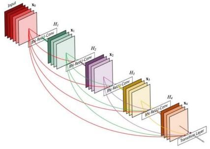
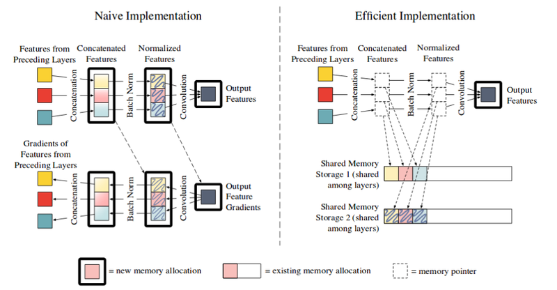
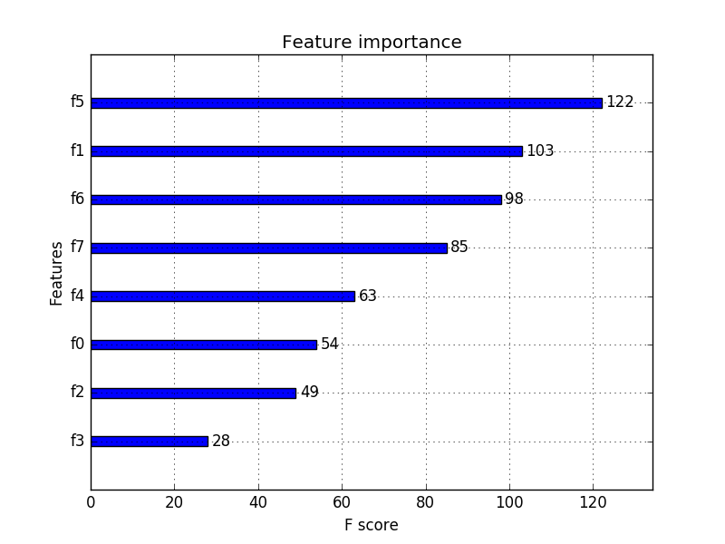
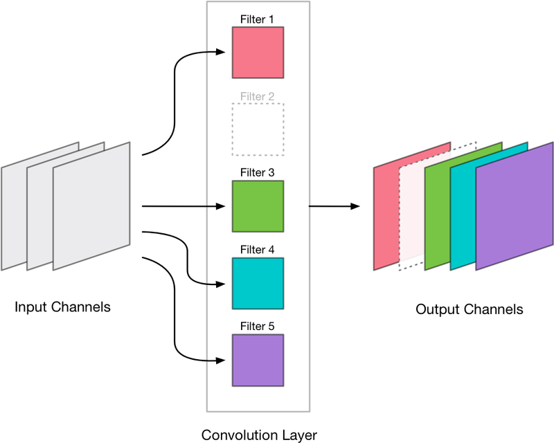
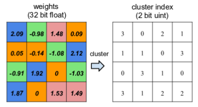
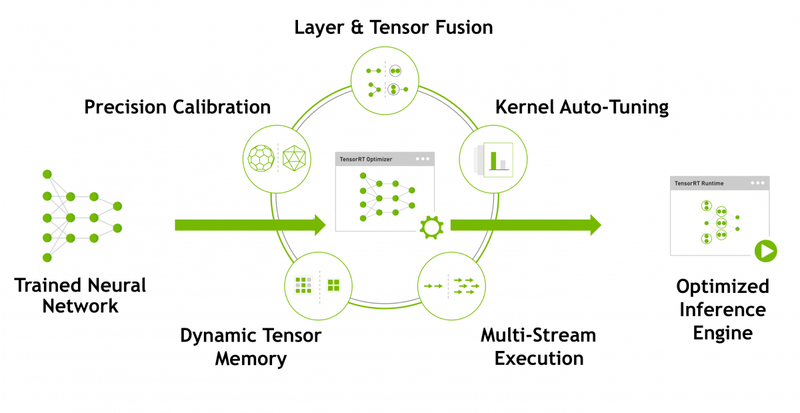
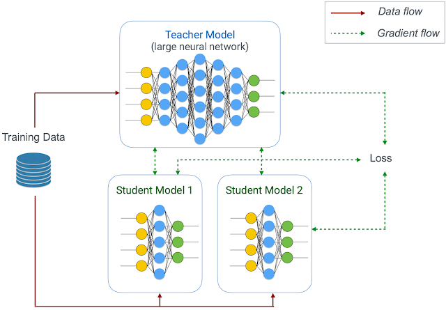

# 
How to Improve Model Performance
 

  

本文探讨了一些可用于在内存受限的配置下部署神经网络的技术。

  

## 训练阶段
----
某些应用须在线学习。即，模型性能提高是依赖于反馈或附加数据。在边缘设备上部署此类应用程序会对模型造成切实的资源限制。

 

### 设置梯度检查点
TensorFlow训练需消耗大量内存。在前向传递期间，计算图中每个节点值都需被计算并存在内存中。这在反向传播期间计算梯度所必需。

  <iframe height=150 width=600 alt="重新计算节点值用以计算梯度。需好几次分步的前向传递，才能计算一次反向传播。github.com/openai/gradient-checkpointing" src="./Images/model_performance_tf1.gif">

当模型越来越复杂时，内存消耗急剧增加。解决方案是在需要时重新计算节点值，而不是保存到内存。

  <iframe height=150 width=600 alt="左数第二个节点为检查点。可减少内存消耗，为此增加的计算时间也在接受范围。github.com/openai/gradient-checkpointing" src="./Images/model_performance_tf2.gif">

 

### 牺牲速度换取内存（重计算）
可重新计算某些操作以节省内存。内存高效的DenseNet的实现就是一个例子。

  

DenseNet中的参数效率高，但内存效率低。原因是DenseNet拼接结构及batchnorm性质。

想在GPU实现高效卷积，数值须连续放置。因此，拼接操作后，cuDNN将值在GPU上连续排列，产生冗余内存分配。同样，batchnorm产生过多内存分配。这两种操作会导致内存平方级增长。DenseNet结构含大量拼接操作和batchnorm，因此内存效率低下。

  

针对上述问题的解决方案基于两个关键现象：
1. 拼接和batchnorm不是时间密集。因此，可在需要时重新计算其值，而不是存储所有冗余内存。
2. 可使用“共享内存空间”转储输出，而不是为输出分配新内存空间。共享空间可被覆盖，存储其他拼接操作输出。可在需要时对拼接操作重计算，用以计算梯度。同样，可将这种做法扩展到batchnorm操作。这可节省大量GPU内存，而计算时间不会增加太多。

 

### 牺牲浮点数精度
解释了如何使用8比特浮点数训练神经网络。但由于浮点数精度降低，产生许多问题。

如[论文](https://arxiv.org/pdf/1412.7024.pdf)所述，激活函数、梯度和参数取值范围大不相同。用一个固定点表示的方式不理想。论文表示，可设一个“动态固定点”表示，对低浮点数精度神经网络有效。

另一个[博客](https://petewarden.com/2017/06/22/what-ive-learned-about-neural-network-quantization/)讲到，浮点数精度越低意味着预测值距正确值偏差越大。如果错误完全随机，那么他们相互间可能会抵消。然而，在padding，dropout和ReLU操作中，0这个值被广泛采用。如果采用低浮点数精度，0这个值很难被精确表示，会带偏整个网络性能。

 

### 调整网络架构
调整网络架构是设计一个新神经网络结构，该结构需优化精度、内存和速度。几种可在空间或时间优化卷积的方法：

1. 将$$N*N$$卷积操作分解为$$N*1$$和$$1*N$$卷积操作组合。节省空间也提高运算速度。https://towardsdatascience.com/a-simple-guide-to-the-versions-of-the-inception-network-7fc52b863202

2. 使用深度可分离卷积结构（Depthwise Separable convolutions）。[MobileNet](https://arxiv.org/pdf/1704.04861.pdf)和[XceptionNet](https://arxiv.org/abs/1610.02357)使用了该结构。https://towardsdatascience.com/types-of-convolutions-in-deep-learning-717013397f4d

3. 使用$$1*1$$卷积作为瓶颈层，减少特征通道数。这种技术用在好几个流行的神经网络中。

4. AutoML，针对具体问题让机器决定哪个架构。NAS利用机器学习为给定的分类问题寻找最好的神经网络结构。

  

## 推理阶段
----
### 去掉“冗余部件”
TensorFlow需巨大存储空间用于创建计算图。这些额外空间可加速训练，但在推理阶段没用。因此，专门用于训练的这部分图可被剪掉，将这部分图称为“冗余部件”。

对TensorFlow，建议将模型检查点转为冻结的推理图。这一过程自动删除占内存的冗余部件，直接使用模型检查点的图时报出的资源耗尽错误有时可通过这种转换为冻结推理图方式解决。

 

### 特征剪枝
Scikit-Learn一些机器学习模型（如随机森林和XGBoost）输出名为`feature_importances_`属性。这属性代表在当前分类或回归问题中每个特征的显著性。可将不显著特征剪枝。如果模型中特征非常多，又难以通过其他方法降低特征量，这种方法会有效。

  

在神经网络，很多权重值很接近于0。可剪去那些权重趋于0的连接。然而，移除层间独立连接可能产生稀疏矩阵。不过，已经出现了高效推理器（硬件）的[相关工作](https://arxiv.org/pdf/1602.01528.pdf)，可无缝处理稀疏矩阵问题。然而，大部分机器学习框架还是将稀疏矩阵转为稠密格式，然后传输到GPU。

  

另一种做法是移除不显著神经元，并对模型稍加重新训练。对CNN，可移除整个卷积核。[研究](https://arxiv.org/pdf/1510.00149.pdf)和[实验](http://machinethink.net/blog/compressing-deep-neural-nets/)表明，使用这种方法可做到最大程度保持精度，同时减少模型大部分空间占用。

 

### 共享权重
为解释权重共享，考虑一篇关于深度压缩[论文](https://arxiv.org/pdf/1510.00149.pdf)中例子。考虑一个$$4*4$$权重矩阵，有16个32比特浮点值。

可将权重值量化为4个层，但保留其32比特属性。现在，这个$$4*4$$权重矩阵只有4个值。这4个不同值保存到一个独立的（共享）内存空间。分别给这4个不同值赋予一个2比特的地址（比如0，1，2，3）。

  

可使用2比特地址索引权重值。因此，得到一个由2比特地址表示的新的$$4*4$$矩阵，矩阵中每个位置代表其在共享存储空间中位置。使用该方法表示整个矩阵仅需160比特（$$16 * 2 + 4 * 32$$）。这样，获得3.2尺寸缩减系数。

 

### 量子化和降低浮点数精度（推理阶段）
对推理阶段，降低浮点数精度不像训练阶段麻烦，[权重可直接转为低精度格式并直接用于推理](https://heartbeat.fritz.ai/8-bit-quantization-and-tensorflow-lite-speeding-up-mobile-inference-with-low-precision-a882dfcafbbd)。

 

### 编码
使用编码进一步对修剪和量化过的权重空间优化。霍夫曼编码可用较低位数表示使用最频繁的权重值。因此，在比特级别，经过霍夫曼编码的字符串比正常字符串的空间占用更少。

深度压缩使用无损压缩技术（如霍夫曼算法）。也有研究使用[有损压缩技术](https://arxiv.org/abs/1711.04686)。这两种方法都有一个缺点，翻译过程开销大。

 

### 推理优化器
之前的想法从头开始实施需相当长时间。于是，推理优化器有了用武之地。如Nvidia的TensorRT结合所有这些想法，并在训练好的神经网络的基础上提供优化推理引擎。

  

此外，TensorRT还可优化模型，使其更好地利用Nvidia硬件。

 

### 知识蒸馏
可教小型模型来模仿强大的大型模型性能，而不是执行花哨的优化技术。这种技术叫知识蒸馏，集成在Google Learn2Compress。

  

[研究](https://arxiv.org/pdf/1503.02531.pdf)表明，使用此方法造成的精度下降很小。
